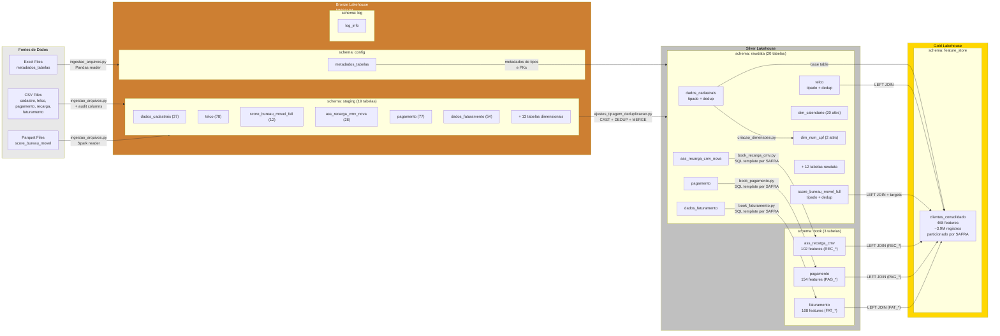
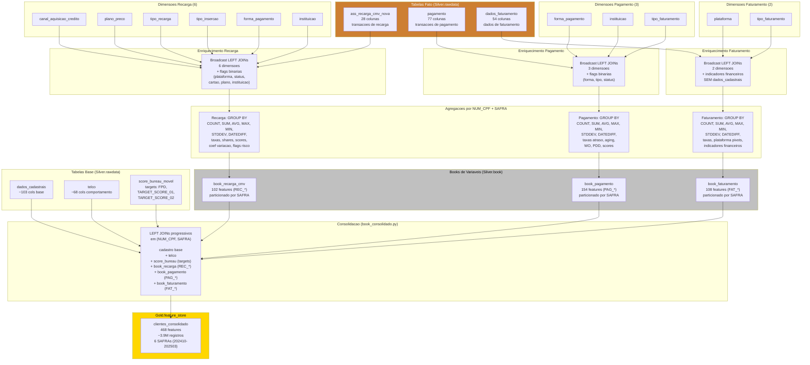
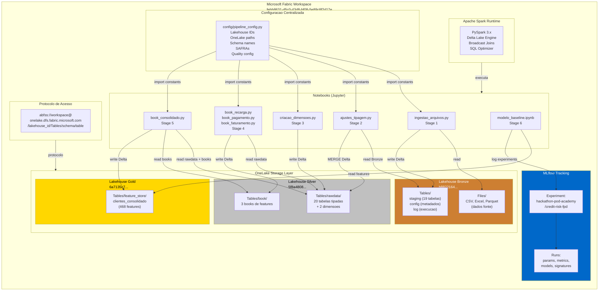

# Data Architecture — Hackathon PoD Academy (Claro + Oracle)

**Data**: 2026-02-08
**Versao**: 1.0
**Autor**: @architect (Aria)
**Story**: HD-1.3 — Documentar Arquitetura com Diagramas
**Projeto**: Credit Risk Modeling — First Payment Default (FPD)
**Plataforma**: Microsoft Fabric | PySpark | Delta Lake

---

## Sumario

1. [Visao Geral](#1-visao-geral)
2. [Diagrama 1 — Pipeline Medallion](#2-diagrama-1--pipeline-medallion)
3. [Diagrama 2 — Modelo Logico ER](#3-diagrama-2--modelo-logico-er)
4. [Diagrama 3 — Fluxo de Feature Engineering](#4-diagrama-3--fluxo-de-feature-engineering)
5. [Diagrama 4 — Fluxo de Treinamento de Modelos](#5-diagrama-4--fluxo-de-treinamento-de-modelos)
6. [Diagrama 5 — Deployment no Microsoft Fabric](#6-diagrama-5--deployment-no-microsoft-fabric)
7. [Justificativas Tecnicas](#7-justificativas-tecnicas)
8. [Seguranca e Governanca](#8-seguranca-e-governanca)
9. [Escalabilidade](#9-escalabilidade)
10. [Metricas do Pipeline](#10-metricas-do-pipeline)

---

## 1. Visao Geral

Este documento descreve a arquitetura de dados do projeto de modelagem de risco de credito para clientes de telecomunicacoes da **Claro**, desenvolvido em parceria com a **Oracle** no contexto do Hackathon PoD Academy.

O pipeline processa dados cadastrais, transacionais e comportamentais de aproximadamente **3.9 milhoes de registros** distribuidos em **6 safras** (202410 a 202503), gerando **468 features** consolidadas que alimentam modelos de Machine Learning para predicao de **First Payment Default (FPD)**.

A arquitetura segue o padrao **Medallion (Bronze, Silver, Gold)** sobre **Microsoft Fabric**, utilizando **Delta Lake** como formato de armazenamento e **PySpark** como engine de processamento.

### Identificadores de Infraestrutura

| Componente | ID |
|-----------|-----|
| Workspace | `febb8631-d5c0-43d8-bf08-5e89c8f2d17e` |
| Lakehouse Bronze | `b8822164-7b67-4b17-9a01-3d0737dace7e` |
| Lakehouse Silver | `5f8a4808-6f65-401b-a427-b0dd9d331b35` |
| Lakehouse Gold | `6a7135c7-0d8d-4625-815d-c4c4a02e4ed4` |

### Stack Tecnologico

| Componente | Tecnologia |
|-----------|-----------|
| Plataforma | Microsoft Fabric (OneLake) |
| Storage | Delta Lake (ABFSS protocol) |
| Processing | PySpark 3.x |
| Linguagem | Python 3.x |
| ML Framework | scikit-learn 1.3.2 + LightGBM |
| Experiment Tracking | MLflow (habilitado) |
| Encoding | category-encoders 2.6.3 (CountEncoder) |
| Configuracao | config/pipeline_config.py (centralizada) |

---

## 2. Diagrama 1 — Pipeline Medallion

O diagrama abaixo apresenta o fluxo completo do pipeline, desde a ingestao de arquivos fontes ate a feature store no Gold, passando pelas transformacoes de cada camada.



### Detalhamento dos Scripts por Estagio

| Estagio | Script | Entrada | Saida | Transformacoes |
|---------|--------|---------|-------|----------------|
| 1. Ingestao | `ingestao-arquivos.py` | CSV/Excel/Parquet (Files/) | Bronze.staging.* (19 tabelas) | Leitura hibrida Pandas+Spark, audit columns (`_execution_id`, `_data_inclusao`) |
| 2. Metadados | `ajustes-tipagem-deduplicacao.py` | Bronze.staging.* + config.metadados_tabelas | Silver.rawdata.* (20 tabelas) | Type casting dinamico, dedup por PK + `_data_inclusao` DESC, Delta MERGE |
| 3. Dimensoes | `criacao-dimensoes.py` | Parametros de data + Silver.rawdata.dados_cadastrais | Silver.rawdata.dim_calendario + dim_num_cpf | Geracao de calendario (2010-2035), surrogate keys para CPFs |
| 4a. Book Recarga | `book_recarga_cmv.py` | Silver.rawdata (fato + 6 dims) | Silver.book.ass_recarga_cmv (102 features) | SQL template por SAFRA, broadcast joins, agregacoes por NUM_CPF |
| 4b. Book Pagamento | `book_pagamento.py` | Silver.rawdata (fato + 3 dims) | Silver.book.pagamento (154 features) | SQL template por SAFRA, broadcast joins, agregacoes por NUM_CPF |
| 4c. Book Faturamento | `book_faturamento.py` | Silver.rawdata (fato + 2 dims) | Silver.book.faturamento (108 features) | SQL template por SAFRA, SEM join com dados_cadastrais (leakage fix) |
| 5. Consolidacao | `book_consolidado.py` | Silver.rawdata (base) + Silver.book (3 books) | Gold.feature_store.clientes_consolidado (468 features) | LEFT JOINs progressivos em (NUM_CPF, SAFRA) |
| 6. Modelo | `modelo_baseline_risco_telecom_sklearn.ipynb` | Gold.feature_store.clientes_consolidado | Modelo treinado + metricas MLflow | Feature selection, train/val/OOT split, LogReg + LGBM |

---

## 3. Diagrama 2 — Modelo Logico ER

O diagrama abaixo apresenta o modelo logico com todas as tabelas do pipeline, suas colunas-chave e os relacionamentos entre elas. As tabelas estao organizadas por camada (Bronze, Silver, Gold).

```mermaid
erDiagram
    BRONZE_STAGING_DADOS_CADASTRAIS {
        varchar NUM_CPF PK
        int SAFRA PK
        varchar NUM_CLIENTE
        varchar COD_CANAL_AQUISICAO
        varchar FLAG_INSTALACAO
        varchar FPD
        varchar PROD
        varchar _execution_id
        timestamp _data_inclusao
    }

    BRONZE_STAGING_TELCO {
        varchar NUM_CPF PK
        int SAFRA PK
        varchar DW_NUM_NTC
        varchar COD_PLATAFORMA_ATU
        varchar NUM_CLIENTE
        varchar _execution_id
        timestamp _data_inclusao
    }

    BRONZE_STAGING_SCORE_BUREAU {
        varchar NUM_CPF PK
        int SAFRA PK
        varchar SCORE_01
        varchar SCORE_02
        varchar _execution_id
        timestamp _data_inclusao
    }

    BRONZE_STAGING_ASS_RECARGA {
        varchar NUM_CPF
        varchar DW_NUM_NTC
        varchar DW_TIPO_RECARGA FK
        varchar DW_TIPO_INSERCAO FK
        varchar DW_FORMA_PAGAMENTO FK
        varchar DW_INSTITUICAO FK
        varchar COD_CANAL_AQUISICAO FK
        varchar DW_PLANO_TARIFACAO FK
        timestamp DAT_INSERCAO_CREDITO
        decimal VAL_CREDITO_INSERIDO
    }

    BRONZE_STAGING_PAGAMENTO {
        varchar NUM_CPF
        varchar CONTRATO
        varchar DW_FORMA_PAGAMENTO FK
        varchar DW_INSTITUICAO FK
        varchar DW_TIPO_FATURAMENTO FK
        timestamp DAT_PAGAMENTO
        decimal VAL_PAGAMENTO
    }

    BRONZE_STAGING_DADOS_FATURAMENTO {
        varchar NUM_CPF
        varchar CONTRATO
        varchar DW_PLATAFORMA FK
        varchar DW_TIPO_FATURAMENTO FK
        timestamp DAT_REFERENCIA
        decimal VAL_FAT_BRUTO
        decimal VAL_FAT_LIQUIDO
    }

    BRONZE_CONFIG_METADADOS {
        varchar nome_tabela PK
        varchar nome_coluna PK
        varchar tipo
        varchar primary_key
    }

    SILVER_RAWDATA_DADOS_CADASTRAIS {
        string NUM_CPF PK
        int SAFRA PK
        string NUM_CLIENTE
        string COD_CANAL_AQUISICAO
        int FLAG_INSTALACAO
        int FPD
        string PROD
        string _execution_id
        timestamp _data_alteracao_silver
    }

    SILVER_RAWDATA_TELCO {
        string NUM_CPF PK
        int SAFRA PK
        string DW_NUM_NTC
        string COD_PLATAFORMA_ATU
        int QTD_LINHAS_ATIVAS
        string _execution_id
        timestamp _data_alteracao_silver
    }

    SILVER_RAWDATA_SCORE_BUREAU {
        string NUM_CPF PK
        int SAFRA PK
        double SCORE_01
        double SCORE_02
        string _execution_id
        timestamp _data_alteracao_silver
    }

    SILVER_RAWDATA_DIM_CALENDARIO {
        int DataKey PK
        date Data
        int Ano
        int Mes
        int Trimestre
        string AnoMes
        int NumAnoMes
        boolean EhDiaUtil
    }

    SILVER_RAWDATA_DIM_NUM_CPF {
        int CpfKey PK
        string NumCPF
    }

    SILVER_RAWDATA_CANAL_AQUISICAO {
        string COD_CANAL_AQUISICAO PK
        string DSC_CANAL_AQUISICAO_BI
        string COD_TIPO_CREDITO
    }

    SILVER_RAWDATA_PLANO_PRECO {
        string DW_PLANO PK
        string DSC_TIPO_PLANO_BI
        string DSC_GRUPO_PLANO_BI
        string IND_AMDOCS_PLAT_PRE
    }

    SILVER_RAWDATA_TIPO_RECARGA {
        string DW_TIPO_RECARGA PK
        string DSC_TIPO_RECARGA
    }

    SILVER_RAWDATA_TIPO_INSERCAO {
        string DW_TIPO_INSERCAO PK
        string DSC_TIPO_INSERCAO
    }

    SILVER_RAWDATA_FORMA_PAGAMENTO {
        string DW_FORMA_PAGAMENTO PK
        string DSC_FORMA_PAGAMENTO
    }

    SILVER_RAWDATA_INSTITUICAO {
        string DW_INSTITUICAO PK
        string DSC_INSTITUICAO
        string DSC_TIPO_INSTITUICAO
    }

    SILVER_RAWDATA_PLATAFORMA {
        string DW_PLATAFORMA PK
        string DSC_PLATAFORMA
    }

    SILVER_RAWDATA_TIPO_FATURAMENTO {
        string DW_TIPO_FATURAMENTO PK
        string DSC_TIPO_FATURAMENTO
        string DSC_TIPO_FATURAMENTO_ABREV
    }

    SILVER_BOOK_ASS_RECARGA_CMV {
        string NUM_CPF PK
        int SAFRA PK
        int QTD_RECARGAS_TOTAL
        double VLR_CREDITO_TOTAL
        double VLR_CREDITO_MEDIO
        double SCORE_RISCO
        string SEGMENTO_RISCO
        timestamp DT_PROCESSAMENTO
    }

    SILVER_BOOK_PAGAMENTO {
        string NUM_CPF PK
        int SAFRA PK
        int QTD_PAGAMENTOS_TOTAL
        double VLR_PAGAMENTO_TOTAL
        double VLR_PAGAMENTO_MEDIO
        double SCORE_RISCO
        string SEGMENTO_RISCO
        timestamp DT_PROCESSAMENTO
    }

    SILVER_BOOK_FATURAMENTO {
        string NUM_CPF PK
        int SAFRA PK
        int QTD_FATURAS_TOTAL
        double VLR_FAT_BRUTO_TOTAL
        double VLR_FAT_BRUTO_MEDIO
        double SCORE_RISCO
        string SEGMENTO_RISCO
        timestamp DT_PROCESSAMENTO
    }

    GOLD_FEATURE_STORE_CONSOLIDADO {
        string NUM_CPF PK
        int SAFRA PK
        int FPD
        double TARGET_SCORE_01
        double TARGET_SCORE_02
        double REC_QTD_RECARGAS_TOTAL
        double REC_VLR_CREDITO_TOTAL
        double PAG_QTD_PAGAMENTOS_TOTAL
        double PAG_VLR_PAGAMENTO_TOTAL
        double FAT_QTD_FATURAS_TOTAL
        double FAT_VLR_FAT_BRUTO_TOTAL
        timestamp DT_PROCESSAMENTO
    }

    BRONZE_CONFIG_METADADOS ||--o{ BRONZE_STAGING_DADOS_CADASTRAIS : "define tipos"
    BRONZE_STAGING_DADOS_CADASTRAIS ||--|| SILVER_RAWDATA_DADOS_CADASTRAIS : "CAST + DEDUP"
    BRONZE_STAGING_TELCO ||--|| SILVER_RAWDATA_TELCO : "CAST + DEDUP"
    BRONZE_STAGING_SCORE_BUREAU ||--|| SILVER_RAWDATA_SCORE_BUREAU : "CAST + DEDUP"

    SILVER_RAWDATA_DADOS_CADASTRAIS ||--o{ SILVER_RAWDATA_DIM_NUM_CPF : "gera CPFs unicos"

    BRONZE_STAGING_ASS_RECARGA ||--o{ SILVER_RAWDATA_CANAL_AQUISICAO : "COD_CANAL_AQUISICAO"
    BRONZE_STAGING_ASS_RECARGA ||--o{ SILVER_RAWDATA_PLANO_PRECO : "DW_PLANO_TARIFACAO"
    BRONZE_STAGING_ASS_RECARGA ||--o{ SILVER_RAWDATA_TIPO_RECARGA : "DW_TIPO_RECARGA"
    BRONZE_STAGING_ASS_RECARGA ||--o{ SILVER_RAWDATA_TIPO_INSERCAO : "DW_TIPO_INSERCAO"
    BRONZE_STAGING_ASS_RECARGA ||--o{ SILVER_RAWDATA_FORMA_PAGAMENTO : "DW_FORMA_PAGAMENTO"
    BRONZE_STAGING_ASS_RECARGA ||--o{ SILVER_RAWDATA_INSTITUICAO : "DW_INSTITUICAO"

    SILVER_RAWDATA_DADOS_CADASTRAIS ||--o| SILVER_RAWDATA_TELCO : "NUM_CPF + SAFRA"
    SILVER_RAWDATA_DADOS_CADASTRAIS ||--o| SILVER_RAWDATA_SCORE_BUREAU : "NUM_CPF + SAFRA"

    SILVER_BOOK_ASS_RECARGA_CMV ||--o| GOLD_FEATURE_STORE_CONSOLIDADO : "LEFT JOIN REC_*"
    SILVER_BOOK_PAGAMENTO ||--o| GOLD_FEATURE_STORE_CONSOLIDADO : "LEFT JOIN PAG_*"
    SILVER_BOOK_FATURAMENTO ||--o| GOLD_FEATURE_STORE_CONSOLIDADO : "LEFT JOIN FAT_*"
    SILVER_RAWDATA_DADOS_CADASTRAIS ||--o{ GOLD_FEATURE_STORE_CONSOLIDADO : "base table"
    SILVER_RAWDATA_TELCO ||--o{ GOLD_FEATURE_STORE_CONSOLIDADO : "LEFT JOIN"
    SILVER_RAWDATA_SCORE_BUREAU ||--o{ GOLD_FEATURE_STORE_CONSOLIDADO : "LEFT JOIN targets"
```



### Inventario Completo de Tabelas

#### Bronze — Staging (19 tabelas)

| Tabela | Colunas | Dominio |
|--------|---------|---------|
| dados_cadastrais | 37 | Dados cadastrais do cliente |
| telco | 78 | Dados comportamentais de telecomunicacao |
| score_bureau_movel_full | 12 | Scores de bureau de credito |
| ass_recarga_cmv_nova | 28 | Transacoes de recarga de credito |
| pagamento | 77 | Transacoes de pagamento |
| dados_faturamento | 54 | Dados de faturamento |
| canal_aquisicao_credito | 16 | Canais de aquisicao |
| plano_preco | 29 | Planos tarifarios |
| forma_pagamento | 9 | Formas de pagamento |
| instituicao | 13 | Instituicoes financeiras |
| tipo_recarga | 8 | Tipos de recarga |
| tipo_insercao | 8 | Tipos de insercao |
| tipo_faturamento | 10 | Tipos de faturamento |
| tipo_credito | 9 | Tipos de credito |
| plataforma | 12 | Plataformas (PREPG, AUTOC, etc.) |
| promocao_credito | 16 | Promocoes de credito |
| score_bureau_movel | 12 | Score bureau (versao parcial) |
| status_plataforma | 11 | Status das plataformas |
| tecnologia | 9 | Tipos de tecnologia |

#### Bronze — Config e Log

| Schema.Tabela | Funcao |
|--------------|--------|
| config.metadados_tabelas | Metadados de tipagem (nome_coluna, tipo, primary_key) |
| log.log_info | Log de execucao (ExecutionId, Status, RowsAffected, ErrorMessage) |

#### Silver — Rawdata (20 tabelas)

As 19 tabelas do staging com tipagem correta + colunas de auditoria Silver, mais 2 dimensoes geradas (dim_calendario, dim_num_cpf), menos 1 tabela que nao e promovida ao Silver. Total: 20 tabelas.

| Tabela Adicional | Colunas | Funcao |
|-----------------|---------|--------|
| dim_calendario | 20 | Dimensao temporal (2010-01-01 a 2035-12-31) |
| dim_num_cpf | 2 | Surrogate key (CpfKey) para CPFs unicos |

#### Silver — Book (3 tabelas)

| Tabela | Features | Prefixo | Granularidade |
|--------|----------|---------|---------------|
| ass_recarga_cmv | 102 | REC_ | NUM_CPF + SAFRA |
| pagamento | 154 | PAG_ | NUM_CPF + SAFRA |
| faturamento | 108 | FAT_ | NUM_CPF + SAFRA |

#### Gold — Feature Store (1 tabela)

| Tabela | Features | Registros | Particao |
|--------|----------|-----------|----------|
| clientes_consolidado | 468 | ~3.9M | SAFRA (202410-202503) |

---

## 4. Diagrama 3 — Fluxo de Feature Engineering

O diagrama abaixo detalha como as features sao construidas a partir das fontes brutas, passando pelos enriquecimentos com dimensoes, agregacoes estatisticas e consolidacao final.



### Convencao de Prefixos

Cada book de variaveis adiciona um prefixo unico as suas features, garantindo rastreabilidade da origem:

| Prefixo | Fonte | Quantidade |
|---------|-------|-----------|
| (nenhum) | CADASTRO + TELCO + TARGET | ~103 |
| `REC_` | book_recarga_cmv | 102 |
| `PAG_` | book_pagamento | 154 |
| `FAT_` | book_faturamento | 108 |
| **Total** | | **~468** |

### Categorias de Features por Book

**Book Recarga (REC_)**: Volumetria (QTD_RECARGAS_TOTAL, QTD_LINHAS), Valores (VLR_CREDITO_TOTAL, VLR_BONUS_TOTAL), Plataforma pivots (QTD_PLAT_PREPG, QTD_PLAT_AUTOC), Status pivots, Cartao pivots, Taxas (TAXA_PLAT_PREPG, TAXA_SOS), Shares (SHARE_PLAT_PREPG), Coeficientes de variacao, Score de risco composto, Flags de risco (FLAG_ALTO_RISCO, FLAG_BAIXO_RISCO), Segmento de risco.

**Book Pagamento (PAG_)**: Volumetria, Valores de pagamento, Status pivots (aberto, pago, WO, PDD), Aging de atrasos, Formas de pagamento pivots, Tipo faturamento pivots, Taxas de atraso, Dias entre pagamentos, Score de risco, Flags de risco.

**Book Faturamento (FAT_)**: Volumetria de faturas, Valores brutos e liquidos, Plataforma pivots, Indicadores financeiros, Taxas, Dias entre faturas, Score de risco, Flags de risco. Nota: Este book nao faz join com dados_cadastrais (correcao de leakage na Story TD-1.1).

---

## 5. Diagrama 4 — Fluxo de Treinamento de Modelos

O diagrama abaixo apresenta o fluxo completo de treinamento, desde a feature store ate a avaliacao final com MLflow tracking.

```mermaid
graph LR
    subgraph INPUT["Feature Store"]
        FS["Gold.feature_store<br/>clientes_consolidado<br/>468 features<br/>~3.9M registros"]
    end

    subgraph PREP["Preparacao"]
        FILTER["Filtro:<br/>FLAG_INSTALACAO == 1<br/>(pos-pago)"]
        SAMPLE["Sampling: 25%<br/>estratificado<br/>SAFRA x FPD"]
        CLEAN["Cleaning:<br/>- remove nulls > 70%<br/>- remove low cardinality<br/>- remove date columns<br/>- remove ID columns"]
    end

    subgraph SELECTION["Feature Selection"]
        IV_CALC["Information Value (IV)<br/>filtro: IV >= 0.02<br/>numericas + categoricas"]
        L1_COEF["L1 Regularization<br/>LogReg(penalty=l1)<br/>coef != 0"]
        CORR_FILTER["Correlation Filter<br/>threshold: 0.95<br/>remove redundantes"]
        FINAL_FEATURES["Features Finais<br/>~50-70 variaveis"]
    end

    subgraph SPLIT["Split Temporal"]
        TRAIN["Train<br/>SAFRA: 202410,<br/>202411, 202412"]
        VAL["Validation (OOS)<br/>SAFRA: 202501"]
        OOT["Out-of-Time (OOT)<br/>SAFRA: 202502,<br/>202503"]
    end

    subgraph PREPROCESSING["Preprocessing"]
        NUM_PIPE["Numericas:<br/>SimpleImputer(median)<br/>StandardScaler (RL)"]
        CAT_PIPE["Categoricas:<br/>SimpleImputer(mode)<br/>CountEncoder"]
        COL_TRANS["ColumnTransformer<br/>Pipeline encapsulado"]
    end

    subgraph MODELS["Modelos"]
        LR["Logistic Regression<br/>penalty=l1<br/>solver=liblinear<br/>GridSearchCV<br/>StratifiedKFold(4)"]
        LGBM["LightGBM<br/>GBDT classifier<br/>top 70 features<br/>GridSearchCV<br/>StratifiedKFold(4)"]
    end

    subgraph EVAL["Avaliacao"]
        METRICS["Metricas:<br/>AUC-ROC<br/>KS (benchmark 33.1%)<br/>por SAFRA"]
        SWAP["Swap Analysis:<br/>swap-in / swap-out<br/>contribuicao incremental"]
        VIZ["Visualizacoes:<br/>distribuicao scores<br/>ROC curve<br/>KS plot<br/>feature importance"]
    end

    subgraph TRACKING["MLflow"]
        MLFLOW["Experiment:<br/>hackathon-pod-academy<br/>/credit-risk-fpd<br/><br/>autolog: models,<br/>params, metrics,<br/>signatures"]
    end

    FS --> FILTER
    FILTER --> SAMPLE
    SAMPLE --> CLEAN

    CLEAN --> IV_CALC
    IV_CALC --> L1_COEF
    L1_COEF --> CORR_FILTER
    CORR_FILTER --> FINAL_FEATURES

    FINAL_FEATURES --> TRAIN
    FINAL_FEATURES --> VAL
    FINAL_FEATURES --> OOT

    TRAIN --> COL_TRANS
    NUM_PIPE --> COL_TRANS
    CAT_PIPE --> COL_TRANS
    COL_TRANS --> LR
    COL_TRANS --> LGBM

    LR --> METRICS
    LGBM --> METRICS
    METRICS --> SWAP
    SWAP --> VIZ
    VIZ --> MLFLOW
    LR --> MLFLOW
    LGBM --> MLFLOW

    style INPUT fill:#ffd700,color:#000
    style TRACKING fill:#0068c9,color:#fff
```



### Detalhamento do Pipeline de Feature Selection

A selecao de features segue um processo de tres etapas cascateadas, cada uma eliminando features com baixo poder preditivo ou redundantes:

| Etapa | Metodo | Criterio | Features Removidas |
|-------|--------|----------|-------------------|
| 1. Univariada | Information Value (IV) | IV < 0.02 | Features com nenhum poder discriminativo |
| 2. Multivariada | L1 Regularization (Lasso) | coef == 0 | Features eliminadas pela regularizacao |
| 3. Correlacao | Pearson Correlation | corr > 0.95 | Features redundantes entre si |

### Split Temporal

| Conjunto | SAFRAs | Finalidade |
|----------|--------|-----------|
| Train | 202410, 202411, 202412 | Treinamento dos modelos |
| Validation (OOS) | 202501 | Selecao de hiperparametros |
| Out-of-Time (OOT) | 202502, 202503 | Validacao de estabilidade temporal |

---

## 6. Diagrama 5 — Deployment no Microsoft Fabric

O diagrama abaixo apresenta a arquitetura de deployment no Microsoft Fabric, mostrando como os componentes se relacionam dentro do workspace.



### Ordem de Execucao do Pipeline

Os notebooks devem ser executados na seguinte ordem, respeitando as dependencias entre estagios:

```
1. ingestao-arquivos.py          (CSV/Excel/Parquet -> Bronze.staging)
2. ajustes-tipagem-deduplicacao.py (Bronze.staging -> Silver.rawdata)
3. criacao-dimensoes.py          (-> Silver.rawdata.dim_*)
4a. book_recarga_cmv.py          (Silver.rawdata -> Silver.book)
4b. book_pagamento.py            (Silver.rawdata -> Silver.book)
4c. book_faturamento.py          (Silver.rawdata -> Silver.book)
5. book_consolidado.py           (Silver.rawdata + Silver.book -> Gold.feature_store)
6. modelo_baseline_*.ipynb       (Gold.feature_store -> modelo treinado + MLflow)
```

Os estagios 4a, 4b e 4c podem ser executados em paralelo, pois nao possuem dependencias entre si.

### Protocolo de Acesso OneLake (ABFSS)

Todos os acessos ao OneLake seguem o padrao ABFSS:

```
abfss://{WORKSPACE_ID}@onelake.dfs.fabric.microsoft.com/{LAKEHOUSE_ID}/Tables/{SCHEMA}/{TABLE}
```

Este padrao esta centralizado em `config/pipeline_config.py`, que exporta constantes como `BRONZE_BASE`, `SILVER_BASE`, `GOLD_BASE` e paths completos para cada tabela.

---

## 7. Justificativas Tecnicas

### 7.1 Por que Arquitetura Medallion?

A arquitetura Medallion (Bronze, Silver, Gold) foi escolhida por ser o padrao recomendado para pipelines de dados no Microsoft Fabric e oferecer separacao clara de responsabilidades:

| Camada | Responsabilidade | Beneficio |
|--------|-----------------|-----------|
| **Bronze** | Armazena dados brutos como recebidos, com tipagem generica (varchar) | Preserva o dado original para auditoria e reprocessamento. Permite rastreio de linhagem via `_execution_id` |
| **Silver** | Dados limpos, tipados e deduplicados + tabelas derivadas (books) | Garante qualidade e consistencia. Delta MERGE permite idempotencia em reprocessamentos |
| **Gold** | Feature store consolidada, pronta para consumo ML | Fornece um unico ponto de acesso para modelos, com features pre-calculadas e particionadas |

A separacao em tres camadas permite reprocessamento independente de cada estagio sem impactar os demais, alem de facilitar a auditoria do pipeline.

### 7.2 Por que Delta Lake?

O Delta Lake foi escolhido como formato de armazenamento por oferecer recursos essenciais para um pipeline de dados de producao:

- **ACID Transactions**: Garantia de atomicidade em escritas — se um book falha no meio, nao corrompe o dataset existente
- **Delta MERGE (UPSERT)**: Permite atualizacao incremental na Silver sem reescrever toda a tabela. Crucial para o processo de tipagem e deduplicacao
- **Schema Evolution**: `mergeSchema=true` permite adicionar colunas automaticamente quando a fonte muda, sem quebrar o pipeline
- **Time Travel**: Possibilidade de consultar versoes anteriores dos dados para auditoria ou rollback
- **Partitioning**: Particao por SAFRA no Gold permite leitura eficiente de periodos especificos (ex: somente OOT)
- **V-Order Optimization**: Habilitado na ingestao (`spark.sql.parquet.vorder.enabled=true`) para melhor compressao e performance de leitura

### 7.3 Por que LEFT JOIN na Consolidacao?

A consolidacao usa LEFT JOINs progressivos a partir de `dados_cadastrais` como tabela base:

```
dados_cadastrais (base)
  LEFT JOIN telco ON (NUM_CPF, SAFRA)
  LEFT JOIN score_bureau_movel ON (NUM_CPF, SAFRA)
  LEFT JOIN book_recarga_cmv ON (NUM_CPF, SAFRA)
  LEFT JOIN book_pagamento ON (NUM_CPF, SAFRA)
  LEFT JOIN book_faturamento ON (NUM_CPF, SAFRA)
```

**Justificativa**: LEFT JOIN (e nao INNER JOIN) garante que todos os clientes do cadastro sejam preservados na feature store, mesmo que nao possuam transacoes em todos os books. Clientes sem recarga, por exemplo, terao `REC_*` como NULL — informacao em si valiosa para o modelo (indicativo de perfil de uso). INNER JOIN eliminaria esses clientes, introduzindo vies de selecao.

### 7.4 Por que Particionamento por SAFRA?

A SAFRA (periodo no formato YYYYMM) foi escolhida como coluna de particao por varios motivos:

- **Split temporal nativo**: O modelo usa SAFRAs para definir conjuntos Train/Val/OOT. Particionar por SAFRA torna leitura de cada conjunto eficiente (partition pruning)
- **Cardinalidade adequada**: 6 SAFRAs (202410-202503) geram 6 particoes — nem muitas (overhead de metadados) nem poucas (sem beneficio)
- **Processamento incremental**: Novos periodos podem ser adicionados sem reprocessar safras existentes
- **SAFRA como INT**: Correcao aplicada (Story TD-1.3) para garantir que SAFRA seja tratado como inteiro em todas as camadas, evitando inconsistencias em joins e filtros

### 7.5 Por que Broadcast Joins nos Books?

Os books de features usam `spark.sql.autoBroadcastJoinThreshold = 10MB` e registram tabelas dimensionais como views temporarias:

- **Tabelas dimensionais sao pequenas**: canal_aquisicao (16 rows), tipo_recarga (8 rows), forma_pagamento (9 rows), etc.
- **Broadcast evita shuffle**: O Spark distribui a tabela pequena para todos os executors em vez de realizar shuffle da tabela grande
- **Performance**: Joins com broadcast sao ordens de magnitude mais rapidos para tabelas dimensionais pequenas sobre fatos com milhoes de registros

### 7.6 Por que SQL Templates por SAFRA?

Os books processam cada SAFRA individualmente usando SQL templates com parametros `{safra}` e `{data_cutoff}`:

- **Controle de cutoff temporal**: Cada SAFRA tem uma data de corte diferente, garantindo que o modelo so use dados anteriores ao periodo de observacao
- **Gerenciamento de memoria**: Processar SAFRA a SAFRA evita picos de memoria ao processar todos os 3.9M registros de uma vez
- **Idempotencia**: Primeira SAFRA usa `mode=overwrite`, subsequentes usam `mode=append` com `partitionBy("SAFRA")`

---

## 8. Seguranca e Governanca

### 8.1 Protecao de Dados Pessoais

| Controle | Implementacao |
|----------|--------------|
| **NUM_CPF mascarado** | O campo NUM_CPF nao contem CPFs reais. Os dados foram anonimizados antes da ingestao no Lakehouse, usando identificadores mascarados que preservam a unicidade sem expor PII |
| **Sem PII no pipeline** | Nenhum nome, endereco, telefone ou dado pessoal identificavel transita pelo pipeline. Dados cadastrais contem apenas atributos comportamentais e demograficos agregados |
| **Sem dados sensiveis em logs** | O log de execucao (log.log_info) registra apenas metadados operacionais: ExecutionId, Status, RowsAffected, ErrorMessage. Nenhum dado de cliente e logado |

### 8.2 Auditoria e Rastreabilidade

O pipeline implementa rastreabilidade completa em todas as camadas:

| Coluna de Auditoria | Camada | Descricao |
|---------------------|--------|-----------|
| `_execution_id` | Bronze, Silver | UUID unico por execucao. Permite rastrear qual execucao gerou cada registro |
| `_data_inclusao` | Bronze | Timestamp de quando o registro foi ingerido no Bronze |
| `_data_alteracao_silver` | Silver | Timestamp de quando o registro foi processado/atualizado na Silver |
| `DT_PROCESSAMENTO` | Books, Gold | Timestamp de quando o registro foi gerado pelo book/consolidacao |

A combinacao de `_execution_id` com os timestamps permite reconstruir a linhagem completa de qualquer registro, desde a ingestao ate a feature store.

### 8.3 Log de Execucao

Toda execucao de pipeline e registrada em `Bronze.log.log_info`:

```
| ExecutionId | Schema   | TableName        | StartTime | EndTime | Status  | RowsAffected | ErrorMessage |
|-------------|----------|------------------|-----------|---------|---------|--------------|--------------|
| uuid-1      | staging  | dados_cadastrais | ...       | ...     | SUCCESS | 650000       |              |
| uuid-2      | rawdata  | telco            | ...       | ...     | SUCCESS | 650000       |              |
| uuid-3      | staging  | pagamento        | ...       | ...     | FAILED  | 0            | FileNotFound |
```

### 8.4 Prevencao de Data Leakage

Data leakage e uma preocupacao central em modelos de credit risk. As seguintes medidas foram implementadas:

| Medida | Implementacao |
|--------|--------------|
| **Blacklist de features** | `LEAKAGE_BLACKLIST = ["FAT_VLR_FPD"]` em `pipeline_config.py`. Feature que era copia direta do target foi identificada e removida (Story TD-1.1) |
| **Book faturamento isolado** | O book de faturamento NAO faz join com dados_cadastrais, eliminando a possibilidade de vazamento de FPD via features derivadas |
| **Split temporal** | Treinamento usa SAFRAs 202410-202412, validacao usa 202501, teste usa 202502-202503. Nao ha contaminacao temporal entre conjuntos |
| **Cutoff de dados** | SQL templates usam `WHERE DAT < '{data_cutoff}'` para garantir que cada SAFRA so usa dados anteriores a data de referencia |

### 8.5 Governanca de Configuracao

Toda configuracao sensivel (IDs de Lakehouse, paths OneLake, schemas) esta centralizada em `config/pipeline_config.py`, eliminando IDs hardcoded nos scripts e notebooks. Alteracoes de ambiente (dev/staging/prod) requerem modificacao em um unico arquivo.

---

## 9. Escalabilidade

### 9.1 Estado Atual

| Metrica | Valor Atual |
|---------|-------------|
| Registros na Feature Store | ~3.9M |
| Features | 468 |
| SAFRAs | 6 (202410-202503) |
| Tabelas Bronze | 21 |
| Tabelas Silver | 23 |
| Volume estimado (Delta) | ~5-10 GB |

### 9.2 Estrategia para Escalabilidade 10x

Para suportar crescimento de 10x (~39M registros, +60 SAFRAs), as seguintes estrategias estao disponiveis na arquitetura atual:

#### Particionamento

- **SAFRA como particao**: Ja implementado no Gold. Adicionar novas SAFRAs e operacao de append, sem reprocessar SAFRAs existentes
- **Partition Pruning**: Queries que filtram por SAFRA so leem as particoes relevantes, mantendo performance constante independente do volume total
- **Reparticionamento de books**: Os books ja usam `partitionBy("SAFRA")` na escrita, permitindo leitura eficiente

#### Processamento Distribuido (Spark)

- **Paralelismo nativo**: PySpark distribui automaticamente o processamento entre executors. Aumentar o cluster Fabric escala horizontalmente
- **Broadcast joins**: Tabelas dimensionais pequenas sao broadcast para todos os executors, evitando shuffle em joins com tabelas grandes
- **Caching estrategico**: Books usam `.cache()` em DataFrames intermediarios para evitar recomputacao

#### Processamento Incremental

- **Delta MERGE**: A Silver ja suporta UPSERT incremental — novos dados podem ser processados sem reescrever toda a tabela
- **SAFRA por SAFRA**: Books processam cada SAFRA individualmente, permitindo reprocessamento seletivo
- **Append mode**: Books usam `overwrite` na primeira SAFRA e `append` nas subsequentes

#### Configuracao Centralizada

- **Config-driven pipeline**: Adicionar novas tabelas requer apenas incluir entrada em `INGESTION_PARAMS` e `SILVER_TABLES` no `pipeline_config.py`
- **Novas SAFRAs**: Basta adicionar ao array `SAFRAS` no config — todos os scripts e books automaticamente processam os novos periodos
- **Novos books**: A arquitetura modular permite adicionar novos books (ex: book_atendimento) sem alterar os existentes. O consolidado automaticamente detecta tabelas Delta disponiveis

#### Otimizacoes de Storage

- **V-Order**: Habilitado na ingestao para compressao otimizada de Parquet
- **Delta Lake compaction**: OPTIMIZE pode ser executado periodicamente para compactar arquivos pequenos
- **Z-ORDER**: Pode ser aplicado em NUM_CPF para otimizar point lookups frequentes

### 9.3 Cenario de Escalabilidade

| Cenario | Volume | SAFRAs | Acao Necessaria |
|---------|--------|--------|----------------|
| Atual | 3.9M | 6 | Nenhuma |
| 2x (12 meses) | ~7.8M | 12 | Adicionar SAFRAs ao config |
| 5x (30 meses) | ~19.5M | 30 | Aumentar cluster Spark, OPTIMIZE periodico |
| 10x (60 meses) | ~39M | 60 | Cluster dedicado, Z-ORDER, considerar orquestracao via Fabric Pipelines |

---

## 10. Metricas do Pipeline

| Metrica | Valor |
|---------|-------|
| Scripts Python (.py) | 7 |
| Notebooks Jupyter (.ipynb) | 9 |
| SQL Schema Files (DDL) | 52 |
| JSON Metadados Enriquecidos | 15 |
| Tabelas Bronze (staging + config + log) | 21 |
| Tabelas Silver (rawdata + books) | 23 |
| Tabelas Gold (feature store) | 1 |
| Total de Features Consolidadas | 468 |
| Registros na Feature Store | ~3.9M |
| SAFRAs Processadas | 6 (202410-202503) |
| Targets | 3 (FPD, TARGET_SCORE_01, TARGET_SCORE_02) |
| Modelos Implementados | 2 (Logistic Regression L1 + LightGBM GBDT) |
| KS Benchmark | 33.1% |
| MLflow Tracking | Habilitado |
| Configuracao Centralizada | Sim (config/pipeline_config.py) |

---

*Documento gerado para Story HD-1.3 — Entregavel E (Proposta de Arquitetura de Dados)*
*Hackathon PoD Academy (Claro + Oracle) | Microsoft Fabric | 2026*
