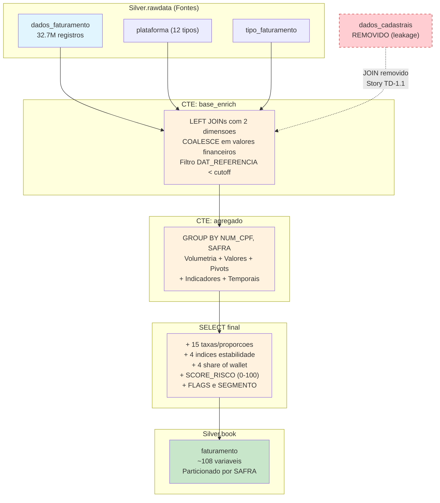

# Book de Variaveis — Faturamento

> **Story**: HD-2.3 | **Epic**: EPIC-HD-001 | **Entregavel**: B (Documentacao de Variaveis)
> **Prefixo**: `FAT_` (no book consolidado) | **Total**: ~108 variaveis
> **Granularidade**: `NUM_CPF` + `SAFRA` (YYYYMM)
> **IMPORTANTE**: Este book NAO faz JOIN com dados_cadastrais para evitar data leakage (Story TD-1.1 — FAT_VLR_FPD era copia direta do target FPD).

## 1. Visao Geral

O Book de Faturamento agrega dados transacionais de faturamento (faturas) de clientes Claro, enriquecidos com 2 tabelas dimensionais (plataforma, tipo_faturamento). Gera **~108 variaveis comportamentais** para o modelo de risco de inadimplencia (FPD), cobrindo volumetria, valores financeiros, pivots por plataforma e indicadores, metricas temporais, taxas, indices de estabilidade, share of wallet, score de risco e segmentacao.

**LEAKAGE FIX (Story TD-1.1)**: O JOIN com `dados_cadastrais` foi removido integralmente. A variavel `FAT_VLR_FPD` (que era `MAX(FPD)`, copia direta do target) e as 12 features provenientes de dados_cadastrais foram eliminadas.

### Dados de Origem

| Tabela | Tipo | Registros | Descricao |
|--------|------|-----------|-----------|
| `Silver.rawdata.dados_faturamento` | Fato | 32.687.219 | Faturas (53 colunas) |
| `Silver.rawdata.plataforma` | Dimensao | — | Plataformas (12 tipos) |
| `Silver.rawdata.tipo_faturamento` | Dimensao | — | Tipos de faturamento |

### Output

- **Tabela**: `Silver.book.faturamento`
- **Particionamento**: `SAFRA` (202410, 202411, 202412, 202501, 202502, 202503)
- **Filtro temporal**: `DAT_REFERENCIA < data_cutoff` (1o dia da safra)

---

## 2. Fluxo de Construcao



---

## 3. Dicionario Completo de Variaveis (~108)

### 3.1 Chaves e Controle (3 variaveis)

| # | Variavel | Tipo | Descricao |
|---|----------|------|-----------|
| 1 | `NUM_CPF` | STRING | CPF mascarado do cliente |
| 2 | `SAFRA` | INT | Periodo de referencia (YYYYMM) |
| 3 | `DT_PROCESSAMENTO` | TIMESTAMP | Data/hora de geracao do book |

### 3.2 Volumetria e Indicadores (16 variaveis)

| # | Variavel | Tipo | Agregacao | Descricao |
|---|----------|------|-----------|-----------|
| 4 | `QTD_FATURAS` | BIGINT | COUNT(*) | Total de faturas do cliente |
| 5 | `QTD_CONTRATOS_DISTINTOS` | BIGINT | COUNT(DISTINCT CONTRATO) | Contratos distintos com faturas |
| 6 | `QTD_SAFRAS_DISTINTAS` | BIGINT | COUNT(DISTINCT DAT_REFERENCIA) | Periodos de referencia distintos |
| 7 | `QTD_FATURAS_PRIMEIRA` | BIGINT | SUM(IND_PRIMEIRA_FAT='S') | Faturas marcadas como primeira fatura |
| 8 | `QTD_FATURAS_WO` | BIGINT | SUM(IND_WO='W') | Faturas com Write-Off (irrecuperavel) |
| 9 | `QTD_FATURAS_REGULAR` | BIGINT | SUM(IND_WO='R') | Faturas com status Regular |
| 10 | `QTD_FATURAS_PDD` | BIGINT | SUM(IND_PDD='S') | Faturas com Provisao para Devedores Duvidosos |
| 11 | `QTD_FATURAS_SEM_PDD` | BIGINT | SUM(IND_PDD='N') | Faturas sem PDD |
| 12 | `QTD_FATURAS_PCCR_C` | BIGINT | SUM(IND_PCCR='C') | Faturas com provisionamento contabil Contabilizado |
| 13 | `QTD_FATURAS_PCCR_W` | BIGINT | SUM(IND_PCCR='W') | Faturas com provisionamento contabil Write-Off |
| 14 | `QTD_FATURAS_ACA` | BIGINT | SUM(IND_ACA='S') | Faturas com Acordo de Cobranca |
| 15 | `QTD_FATURAS_SEM_ACA` | BIGINT | SUM(IND_ACA='N') | Faturas sem Acordo de Cobranca |
| 16 | `QTD_FATURAS_FRAUDE` | BIGINT | SUM(IND_FRAUDE='S') | Faturas com indicacao de fraude |
| 17 | `QTD_FATURAS_ISENTAS` | BIGINT | SUM(IND_ISENCAO_COB_FAT IN ('Y','S')) | Faturas isentas de cobranca |
| 18 | `QTD_FATURAS_NAO_ISENTAS` | BIGINT | SUM(IND_ISENCAO_COB_FAT='N') | Faturas nao isentas de cobranca |

**Legenda de indicadores**:
- **WO** (Write-Off): `W` = Write-Off (irrecuperavel), `R` = Regular
- **PDD** (Provisao para Devedores Duvidosos): `S` = Sim, `N` = Nao
- **PCCR** (Provisionamento Contabil): `C` = Contabilizado, `W` = Write-Off
- **ACA** (Acordo de Cobranca): `S` = Sim, `N` = Nao
- **FRAUDE**: `S` = Sim, `N` = Nao
- **IND_PRIMEIRA_FAT**: `S` = Primeira fatura, `N` = Nao

### 3.3 Valores Financeiros (24 variaveis)

| # | Variavel | Tipo | Agregacao | Descricao |
|---|----------|------|-----------|-----------|
| 19 | `VLR_FAT_BRUTO_TOTAL` | DOUBLE | SUM(VAL_FAT_BRUTO) | Valor total bruto das faturas |
| 20 | `VLR_FAT_BRUTO_MEDIO` | DOUBLE | AVG(VAL_FAT_BRUTO) | Valor medio bruto por fatura |
| 21 | `VLR_FAT_BRUTO_MAX` | DOUBLE | MAX(VAL_FAT_BRUTO) | Maior valor bruto de fatura |
| 22 | `VLR_FAT_BRUTO_MIN` | DOUBLE | MIN(VAL_FAT_BRUTO) | Menor valor bruto de fatura |
| 23 | `VLR_FAT_BRUTO_STDDEV` | DOUBLE | STDDEV(VAL_FAT_BRUTO) | Desvio padrao do valor bruto |
| 24 | `VLR_FAT_LIQUIDO_TOTAL` | DOUBLE | SUM(VAL_FAT_LIQUIDO) | Valor total liquido das faturas |
| 25 | `VLR_FAT_LIQUIDO_MEDIO` | DOUBLE | AVG(VAL_FAT_LIQUIDO) | Valor medio liquido por fatura |
| 26 | `VLR_FAT_LIQUIDO_MAX` | DOUBLE | MAX(VAL_FAT_LIQUIDO) | Maior valor liquido de fatura |
| 27 | `VLR_FAT_CREDITO_TOTAL` | DOUBLE | SUM(VAL_FAT_CREDITO) | Valor total de creditos nas faturas |
| 28 | `VLR_FAT_CREDITO_MEDIO` | DOUBLE | AVG(VAL_FAT_CREDITO) | Valor medio de credito por fatura |
| 29 | `VLR_FAT_CREDITO_MAX` | DOUBLE | MAX(VAL_FAT_CREDITO) | Maior valor de credito em fatura |
| 30 | `VLR_FAT_ABERTO_TOTAL` | DOUBLE | SUM(VAL_FAT_ABERTO) | Valor total de faturas em aberto |
| 31 | `VLR_FAT_ABERTO_MEDIO` | DOUBLE | AVG(VAL_FAT_ABERTO) | Valor medio de faturas em aberto |
| 32 | `VLR_FAT_ABERTO_MAX` | DOUBLE | MAX(VAL_FAT_ABERTO) | Maior valor de fatura em aberto |
| 33 | `VLR_FAT_ABERTO_LIQ_TOTAL` | DOUBLE | SUM(VAL_FAT_ABERTO_LIQ) | Valor total liquido de faturas em aberto |
| 34 | `VLR_FAT_ABERTO_LIQ_MEDIO` | DOUBLE | AVG(VAL_FAT_ABERTO_LIQ) | Valor medio liquido de faturas em aberto |
| 35 | `VLR_MULTA_JUROS_TOTAL` | DOUBLE | SUM(VAL_MULTA_JUROS) | Valor total de multas e juros |
| 36 | `VLR_MULTA_JUROS_MEDIO` | DOUBLE | AVG(VAL_MULTA_JUROS) | Valor medio de multas e juros |
| 37 | `VLR_MULTA_JUROS_MAX` | DOUBLE | MAX(VAL_MULTA_JUROS) | Maior valor de multa/juros |
| 38 | `VLR_MULTA_CANCEL_TOTAL` | DOUBLE | SUM(VAL_MULTA_CANCELAMENTO) | Valor total de multas de cancelamento |
| 39 | `VLR_MULTA_CANCEL_MEDIO` | DOUBLE | AVG(VAL_MULTA_CANCELAMENTO) | Valor medio de multa de cancelamento |
| 40 | `VLR_FAT_AJUSTE_TOTAL` | DOUBLE | SUM(VAL_FAT_AJUSTE) | Valor total de ajustes em faturas |
| 41 | `VLR_FAT_PAGAMENTO_BRUTO_TOTAL` | DOUBLE | SUM(VAL_FAT_PAGAMENTO_BRUTO) | Valor total bruto de pagamentos |
| 42 | `VLR_PARC_APARELHO_TOTAL` | DOUBLE | SUM(VAL_PARC_APARELHO_LIQ) | Valor total de parcelas de aparelho |
| 43 | `VLR_FAT_LIQ_JM_MC_TOTAL` | DOUBLE | SUM(VAL_FAT_LIQ_JM_MC) | Valor total liquido (juros+multa+cancelamento) |

### 3.4 Pivot por Plataforma Codigo (10 variaveis)

Segmentacao por `COD_PLATAFORMA`: AUTOC (Autocontido), POSPG (Pos-pago), PREPG (Pre-pago), POSBL (Pos-pago Boleto), -2 (Sem Plataforma).

| # | Variavel | Tipo | Descricao |
|---|----------|------|-----------|
| 44 | `QTD_FAT_AUTOC` | BIGINT | Faturas em plataforma Autocontido |
| 45 | `VLR_FAT_AUTOC` | DOUBLE | Valor liquido faturas Autocontido |
| 46 | `QTD_FAT_POSPG` | BIGINT | Faturas em plataforma Pos-pago |
| 47 | `VLR_FAT_POSPG` | DOUBLE | Valor liquido faturas Pos-pago |
| 48 | `QTD_FAT_PREPG` | BIGINT | Faturas em plataforma Pre-pago |
| 49 | `VLR_FAT_PREPG` | DOUBLE | Valor liquido faturas Pre-pago |
| 50 | `QTD_FAT_POSBL` | BIGINT | Faturas em plataforma Pos-pago Boleto |
| 51 | `VLR_FAT_POSBL` | DOUBLE | Valor liquido faturas Pos-pago Boleto |
| 52 | `QTD_FAT_SEM_PLATAFORMA` | BIGINT | Faturas sem plataforma definida (COD=-2) |
| 53 | `VLR_FAT_SEM_PLATAFORMA` | DOUBLE | Valor liquido faturas sem plataforma |

### 3.5 Pivot por Grupo Plataforma (10 variaveis)

Segmentacao por `DSC_GRUPO_PLATAFORMA`: Pos Pago, Pre Pago, Controle, Telemetria, Outros.

| # | Variavel | Tipo | Descricao |
|---|----------|------|-----------|
| 54 | `QTD_FAT_POS_PAGO` | BIGINT | Faturas no grupo Pos Pago |
| 55 | `VLR_FAT_POS_PAGO` | DOUBLE | Valor liquido faturas Pos Pago |
| 56 | `QTD_FAT_PRE_PAGO` | BIGINT | Faturas no grupo Pre Pago |
| 57 | `VLR_FAT_PRE_PAGO` | DOUBLE | Valor liquido faturas Pre Pago |
| 58 | `QTD_FAT_CONTROLE` | BIGINT | Faturas no grupo Controle |
| 59 | `VLR_FAT_CONTROLE` | DOUBLE | Valor liquido faturas Controle |
| 60 | `QTD_FAT_TELEMETRIA` | BIGINT | Faturas no grupo Telemetria |
| 61 | `VLR_FAT_TELEMETRIA` | DOUBLE | Valor liquido faturas Telemetria |
| 62 | `QTD_FAT_OUTROS` | BIGINT | Faturas no grupo Outros |
| 63 | `VLR_FAT_OUTROS` | DOUBLE | Valor liquido faturas Outros |

### 3.6 Valores por Indicador (11 variaveis)

| # | Variavel | Tipo | Agregacao | Descricao |
|---|----------|------|-----------|-----------|
| 64 | `VLR_FAT_WO` | DOUBLE | SUM(IND_WO='W') | Valor liquido total faturas Write-Off |
| 65 | `VLR_FAT_REGULAR` | DOUBLE | SUM(IND_WO='R') | Valor liquido total faturas Regular |
| 66 | `VLR_FAT_PDD` | DOUBLE | SUM(IND_PDD='S') | Valor liquido total faturas com PDD |
| 67 | `VLR_FAT_SEM_PDD` | DOUBLE | SUM(IND_PDD='N') | Valor liquido total faturas sem PDD |
| 68 | `VLR_FAT_ACA` | DOUBLE | SUM(IND_ACA='S') | Valor liquido total faturas com Acordo de Cobranca |
| 69 | `VLR_FAT_FRAUDE` | DOUBLE | SUM(IND_FRAUDE='S') | Valor liquido total faturas com fraude |
| 70 | `VLR_PRIMEIRA_FAT` | DOUBLE | SUM(IND_PRIMEIRA_FAT='S') | Valor liquido total de primeiras faturas |
| 71 | `VLR_MEDIO_WO` | DOUBLE | AVG(IND_WO='W') | Valor medio por fatura Write-Off |
| 72 | `VLR_MEDIO_PDD` | DOUBLE | AVG(IND_PDD='S') | Valor medio por fatura com PDD |
| 73 | `VLR_MEDIO_PRIMEIRA_FAT` | DOUBLE | AVG(IND_PRIMEIRA_FAT='S') | Valor medio por primeira fatura |
| 74 | `VLR_MAX_WO` | DOUBLE | MAX(IND_WO='W') | Maior valor de fatura Write-Off |
| 75 | `VLR_MAX_PDD` | DOUBLE | MAX(IND_PDD='S') | Maior valor de fatura com PDD |

### 3.7 Metricas Temporais e Atraso (15 variaveis)

| # | Variavel | Tipo | Agregacao | Descricao |
|---|----------|------|-----------|-----------|
| 76 | `DIAS_DESDE_PRIMEIRA_FAT` | INT | DATEDIFF(cutoff, MIN(DAT_CRIACAO_FAT)) | Dias entre cutoff e primeira fatura criada |
| 77 | `DIAS_DESDE_ULTIMA_FAT` | INT | DATEDIFF(cutoff, MAX(DAT_CRIACAO_FAT)) | Dias entre cutoff e ultima fatura criada |
| 78 | `DIAS_ENTRE_PRIMEIRA_ULTIMA_FAT` | INT | DATEDIFF(MAX, MIN DAT_CRIACAO_FAT) | Dias entre primeira e ultima fatura |
| 79 | `DIAS_DESDE_ATIVACAO_CONTA` | INT | DATEDIFF(cutoff, MIN(DAT_ATIVACAO_CONTA_CLI)) | Dias desde a ativacao da conta |
| 80 | `DIAS_MEDIO_CRIACAO_VENCIMENTO` | DOUBLE | AVG(DATEDIFF(vencimento, criacao)) | Media de dias entre criacao e vencimento |
| 81 | `DIAS_MAX_CRIACAO_VENCIMENTO` | INT | MAX(DATEDIFF(vencimento, criacao)) | Maximo de dias entre criacao e vencimento |
| 82 | `DIAS_MIN_CRIACAO_VENCIMENTO` | INT | MIN(DATEDIFF(vencimento, criacao)) | Minimo de dias entre criacao e vencimento |
| 83 | `DIAS_ATRASO_MEDIO` | DOUBLE | AVG(DATEDIFF(status, vencimento)) | Media de dias de atraso |
| 84 | `DIAS_ATRASO_MAX` | INT | MAX(DATEDIFF(status, vencimento)) | Maximo de dias de atraso |
| 85 | `DIAS_ATRASO_MIN` | INT | MIN(DATEDIFF(status, vencimento)) | Minimo de dias de atraso |
| 86 | `QTD_FATURAS_ATRASADAS` | BIGINT | SUM(atraso > 0) | Faturas com qualquer atraso |
| 87 | `QTD_FATURAS_ATRASO_30D` | BIGINT | SUM(atraso > 30) | Faturas com atraso superior a 30 dias |
| 88 | `QTD_FATURAS_ATRASO_60D` | BIGINT | SUM(atraso > 60) | Faturas com atraso superior a 60 dias |
| 89 | `QTD_FATURAS_ATRASO_90D` | BIGINT | SUM(atraso > 90) | Faturas com atraso superior a 90 dias |
| 90 | `QTD_FATURAS_EM_DIA` | BIGINT | SUM(atraso <= 0) | Faturas pagas em dia ou antecipadamente |

### 3.8 Taxas (15 variaveis)

| # | Variavel | Tipo | Formula | Descricao |
|---|----------|------|---------|-----------|
| 91 | `TAXA_WO` | DOUBLE | QTD_FATURAS_WO / QTD_FATURAS | % faturas Write-Off |
| 92 | `TAXA_PDD` | DOUBLE | QTD_FATURAS_PDD / QTD_FATURAS | % faturas com PDD |
| 93 | `TAXA_ACA` | DOUBLE | QTD_FATURAS_ACA / QTD_FATURAS | % faturas com Acordo de Cobranca |
| 94 | `TAXA_FRAUDE` | DOUBLE | QTD_FATURAS_FRAUDE / QTD_FATURAS | % faturas com fraude |
| 95 | `TAXA_PRIMEIRA_FAT` | DOUBLE | QTD_FATURAS_PRIMEIRA / QTD_FATURAS | % faturas que sao primeira fatura |
| 96 | `TAXA_ISENCAO` | DOUBLE | QTD_FATURAS_ISENTAS / QTD_FATURAS | % faturas isentas de cobranca |
| 97 | `TAXA_ATRASO` | DOUBLE | QTD_FATURAS_ATRASADAS / QTD_FATURAS | % faturas com qualquer atraso |
| 98 | `TAXA_ATRASO_30D` | DOUBLE | QTD_FATURAS_ATRASO_30D / QTD_FATURAS | % faturas com atraso > 30 dias |
| 99 | `TAXA_ATRASO_60D` | DOUBLE | QTD_FATURAS_ATRASO_60D / QTD_FATURAS | % faturas com atraso > 60 dias |
| 100 | `TAXA_ATRASO_90D` | DOUBLE | QTD_FATURAS_ATRASO_90D / QTD_FATURAS | % faturas com atraso > 90 dias |
| 101 | `TAXA_CREDITO_BRUTO` | DOUBLE | VLR_FAT_CREDITO_TOTAL / VLR_FAT_BRUTO_TOTAL | Proporcao credito/bruto |
| 102 | `TAXA_ABERTO_BRUTO` | DOUBLE | VLR_FAT_ABERTO_TOTAL / VLR_FAT_BRUTO_TOTAL | Proporcao aberto/bruto |
| 103 | `TAXA_MULTA_JUROS` | DOUBLE | VLR_MULTA_JUROS_TOTAL / VLR_FAT_LIQUIDO_TOTAL | Proporcao multa+juros/liquido |
| 104 | `TAXA_VLR_WO` | DOUBLE | VLR_FAT_WO / VLR_FAT_LIQUIDO_TOTAL | Proporcao valor WO/liquido |
| 105 | `TAXA_VLR_PDD` | DOUBLE | VLR_FAT_PDD / VLR_FAT_LIQUIDO_TOTAL | Proporcao valor PDD/liquido |

> **Nota**: Todas as divisoes usam `NULLIF(..., 0)` para protecao contra divisao por zero, resultando em NULL quando denominador = 0. Arredondamento com `ROUND(..., 4)`.

### 3.9 Indices de Estabilidade (4 variaveis)

| # | Variavel | Tipo | Formula | Descricao |
|---|----------|------|---------|-----------|
| 106 | `COEF_VAR_FAT_BRUTO` | DOUBLE | VLR_FAT_BRUTO_STDDEV / VLR_FAT_BRUTO_MEDIO | Coeficiente de variacao do valor bruto (volatilidade) |
| 107 | `INDICE_CONCENTRACAO_FAT` | DOUBLE | VLR_FAT_BRUTO_MAX / VLR_FAT_BRUTO_TOTAL | Concentracao em poucas faturas grandes |
| 108 | `INDICE_CONCENTRACAO_PLATAFORMA` | DOUBLE | MAX(VLR_PLAT) / VLR_FAT_LIQUIDO_TOTAL | Concentracao de valor na plataforma dominante |
| 109 | `AMPLITUDE_RELATIVA_FAT` | DOUBLE | (MAX - MIN) / VLR_FAT_BRUTO_MEDIO | Amplitude relativa dos valores de fatura |

### 3.10 Share of Wallet (4 variaveis)

| # | Variavel | Tipo | Formula | Descricao |
|---|----------|------|---------|-----------|
| 110 | `SHARE_WALLET_POS_PAGO` | DOUBLE | VLR_FAT_POS_PAGO / VLR_FAT_LIQUIDO_TOTAL | % valor concentrado em Pos Pago |
| 111 | `SHARE_WALLET_PRE_PAGO` | DOUBLE | VLR_FAT_PRE_PAGO / VLR_FAT_LIQUIDO_TOTAL | % valor concentrado em Pre Pago |
| 112 | `SHARE_WALLET_CONTROLE` | DOUBLE | VLR_FAT_CONTROLE / VLR_FAT_LIQUIDO_TOTAL | % valor concentrado em Controle |
| 113 | `SHARE_WALLET_TELEMETRIA` | DOUBLE | VLR_FAT_TELEMETRIA / VLR_FAT_LIQUIDO_TOTAL | % valor concentrado em Telemetria |

### 3.11 Score de Risco e Segmentacao (4 variaveis)

| # | Variavel | Tipo | Descricao |
|---|----------|------|-----------|
| 114 | `SCORE_RISCO` | DOUBLE | Score de risco de inadimplencia (0-100) |
| 115 | `FLAG_ALTO_RISCO` | INT | Indicador binario de alto risco (1 se score >= 70) |
| 116 | `FLAG_BAIXO_RISCO` | INT | Indicador binario de baixo risco (1 se score < 30) |
| 117 | `SEGMENTO_RISCO` | STRING | Segmento: CRITICO / ALTO / MEDIO / BAIXO |

---

## 4. Formula do SCORE_RISCO

O `SCORE_RISCO` e um indicador composto de risco de inadimplencia, escala 0 (baixo risco) a 100 (alto risco). Utiliza exclusivamente indicadores operacionais de faturamento, **sem acesso direto ao FPD** (target).

### Formula

```sql
SCORE_RISCO = LEAST(100, GREATEST(0,
    (TAXA_WO * 30 +
     TAXA_PDD * 25 +
     TAXA_ATRASO_30D * 20 +
     TAXA_FRAUDE * 15 +
     TAXA_ACA * 10
    ) * 100
))
```

Onde cada TAXA e calculada como `QTD_FATURAS_X / NULLIF(QTD_FATURAS, 0)`, com COALESCE para 0 quando NULL.

### Componentes e Justificativas

| Componente | Peso | Indicador | Racional |
|------------|------|-----------|----------|
| Write-Off | 30% | `TAXA_WO` | Faturas dadas como perda irrecuperavel sao o indicador mais forte de inadimplencia |
| PDD | 25% | `TAXA_PDD` | Provisao para devedores duvidosos indica risco reconhecido contabilmente |
| Atraso > 30 dias | 20% | `TAXA_ATRASO_30D` | Atraso prolongado (> 30 dias) indica dificuldade financeira sistematica |
| Fraude | 15% | `TAXA_FRAUDE` | Indicacao de fraude esta diretamente associada a risco de credito |
| Acordo Cobranca | 10% | `TAXA_ACA` | Acordos de cobranca indicam historico de inadimplencia renegociada |

### Segmentacao Derivada

| Segmento | Criterio | Descricao |
|----------|----------|-----------|
| **CRITICO** | score >= 80 | Risco critico de inadimplencia |
| **ALTO** | score >= 50 | Risco alto de inadimplencia |
| **MEDIO** | score >= 30 | Risco moderado de inadimplencia |
| **BAIXO** | score < 30 | Perfil estavel e adimplente |

### Analise de Leakage — CRITICO

> **FAT_VLR_FPD foi REMOVIDO** (Story TD-1.1)

O book de faturamento originalmente realizava um JOIN com `dados_cadastrais`, o que introduziu a variavel `FAT_VLR_FPD`, calculada como `MAX(FPD)` — uma **copia direta do target FPD**. Isso configurava **data leakage grave**.

**Acoes tomadas**:

1. **JOIN com dados_cadastrais removido integralmente** — a CTE `base_enrich` agora utiliza apenas `dados_faturamento`, `plataforma` e `tipo_faturamento`
2. **FAT_VLR_FPD eliminado** — nao existe mais no output do book
3. **12 features provenientes de dados_cadastrais foram eliminadas** — todas as variaveis que dependiam desse JOIN foram removidas
4. **SCORE_RISCO utiliza SOMENTE indicadores operacionais** (WO, PDD, atraso, fraude, ACA) — NAO utiliza FPD em nenhum componente
5. **Modelo baseline NAO foi contaminado** — FAT_VLR_FPD ja era dropado antes do treinamento do modelo, portanto os resultados do baseline permanecem validos

---

## 5. Joins e Enriquecimento Dimensional

```
dados_faturamento (FATO)
    |
    ├── LEFT JOIN plataforma               ON COD_PLATAFORMA
    |       → DSC_GRUPO_PLATAFORMA, COD_GRUPO_PLATAFORMA_BI
    |
    └── LEFT JOIN tipo_faturamento         ON DW_TIPO_FATURAMENTO
            → DSC_TIPO_FATURAMENTO
```

> **NOTA**: O JOIN com `dados_cadastrais` foi **removido** (Story TD-1.1 — leakage fix). O book utiliza apenas 2 LEFT JOINs dimensionais.

### Colunas Enriquecidas na CTE base_enrich

| Dimensao | Colunas Obtidas | Chave de JOIN |
|----------|-----------------|---------------|
| plataforma | DSC_GRUPO_PLATAFORMA, COD_GRUPO_PLATAFORMA_BI | COD_PLATAFORMA |
| tipo_faturamento | DSC_TIPO_FATURAMENTO | DW_TIPO_FATURAMENTO |

---

## 6. Qualidade dos Dados

### Fonte Principal (dados_faturamento)

| Metrica | Valor |
|---------|-------|
| Total de registros | 32.687.219 |
| Colunas originais | 53 |
| Colunas utilizaveis no book | 45 |

### Distribuicao por Indicador (fonte)

**COD_PLATAFORMA**:

| Valor | Frequencia |
|-------|-----------|
| AUTOC | 54.6% |
| POSPG | 35.0% |
| -2 (Sem Plataforma) | 7.0% |
| PREPG | 2.3% |
| POSBL | 0.8% |

**IND_WO** (Write-Off):

| Valor | Frequencia |
|-------|-----------|
| R (Regular) | 93.4% |
| W (Write-Off) | 5.1% |
| -1 (Nao definido) | 1.5% |

**IND_PDD** (Provisao para Devedores Duvidosos):

| Valor | Frequencia |
|-------|-----------|
| N (Nao) | 89.9% |
| S (Sim) | 8.5% |
| -1 (Nao definido) | 1.5% |

**IND_FRAUDE**:

| Valor | Frequencia |
|-------|-----------|
| N (Nao) | 99.8% |
| S (Sim) | 0.2% |

**DAT_STATUS_FAT**: 6.6% null — impacta variaveis de atraso (DIAS_ATRASO_*, QTD_FATURAS_ATRASADAS, etc.)

### Potenciais Riscos de Qualidade

1. **COALESCE em valores financeiros**: `COALESCE(VAL_*, 0)` trata NULLs como zero nas somas, o que pode mascarar dados ausentes
2. **DAT_STATUS_FAT nulo (6.6%)**: Faturas sem data de status geram NULL nas metricas de atraso, subestimando a taxa real de atraso
3. **IND_WO/-1 e IND_PDD/-1**: Registros com valor -1 (1.5%) nao sao contados em nenhum indicador (WO nem Regular, PDD nem SEM_PDD)
4. **Divisao por zero protegida**: Todas as divisoes usam `NULLIF(..., 0)`, gerando NULL quando denominador = 0
5. **Broadcast join**: Threshold configurado em 10MB para tabelas de dimensao

---

## 7. Execucao

### Via Script Python (.py)

```python
from book_faturamento import build_book_faturamento

# Processar todas as safras default
results = build_book_faturamento(spark)

# Ou safras especificas
results = build_book_faturamento(spark, safras=[202501, 202502, 202503])
```

### Via Notebook (.ipynb)

Executar celulas sequencialmente no Microsoft Fabric. O notebook inclui celulas de configuracao, carregamento de views, definicao do SQL e loop de safras.

### Dependencias de Execucao

1. `config/pipeline_config.py` disponivel no lakehouse
2. Tabelas Silver.rawdata populadas (apos `ajustes-tipagem-deduplicacao.py`)
3. SparkSession ativa com acesso ao Silver lakehouse

### Ordem no Pipeline

```
ajustes-tipagem-deduplicacao.py (Silver)
    → book_recarga_cmv
    → book_pagamento
    → book_faturamento       ← ESTE BOOK
    → book_consolidado
```

---

## 8. Prefixo no Book Consolidado

Quando integradas ao `book_consolidado`, todas as variaveis deste book recebem o prefixo `FAT_`:

| Original | No Consolidado |
|----------|----------------|
| QTD_FATURAS | FAT_QTD_FATURAS |
| VLR_FAT_BRUTO_TOTAL | FAT_VLR_FAT_BRUTO_TOTAL |
| TAXA_WO | FAT_TAXA_WO |
| SCORE_RISCO | FAT_SCORE_RISCO |
| SHARE_WALLET_POS_PAGO | FAT_SHARE_WALLET_POS_PAGO |
| ... | FAT_... |

Excecoes: `SAFRA`, `NUM_CPF` e `DT_PROCESSAMENTO` nao recebem prefixo (sao chaves de JOIN).

---

*Documento gerado como parte da Story HD-2.3 — Hackathon PoD Academy (Claro + Oracle)*
