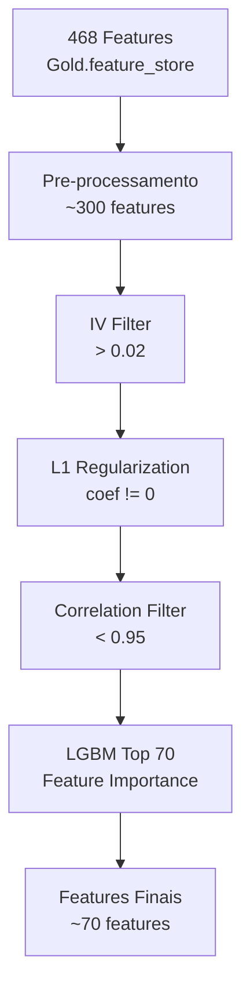

# Metodologia de Selecao de Features

> Story: HD-3.4 | Epic: EPIC-HD-001 | Entregavel: D

## 1. Pipeline de Selecao

## 2. Criterios de Selecao

### 2.1 Information Value (IV)
- Calculo WoE/IV para todas as features vs FPD
- Threshold: IV >= 0.02 (descarta features sem poder preditivo)
- Interpretacao:
  - IV < 0.02: Inutilizavel
  - 0.02 - 0.10: Fraco
  - 0.10 - 0.30: Medio
  - 0.30 - 0.50: Forte
  - IV > 0.50: Suspeita de leakage

### 2.2 L1 Regularization (Lasso)
- Logistic Regression com penalty='l1' e solver='saga'
- Features com coeficiente = 0 sao eliminadas
- C (inverso da regularizacao) calibrado via cross-validation

### 2.3 Correlation Filter
- Remove uma de cada par com correlacao Pearson > 0.95
- Criterio de desempate: mantem a feature com maior IV

### 2.4 LGBM Feature Importance
- LightGBM treinado com todas as features remanescentes
- Seleciona as top 70 por importancia (gain)
- Garante diversidade de fontes (REC_, PAG_, FAT_, cadastro)

## 3. Avaliacao de Leakage

### Features Removidas por Leakage
| Feature | Motivo | Story |
|---------|--------|-------|
| FAT_VLR_FPD | Copia direta do target (MAX(FPD)) | TD-1.1 |

### Features SCORE_RISCO — Status
| Feature | Status | Justificativa |
|---------|--------|---------------|
| REC_SCORE_RISCO | SEGURO | Usa indicadores operacionais (plataforma, status, SOS) |
| PAG_SCORE_RISCO | SEGURO | Usa indicadores de pagamento (juros, faturas abertas) |
| FAT_SCORE_RISCO | SEGURO | Usa indicadores de faturamento (WO, PDD, atraso) |

## 4. Estabilidade (PSI)
- Population Stability Index calculado por SAFRA
- Threshold: PSI < 0.25 (features estaveis)
- Features com PSI > 0.25 sinalizadas para monitoramento

---
*Hackathon PoD Academy (Claro + Oracle)*
