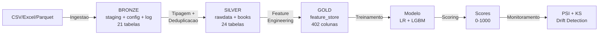
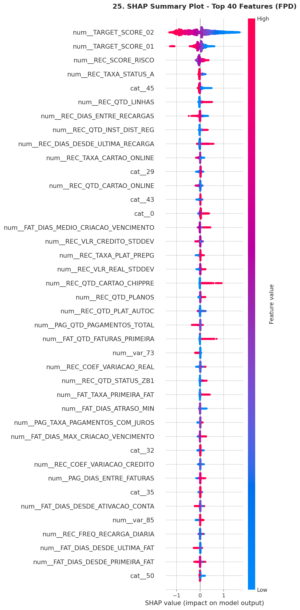

<p align="center">
  <h1 align="center">Hackathon PoD Academy — Credit Risk FPD</h1>
  <p align="center">
    Pipeline de engenharia de dados e machine learning para predicao de <strong>First Payment Default</strong> em clientes de telecomunicacoes
  </p>
  <p align="center">
    
    
    
    
    
    
    
  </p>
</p>

---

## Sobre o Projeto

Clientes migrando de planos **Pre-pago para Controle** (pos-pago) representam um risco de credito que precisa ser quantificado. Este projeto constroi um **score de risco** que prediz a probabilidade de inadimplencia no primeiro pagamento (**FPD — First Payment Default**), permitindo decisoes de credito mais assertivas.

Desenvolvido em parceria com **Claro** e **Oracle** na plataforma **Microsoft Fabric**, o pipeline processa **3.9 milhoes de registros** com **402 colunas** consolidadas (398 features) extraidas de dados transacionais, comportamentais e demograficos.

---

## Resultados do Modelo

| Modelo | KS (OOT) | AUC (OOT) | Gini (OOT) | KS (OOS) | AUC (OOS) |
|--------|----------|-----------|------------|----------|-----------|
| **LightGBM (baseline)** | **33.97%** | **0.7303** | **46.06 pp** | 35.89% | 0.7437 |
| Logistic Regression L1 | 32.77% | 0.7207 | 44.15 pp | 34.79% | 0.7347 |
| *Benchmark (Score Bureau)* | *33.10%* | *—* | *—* | *—* | *—* |

> O modelo LightGBM **supera o benchmark do Score Bureau** em 0.87 pp de KS, com estabilidade temporal validada (PSI < 0.002).

### Destaques

- **Lift 2.47x** no top decil — 52.7% de taxa de default vs 21.3% media
- **59 features** selecionadas de 398 por pipeline de 4 etapas (IV + L1 + Correlacao + LGBM)
- **PSI < 0.002** entre periodos de treino e teste (distribuicao estavel)
- **Monitoramento ativo** com alertas automaticos de drift

### Performance por Decil (Out-of-Time)

| Decil | Taxa Default | Score Medio | Lift | Acumulado Bad |
|-------|-------------|-------------|------|---------------|
| 1 (maior risco) | 52.73% | 0.525 | 2.47x | 24.7% |
| 2 | 36.98% | 0.367 | 1.73x | 42.1% |
| 3 | 29.31% | 0.286 | 1.37x | 55.8% |
| ... | ... | ... | ... | ... |
| 10 (menor risco) | 5.07% | 0.049 | 0.24x | 100% |

---

## Arquitetura

### Pipeline Medallion (Bronze → Silver → Gold)



### Feature Store

**Tabela**: `Gold.feature_store.clientes_consolidado`

| Atributo | Valor |
|----------|-------|
| Granularidade | `NUM_CPF` + `SAFRA` (YYYYMM) |
| Registros | ~3.9 milhoes |
| Colunas | 402 (90 REC_ + 94 PAG_ + 114 FAT_ + 103 base + 1 audit) |
| SAFRAs | 202410 a 202503 (6 periodos) |
| Target | FPD (First Payment Default) — binario {0, 1} |

### Composicao de Features

```
dados_cadastrais (base, 33 vars)
  |-- LEFT JOIN telco               ON (NUM_CPF, SAFRA)  → 66 vars
  |-- LEFT JOIN score_bureau_movel  ON (NUM_CPF, SAFRA)  → 2 targets
  |-- LEFT JOIN book_recarga_cmv    ON (NUM_CPF, SAFRA)  → 90 vars (REC_*)
  |-- LEFT JOIN book_pagamento      ON (NUM_CPF, SAFRA)  → 94 vars (PAG_*)
  |-- LEFT JOIN book_faturamento    ON (NUM_CPF, SAFRA)  → 114 vars (FAT_*)
```

### Visualizacoes do Modelo

<p align="center">
  
  <br><em>Painel 1 — Metricas de Performance (KS, ROC, PR, Score Distribution)</em>
</p>

<p align="center">
  
  <br><em>SHAP Beeswarm — Top 40 features por importancia</em>
</p>

---

## Estrutura do Repositorio

```
projeto-final/
│
├── README.md                          ← Voce esta aqui
│
├── src/                               # Codigo-fonte do pipeline
│   ├── ingestion/                     #   Stage 1: Ingestao (CSV → Bronze)
│   ├── metadata/                      #   Stage 2: Tipagem + Deduplicacao (Bronze → Silver)
│   ├── feature-engineering/           #   Stage 4: Feature Books (Silver → Gold)
│   └── modeling/                      #   Stage 5: Treinamento, Scoring, Monitoramento
│
├── notebooks/                         # Notebooks de analise exploratoria
│   ├── estudo_publico_alvo.ipynb      #   EDA do publico-alvo (Entregavel A)
│   └── edas/                          #   EDAs complementares
│
├── artifacts/                         # Artefatos gerados pelo modelo
│   ├── models/                        #   Modelos treinados (.pkl + MLflow)
│   │   ├── lgbm_baseline/             #     LightGBM baseline v6
│   │   └── lr_baseline/               #     Logistic Regression L1 v6
│   ├── feature_selection/             #   Features selecionadas + SHAP ranking
│   ├── monitoring/                    #   Relatorios de drift (SAFRA 202503)
│   ├── scoring/                       #   Distribuicao de scores batch
│   └── analysis/                      #   CSVs de analise + graficos PNG
│
├── docs/                              # Documentacao completa
│   ├── architecture/                  #   Arquitetura de dados + Fabric
│   ├── feature-engineering/           #   Documentacao das variaveis por book
│   ├── modeling/                      #   Metodologia + resultados + decisoes
│   ├── analytics/                     #   Estudo do publico-alvo
│   └── images/                        #   Graficos e visualizacoes
│
├── config/                            # Configuracao centralizada do pipeline
│   └── pipeline_config.py
│
├── utils/                             # Utilitarios (validacao de qualidade)
│   └── data_quality.py
│
├── schemas/                           # Metadados enriquecidos (15 JSONs)
│   └── enriched-metadata/
│
└── references/                        # Material de referencia (PDFs)
```

---

## Pipeline de Execucao

| # | Etapa | Script | Descricao |
|---|-------|--------|-----------|
| 1 | Ingestao | [`src/ingestion/ingestao-arquivos.py`](src/ingestion/ingestao-arquivos.py) | CSV/Excel/Parquet → Bronze (staging) |
| 2 | Tipagem | [`src/metadata/ajustes-tipagem-deduplicacao.py`](src/metadata/ajustes-tipagem-deduplicacao.py) | Tipagem + deduplicacao → Silver (rawdata) |
| 3 | Dimensoes | [`src/ingestion/criacao-dimensoes.py`](src/ingestion/criacao-dimensoes.py) | Tabelas dimensionais (calendario, CPF) |
| 4a | Book Recarga | [`src/feature-engineering/book_recarga_cmv.py`](src/feature-engineering/book_recarga_cmv.py) | 90 features (REC_*) |
| 4b | Book Pagamento | [`src/feature-engineering/book_pagamento.py`](src/feature-engineering/book_pagamento.py) | 94 features (PAG_*) |
| 4c | Book Faturamento | [`src/feature-engineering/book_faturamento.py`](src/feature-engineering/book_faturamento.py) | 114 features (FAT_*) |
| 4d | Consolidacao | [`src/feature-engineering/book_consolidado.py`](src/feature-engineering/book_consolidado.py) | 402 colunas consolidadas → Gold |
| 5 | Modelo | [`src/modeling/modelo_baseline.ipynb`](src/modeling/modelo_baseline.ipynb) | Treinamento LR L1 + LightGBM |
| 6 | Scoring | [`src/modeling/scoring-batch.ipynb`](src/modeling/scoring-batch.ipynb) | Scoring batch (score 0-1000) |
| 7 | Validacao | [`src/modeling/validacao-deploy.ipynb`](src/modeling/validacao-deploy.ipynb) | Validacao de deploy (KS/AUC/Gini) |
| 8 | Monitoramento | [`src/modeling/monitoramento-drift.ipynb`](src/modeling/monitoramento-drift.ipynb) | PSI drift + performance tracking |

## Modelagem

### Target

**FPD (First Payment Default)** — variavel binaria {0, 1}. Indica se o cliente deixou de pagar a primeira fatura apos migrar para plano Controle.

### Algoritmos

| Modelo | Tipo | Configuracao |
|--------|------|-------------|
| **Logistic Regression (L1)** | Baseline interpretavel | `penalty="l1"`, `solver="liblinear"`, `C=0.5`, `class_weight="balanced"` |
| **LightGBM (GBDT)** | Ensemble tree-based | `n_estimators=250`, `max_depth=4`, `learning_rate=0.05` |

### Split Temporal

| Conjunto | SAFRAs | Registros | Uso |
|----------|--------|-----------|-----|
| Treino | 202410, 202411, 202412 | ~1.35M | Treinamento do modelo |
| Validacao (OOS) | 202501 | ~450K | Validacao in-sample |
| Teste (OOT) | 202502, 202503 | ~870K | Teste temporal out-of-time |

### Selecao de Features (4 Etapas)

```
398 features → IV Filter (>0.02) → L1 Coefs (!=0) → Correlacao (<0.95) → LGBM Top 70 → 59 features finais
```

### Top 10 Features (SHAP Importance)

| # | Feature | Importancia SHAP | % Acumulado |
|---|---------|-----------------|-------------|
| 1 | TARGET_SCORE_02 | 0.5247 | 29.2% |
| 2 | TARGET_SCORE_01 | 0.1220 | 36.0% |
| 3 | REC_SCORE_RISCO | 0.0842 | 40.7% |
| 4 | REC_TAXA_STATUS_A | 0.0448 | 43.2% |
| 5 | REC_QTD_LINHAS | 0.0408 | 45.5% |
| 6 | REC_DIAS_ENTRE_RECARGAS | 0.0344 | 47.4% |
| 7 | REC_QTD_INST_DIST_REG | 0.0320 | 49.2% |
| 8 | REC_DIAS_DESDE_ULTIMA_RECARGA | 0.0310 | 50.9% |
| 9 | REC_TAXA_CARTAO_ONLINE | 0.0295 | 52.6% |
| 10 | REC_VLR_REAL_STDDEV | 0.0285 | 54.1% |

> As Top 40 features representam ~81% da importancia total do modelo.

### Controles de Qualidade

- **Leakage audit**: `FAT_VLR_FPD` identificado como copia direta do target e **removido**
- **SCORE_RISCO**: Validado como **nao-leakage** (usa indicadores operacionais WO/PDD/atraso)
- **SAFRA**: Excluida dos features para prevenir leakage temporal
- **Metricas rank-based**: KS, AUC, Gini (adequadas para dados desbalanceados)

---

## Monitoramento

Framework de monitoramento mensal com alertas automaticos:

| Metrica | Threshold Verde | Threshold Amarelo | Threshold Vermelho |
|---------|----------------|-------------------|-------------------|
| PSI Score | < 0.10 | 0.10 - 0.25 | > 0.25 |
| PSI Features | < 0.10 | 0.10 - 0.20 | > 0.20 |
| KS Drift | < 5.0 pp | — | > 5.0 pp |
| AUC Drift | < 0.03 | — | > 0.03 |

**Ultimo monitoramento (SAFRA 202503)**: Status **AMARELO** — Score PSI estavel (0.0028), porem 1 feature com drift critico (`REC_DIAS_ENTRE_RECARGAS`, PSI=1.35).

---

## Documentacao Completa

| Documento | Link | Descricao |
|-----------|------|-----------|
| Arquitetura de Dados | [`docs/architecture/data-architecture.md`](docs/architecture/data-architecture.md) | Pipeline Medallion com 5 diagramas Mermaid |
| Guia de Execucao Fabric | [`docs/architecture/guia-execucao-fabric.md`](docs/architecture/guia-execucao-fabric.md) | Configuracao e troubleshooting no Fabric |
| Book Recarga (90 vars) | [`docs/feature-engineering/book-recarga-cmv.md`](docs/feature-engineering/book-recarga-cmv.md) | Documentacao das variaveis REC_* |
| Book Pagamento (94 vars) | [`docs/feature-engineering/book-pagamento.md`](docs/feature-engineering/book-pagamento.md) | Documentacao das variaveis PAG_* |
| Book Faturamento (114 vars) | [`docs/feature-engineering/book-faturamento.md`](docs/feature-engineering/book-faturamento.md) | Documentacao das variaveis FAT_* |
| Preprocessamento | [`docs/modeling/preprocessing.md`](docs/modeling/preprocessing.md) | Pipeline de limpeza e transformacao |
| Selecao de Features | [`docs/modeling/feature-selection.md`](docs/modeling/feature-selection.md) | Estrategia de selecao em 4 etapas |
| Resultados do Modelo | [`docs/modeling/model-results.md`](docs/modeling/model-results.md) | Metricas, graficos e interpretacao |
| Analise de Swap | [`docs/modeling/swap-analysis.md`](docs/modeling/swap-analysis.md) | Estabilidade de ranking entre SAFRAs |
| Monitoramento e Drift | [`docs/modeling/monitoring.md`](docs/modeling/monitoring.md) | Framework de monitoramento e alertas |
| Decisoes Tecnicas | [`docs/technical-decisions.md`](docs/technical-decisions.md) | Registro de decisoes arquiteturais |
| Estudo Publico-Alvo | [`docs/analytics/estudo-publico-alvo.md`](docs/analytics/estudo-publico-alvo.md) | EDA com perfil do publico |

---

## Tecnologias

| Componente | Tecnologia |
|-----------|-----------|
| Plataforma | Microsoft Fabric |
| Storage | Delta Lake (OneLake) |
| Processamento | PySpark 3.x |
| ML Framework | scikit-learn 1.3.2, LightGBM |
| Experiment Tracking | MLflow 2.12.2 |
| Linguagem | Python 3.x |
| Formato de Dados | Delta, Parquet, CSV, Excel |

## Volumes de Dados

| Fonte | Registros Brutos |
|-------|-----------------|
| Recarga | 99.9M transacoes |
| Pagamento | 27.9M transacoes |
| Faturamento | 32.7M registros |
| Feature Store (Gold) | 3.9M (NUM_CPF x SAFRA) |

---

## Como Executar

### Pre-requisitos

- Workspace Microsoft Fabric com 3 Lakehouses configurados
- Spark Runtime 3.x com PySpark
- MLflow habilitado no workspace
- Arquivos fonte carregados na pasta `Files/` do Bronze Lakehouse

### Configuracao Centralizada

Todos os scripts importam de [`config/pipeline_config.py`](config/pipeline_config.py):

```python
from config.pipeline_config import (
    BRONZE_BASE, SILVER_BASE, GOLD_BASE,
    PATH_FEATURE_STORE,
    SAFRAS,
    EXPERIMENT_NAME,
    TARGET_COLUMNS,
    LEAKAGE_BLACKLIST,
)
```

### Ordem de Execucao

```bash
# 1. Ingestao (→ Bronze)
executar: src/ingestion/ingestao-arquivos.py

# 2. Tipagem + Deduplicacao (→ Silver)
executar: src/metadata/ajustes-tipagem-deduplicacao.py

# 3. Dimensoes
executar: src/ingestion/criacao-dimensoes.py

# 4. Feature Engineering (→ Silver.book → Gold)
executar: src/feature-engineering/book_recarga_cmv.py
executar: src/feature-engineering/book_pagamento.py
executar: src/feature-engineering/book_faturamento.py
executar: src/feature-engineering/book_consolidado.py

# 5. Modelagem + Deploy
executar: src/modeling/modelo_baseline.ipynb
executar: src/modeling/scoring-batch.ipynb
executar: src/modeling/validacao-deploy.ipynb

# 6. Monitoramento (mensal)
executar: src/modeling/monitoramento-drift.ipynb
```

> Para o guia completo de configuracao no Fabric, veja **[docs/architecture/guia-execucao-fabric.md](docs/architecture/guia-execucao-fabric.md)**.

---

<p align="center">
  <strong>Hackathon PoD Academy</strong> | Claro + Oracle | Microsoft Fabric
</p>
