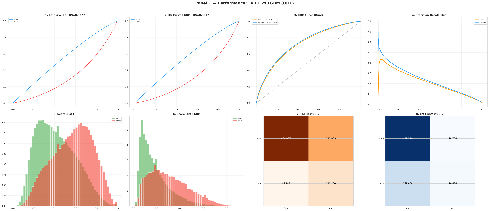
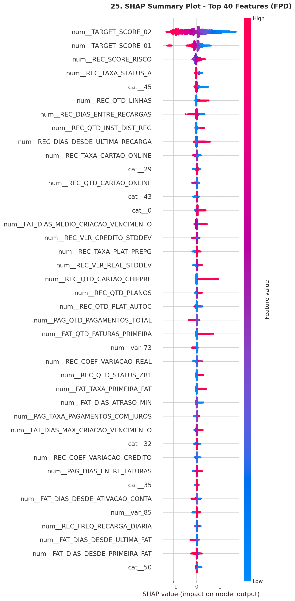
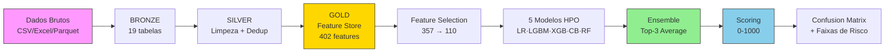

<p align="center">
  <h1 align="center">Hackathon PoD Academy — Credit Risk FPD</h1>
  <p align="center">
    Pipeline de engenharia de dados e machine learning para predicao de <strong>First Payment Default</strong> em clientes de telecomunicacoes
  </p>
  <p align="center">
    
    
    
    
    
    
    
    
    
    
  </p>
</p>

---

## Sobre o Projeto

Clientes migrando de planos **Pre-pago para Controle** (pos-pago) representam um risco de credito que precisa ser quantificado. Este projeto constroi um **score de risco** que prediz a probabilidade de inadimplencia no primeiro pagamento (**FPD — First Payment Default**), permitindo decisoes de credito mais assertivas.

Desenvolvido em parceria com **Claro** e **Oracle**, o projeto apresenta **duas arquiteturas completas** que processam **3.9 milhoes de registros** com **402+ features** extraidas de dados transacionais, comportamentais e demograficos. A plataforma OCI treina **5 modelos com hiperparametros otimizados (HPO)** e seleciona um **ensemble champion** (Top-3 Average) que supera qualquer modelo individual.

---

## Resultados Alcancados

### Ensemble Champion — Top-3 Average (LightGBM + XGBoost + CatBoost)

| Metrica | Valor |
|---------|-------|
| **KS OOT** | **0.3501** |
| **AUC OOT** | **0.7368** |
| **Gini OOT** | **47.35%** |
| **PSI** | **0.000754** |

### Performance dos 5 Modelos + Ensemble

| Modelo | KS OOT | AUC OOT | Gini OOT | PSI |
|--------|--------|---------|----------|-----|
| LR L1 v2 | 0.3314 | 0.7231 | 44.62% | 0.001361 |
| LightGBM v2 (HPO) | 0.3494 | 0.7365 | 47.29% | 0.000933 |
| XGBoost (HPO) | 0.3494 | 0.7362 | 47.24% | 0.000817 |
| CatBoost (HPO) | 0.3482 | 0.7354 | 47.08% | 0.000563 |
| Random Forest | 0.3370 | 0.7278 | 45.56% | 0.001209 |
| **Ensemble Top-3 Avg** | **0.3501** | **0.7368** | **47.35%** | **0.000754** |

### Confusion Matrix (Cutoff 700)

| Metrica | Valor |
|---------|-------|
| Precision | 93,13% |
| Recall (Sensibilidade) | 40,33% |
| Specificity | 88,99% |
| F1-Score | 56,28% |
| Aprovados | 919.274 (34,1%) |
| FPD rate aprovados | 6,87% |

### Faixas de Risco

| Faixa | Score | Clientes | FPD |
|-------|-------|----------|-----|
| CRITICO | 0–299 | 206.535 | 59,2% |
| ALTO | 300–499 | 652.566 | 34,8% |
| MEDIO | 500–699 | 918.246 | 17,5% |
| BAIXO | 700–1000 | 919.274 | 6,9% |

### Impacto Financeiro

| Indicador | Valor |
|-----------|-------|
| **Economia de perda (cutoff 700)** | **R$ 22,9M** |
| Reducao de FPD | 21,3% → 6,9% (-68%) |
| ROI vs infra OCI | > 11.000x (~R$ 168/mes) |
| Gain top 10% | 26,4% dos inadimplentes (lift 2,64x) |
| Gain top 30% | 58,7% dos inadimplentes |

### Quality Gate QG-05

| Criterio | Threshold | Resultado | Status |
|----------|-----------|-----------|--------|
| KS OOT | > 0.20 | 0.3501 | PASS |
| AUC OOT | > 0.65 | 0.7368 | PASS |
| Gini OOT | > 30% | 47.35% | PASS |
| PSI | < 0.25 | 0.000754 | PASS |

### Visualizacoes do Modelo

<p align="center">
  
  <br><em>Painel 1 — Metricas de Performance (KS, ROC, PR, Score Distribution)</em>
</p>

<p align="center">
  
  <br><em>SHAP Beeswarm — Top 40 features por importancia</em>
</p>

---

## Arquiteturas

O projeto implementa o pipeline de credit risk em duas plataformas cloud, demonstrando portabilidade e evolucao:

| | Microsoft Fabric | Oracle Cloud (OCI) |
|---|---|---|
| **Pipeline** | Medallion (Bronze/Silver/Gold) via PySpark + Delta Lake | Medallion via Object Storage + E3.Flex VM |
| **Feature Store** | `Gold.feature_store.clientes_consolidado` | Object Storage (Parquet) + ADW |
| **Modelos** | LR L1 + LightGBM (MLflow) | 5 modelos HPO + Ensemble Champion |
| **Infra** | Workspace Fabric (PaaS) | Terraform IaC (8 modulos) + Airflow |
| **Orchestracao** | Manual (notebooks) | 2 Airflow DAGs (Data + ML) |
| **Deploy** | Scoring batch via notebook | 6 ScoringPipeline PKLs self-contained |
| **Detalhes** | [`fabric/README.md`](fabric/README.md) | [`oci-oracle-cloud/README.md`](oci-oracle-cloud/README.md) |


```mermaid
graph LR
    A[Dados Brutos<br/>CSV/Excel/Parquet] --> B[BRONZE<br/>19 tabelas]
    B --> C[SILVER<br/>Limpeza + Dedup]
    C --> D[GOLD<br/>Feature Store<br/>402 features]
    D --> E[Feature Selection<br/>357 → 110]
    E --> F[5 Modelos HPO<br/>LR·LGBM·XGB·CB·RF]
    F --> G[Ensemble<br/>Top-3 Average]
    G --> H[Scoring<br/>0-1000]
    H --> I[Confusion Matrix<br/>+ Faixas de Risco]

    style A fill:#f9f,stroke:#333
    style D fill:#ffd700,stroke:#333
    style G fill:#90ee90,stroke:#333
    style H fill:#87ceeb,stroke:#333
```

---

## Estrutura do Repositorio

```
projeto-final/
├── oci-oracle-cloud/              # Entrega oficial OCI (producao)
│   ├── scripts/                   #   10 scripts Python de producao
│   ├── artifacts/                 #   Modelos, metricas, plots (Run 20260311)
│   ├── infrastructure/            #   Terraform, Airflow DAGs, ADW, APEX
│   ├── deliverable/               #   6 ScoringPipeline PKLs self-contained
│   ├── research/                  #   Pesquisa: 6 fases (diagnostic → production)
│   ├── notebooks/                 #   12 Jupyter notebooks
│   └── docs/                      #   Arquitetura, modelo, operacoes, pipeline
│
├── fabric/                        # Microsoft Fabric (pipeline original)
│   ├── src/                       #   Codigo-fonte (ingestao, tipagem, features, modelo)
│   ├── notebooks/                 #   EDAs e analise exploratoria
│   ├── config/                    #   Configuracao centralizada
│   ├── artifacts/                 #   Modelos treinados, metricas, plots
│   ├── schemas/                   #   DDLs + metadados enriquecidos
│   └── docs/                      #   Arquitetura, features, modelagem
│
├── _legacy/                       # Versoes anteriores (oci/, oci-project/, oci-final/)
│
├── 1-ingestao-dados/              # Notebooks Fabric — Ingestao
├── 2-metadados/                   # Notebooks Fabric — Tipagem + Dedup
├── 3-edas/                        # Notebooks Fabric — EDA
├── 4-construcao-books/            # Notebooks Fabric — Feature Engineering
│
├── docs/                          # Documentacao compartilhada
├── squads/                        # Squads de agentes AI (Synkra AIOS)
├── references/                    # Referencias e materiais de apoio
├── README.md                      # <- Voce esta aqui
└── LICENSE
```

---

## Pipeline de Execucao (Fabric)

| # | Etapa | Script | Descricao |
|---|-------|--------|-----------|
| 1 | Ingestao | [`fabric/src/ingestion/ingestao-arquivos.py`](fabric/src/ingestion/ingestao-arquivos.py) | CSV/Excel/Parquet → Bronze |
| 2 | Tipagem | [`fabric/src/metadata/ajustes-tipagem-deduplicacao.py`](fabric/src/metadata/ajustes-tipagem-deduplicacao.py) | Tipagem + dedup → Silver |
| 3 | Dimensoes | [`fabric/src/ingestion/criacao-dimensoes.py`](fabric/src/ingestion/criacao-dimensoes.py) | Tabelas dimensionais |
| 4 | Features | [`fabric/src/feature-engineering/`](fabric/src/feature-engineering/) | Books recarga, pagamento, faturamento → Gold |
| 5 | Modelo | [`fabric/src/modeling/modelo_baseline.ipynb`](fabric/src/modeling/modelo_baseline.ipynb) | LR L1 + LightGBM |
| 6 | Scoring | [`fabric/src/modeling/scoring-batch.ipynb`](fabric/src/modeling/scoring-batch.ipynb) | Scoring batch (0-1000) |
| 7 | Monitor | [`fabric/src/modeling/monitoramento-drift.ipynb`](fabric/src/modeling/monitoramento-drift.ipynb) | PSI + drift detection |

## Pipeline de Execucao (OCI)

| # | Etapa | Script | Descricao |
|---|-------|--------|-----------|
| 1 | Data Quality | [`oci-oracle-cloud/scripts/data_quality.py`](oci-oracle-cloud/scripts/data_quality.py) | Validacao Bronze/Silver/Gold |
| 2 | Feature Selection | [`oci-oracle-cloud/scripts/feature_selection.py`](oci-oracle-cloud/scripts/feature_selection.py) | Funnel 5 estagios (357 → 110 features) |
| 3 | Treinamento | [`oci-oracle-cloud/scripts/train_credit_risk.py`](oci-oracle-cloud/scripts/train_credit_risk.py) | 5 modelos com HPO |
| 4 | Ensemble | [`oci-oracle-cloud/scripts/ensemble.py`](oci-oracle-cloud/scripts/ensemble.py) | 3 estrategias, selecao champion |
| 5 | Scoring | [`oci-oracle-cloud/scripts/batch_scoring.py`](oci-oracle-cloud/scripts/batch_scoring.py) | Scoring batch (3.9M clientes) |
| 6 | Monitoring | [`oci-oracle-cloud/scripts/monitoring.py`](oci-oracle-cloud/scripts/monitoring.py) | PSI, drift, backtesting |
| 7 | Confusion Matrix | [`oci-oracle-cloud/scripts/confusion_matrix_analysis.py`](oci-oracle-cloud/scripts/confusion_matrix_analysis.py) | Analise por cutoff + faixas de risco |
| 8 | Swap Analysis | [`oci-oracle-cloud/scripts/swap_analysis.py`](oci-oracle-cloud/scripts/swap_analysis.py) | Swap-in/swap-out por cutoff |

**Orquestracao**: 2 Airflow DAGs — [`credit_risk_data_pipeline`](oci-oracle-cloud/infrastructure/dags/credit_risk_data_pipeline.py) (Bronze → Silver → Gold) e [`credit_risk_ml_pipeline`](oci-oracle-cloud/infrastructure/dags/credit_risk_ml_pipeline.py) (FS → Train → Ensemble → Score → Monitor)

---

## Pesquisa e Desenvolvimento

O projeto inclui uma fase de pesquisa estruturada em **6 etapas**, documentada em [`oci-oracle-cloud/research/`](oci-oracle-cloud/research/):

| Fase | Descricao |
|------|-----------|
| 01 - Diagnostic | Analise exploratoria, correlacoes, estabilidade |
| 02 - Feature Engineering | Interacoes, ratios, PCA, transformacoes nao-lineares |
| 03 - HPO | Otimizacao de hiperparametros (Optuna) para LGBM, XGBoost, CatBoost |
| 04 - Models | Treinamento multi-modelo, analise de diversidade |
| 05 - Ensemble | Blend, stack, selecao de ensemble |
| 06 - Production | Avaliacao final, scorecard, MODEL_CARD |

---

## Tecnologias

| Componente | Fabric | OCI |
|------------|--------|-----|
| Plataforma | Microsoft Fabric | Oracle Cloud Infrastructure |
| Storage | Delta Lake (OneLake) | Object Storage + ADW |
| Processamento | PySpark 3.x | PyArrow + Pandas (E3.Flex VM) |
| ML | scikit-learn, LightGBM | scikit-learn, LightGBM, XGBoost, CatBoost, Optuna |
| Orchestracao | Manual | Apache Airflow (Docker Compose) |
| Tracking | MLflow 2.12.2 | JSON artifacts + PKL pipelines |
| IaC | N/A (PaaS) | Terraform (8 modulos) |
| Deploy | Notebook batch | 6 ScoringPipeline PKLs |
| Dashboard | N/A | APEX (ADW Always Free) |

## Volumes de Dados

| Fonte | Registros Brutos |
|-------|------------------|
| Recarga | 99.9M transacoes |
| Pagamento | 27.9M transacoes |
| Faturamento | 32.7M registros |
| Feature Store (Gold) | 3.9M (NUM_CPF x SAFRA) |

---

## Documentacao

| Documento | Link |
|-----------|------|
| Pipeline Fabric | [`fabric/README.md`](fabric/README.md) |
| Pipeline OCI | [`oci-oracle-cloud/README.md`](oci-oracle-cloud/README.md) |
| Guia de Execucao OCI | [`oci-oracle-cloud/EXECUTION-GUIDE.md`](oci-oracle-cloud/EXECUTION-GUIDE.md) |
| Arquitetura de Dados | [`fabric/docs/architecture/data-architecture.md`](fabric/docs/architecture/data-architecture.md) |
| Feature Engineering | [`fabric/docs/feature-engineering/`](fabric/docs/feature-engineering/) |
| Resultados do Modelo | [`fabric/docs/modeling/model-results.md`](fabric/docs/modeling/model-results.md) |
| Decisoes Tecnicas | [`fabric/docs/technical-decisions.md`](fabric/docs/technical-decisions.md) |
| Confusion Matrix Analysis | [`oci-oracle-cloud/docs/model/confusion-matrix-analysis.md`](oci-oracle-cloud/docs/model/confusion-matrix-analysis.md) |
| Analise de Valor Financeiro | [`oci-oracle-cloud/docs/model/business-value-analysis.md`](oci-oracle-cloud/docs/model/business-value-analysis.md) |
| Selecao do Ensemble | [`oci-oracle-cloud/docs/model/ensemble-selection.md`](oci-oracle-cloud/docs/model/ensemble-selection.md) |
| Swap Analysis | [`oci-oracle-cloud/docs/model/swap-analysis.md`](oci-oracle-cloud/docs/model/swap-analysis.md) |
| Pesquisa (6 fases) | [`oci-oracle-cloud/research/README.md`](oci-oracle-cloud/research/README.md) |
| Artefatos OCI | [`oci-oracle-cloud/artifacts/README.md`](oci-oracle-cloud/artifacts/README.md) |
| OCI Operations Runbook | [`oci-oracle-cloud/docs/operations/`](oci-oracle-cloud/docs/operations/) |
| Apresentacao | [`docs/presentation/`](docs/presentation/) |

---

<p align="center">
  <strong>Hackathon PoD Academy</strong> | Claro + Oracle | Microsoft Fabric + OCI
</p>
