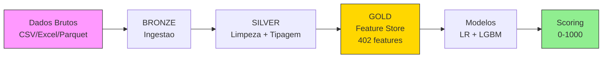

<p align="center">
  <h1 align="center">Hackathon PoD Academy — Credit Risk FPD</h1>
  <p align="center">
    Pipeline de engenharia de dados e machine learning para predicao de <strong>First Payment Default</strong> em clientes de telecomunicacoes
  </p>
  <p align="center">
    
    
    
    
    
    
    
  </p>
</p>

---

## Sobre o Projeto

Clientes migrando de planos **Pre-pago para Controle** (pos-pago) representam um risco de credito que precisa ser quantificado. Este projeto constroi um **score de risco** que prediz a probabilidade de inadimplencia no primeiro pagamento (**FPD — First Payment Default**), permitindo decisoes de credito mais assertivas.

Desenvolvido em parceria com **Claro** e **Oracle**, o projeto apresenta **duas arquiteturas completas** que processam **3.9 milhoes de registros** com **402+ features** extraidas de dados transacionais, comportamentais e demograficos.

---

## Arquiteturas

O projeto implementa o pipeline de credit risk em duas plataformas cloud, demonstrando portabilidade e evolucao:

| | Microsoft Fabric | Oracle Cloud (OCI) |
|---|---|---|
| **Pipeline** | Medallion (Bronze/Silver/Gold) via PySpark + Delta Lake | Medallion via Data Flow (Spark) + Object Storage + ADW |
| **Feature Store** | `Gold.feature_store.clientes_consolidado` | Autonomous Data Warehouse |
| **Modelos** | LR L1 + LightGBM (MLflow) | LR L1 + LightGBM (local + OCI Data Science) |
| **Infra** | Workspace Fabric (PaaS) | Terraform IaC — 7 modulos, 43 recursos (IaaS/PaaS) |
| **Deploy** | Scoring batch via notebook | Container Docker-ready + endpoint REST |
| **Detalhes** | [`fabric/README.md`](fabric/README.md) | [`oci/README.md`](oci/README.md) |


```mermaid
graph LR
    A[Dados Brutos<br/>CSV/Excel/Parquet] --> B[BRONZE<br/>Ingestao]
    B --> C[SILVER<br/>Limpeza + Tipagem]
    C --> D[GOLD<br/>Feature Store<br/>402 features]
    D --> E[Modelos<br/>LR + LGBM]
    E --> F[Scoring<br/>0-1000]

    style A fill:#f9f,stroke:#333
    style D fill:#ffd700,stroke:#333
    style F fill:#90ee90,stroke:#333
```

---

## Resultados do Modelo

| Modelo | KS (OOT) | AUC (OOT) | Gini (OOT) | KS (OOS) | AUC (OOS) |
|--------|-----------|-----------|-------------|----------|-----------|
| **LightGBM (baseline)** | **33.97%** | **0.7303** | **46.06 pp** | 35.89% | 0.7437 |
| Logistic Regression L1 | 32.77% | 0.7207 | 44.15 pp | 34.79% | 0.7347 |
| *Benchmark (Score Bureau)* | *33.10%* | *—* | *—* | *—* | *—* |

> O modelo LightGBM **supera o benchmark do Score Bureau** em 0.87 pp de KS, com estabilidade temporal validada (PSI < 0.002).

### Destaques

- **Lift 2.47x** no top decil — 52.7% de taxa de default vs 21.3% media
- **59 features** selecionadas de 398 por pipeline de 4 etapas (IV + L1 + Correlacao + LGBM)
- **PSI < 0.002** entre periodos de treino e teste (distribuicao estavel)
- **Paridade OCI 100%** — 10/10 metricas PASS, pipeline portado com Terraform IaC (R$ 171 acumulado / US$ 500 trial credit)

### Visualizacoes do Modelo

<p align="center">
  
  <br><em>Painel 1 — Metricas de Performance (KS, ROC, PR, Score Distribution)</em>
</p>

<p align="center">
  
  <br><em>SHAP Beeswarm — Top 40 features por importancia</em>
</p>

---

## Estrutura do Repositorio

```
projeto-final/
├── fabric/                    # Microsoft Fabric (pipeline original)
│   ├── src/                   #   Codigo-fonte (ingestao, tipagem, features, modelo)
│   ├── notebooks/             #   EDAs e analise exploratoria
│   ├── config/                #   Configuracao centralizada
│   ├── artifacts/             #   Modelos treinados, metricas, plots
│   ├── schemas/               #   DDLs + metadados enriquecidos
│   └── docs/                  #   Arquitetura, features, modelagem
│
├── oci/                       # Oracle Cloud Infrastructure (evolucao cloud-native)
│   ├── infrastructure/        #   Terraform IaC (7 modulos) + ops scripts
│   ├── pipeline/              #   ETL: ingest_bronze, transform_silver, engineer_gold
│   ├── model/                 #   train, evaluate, scoring, deploy, monitor, OCI metrics
│   ├── infrastructure/apex/   #   Dashboard ORDS ao vivo (Chart.js, dark theme, 3 paginas)
│   ├── artifacts/             #   Modelos OCI (.pkl) + metricas + monitoring
│   ├── deliverable/           #   Entregavel: scoring Docker-ready
│   └── docs/                  #   PRD, reports, runbook, cost dashboard
│
├── docs/                      # Documentacao compartilhada
│   ├── presentation/          #   Apresentacao do hackathon
│   └── report.html            #   Relatorio consolidado
│
├── README.md                  # <- Voce esta aqui
└── LICENSE
```

---

## Pipeline de Execucao (Fabric)

| # | Etapa | Script | Descricao |
|---|-------|--------|-----------|
| 1 | Ingestao | [`fabric/src/ingestion/ingestao-arquivos.py`](fabric/src/ingestion/ingestao-arquivos.py) | CSV/Excel/Parquet → Bronze |
| 2 | Tipagem | [`fabric/src/metadata/ajustes-tipagem-deduplicacao.py`](fabric/src/metadata/ajustes-tipagem-deduplicacao.py) | Tipagem + dedup → Silver |
| 3 | Dimensoes | [`fabric/src/ingestion/criacao-dimensoes.py`](fabric/src/ingestion/criacao-dimensoes.py) | Tabelas dimensionais |
| 4 | Features | [`fabric/src/feature-engineering/`](fabric/src/feature-engineering/) | Books recarga, pagamento, faturamento → Gold |
| 5 | Modelo | [`fabric/src/modeling/modelo_baseline.ipynb`](fabric/src/modeling/modelo_baseline.ipynb) | LR L1 + LightGBM |
| 6 | Scoring | [`fabric/src/modeling/scoring-batch.ipynb`](fabric/src/modeling/scoring-batch.ipynb) | Scoring batch (0-1000) |
| 7 | Monitor | [`fabric/src/modeling/monitoramento-drift.ipynb`](fabric/src/modeling/monitoramento-drift.ipynb) | PSI + drift detection |

## Pipeline de Execucao (OCI)

| # | Etapa | Script | Descricao |
|---|-------|--------|-----------|
| 0 | Infra | [`oci/infrastructure/terraform/`](oci/infrastructure/terraform/) | `terraform apply` — provisiona toda a infra (7 modulos, 43 recursos) |
| 1 | Bronze | [`oci/pipeline/ingest_bronze.py`](oci/pipeline/ingest_bronze.py) | Ingestao → Object Storage |
| 2 | Silver | [`oci/pipeline/transform_silver.py`](oci/pipeline/transform_silver.py) | Transformacao via Data Flow |
| 3 | Gold | [`oci/pipeline/engineer_gold.py`](oci/pipeline/engineer_gold.py) | Feature engineering → ADW |
| 4 | Modelo | [`oci/model/train_credit_risk.py`](oci/model/train_credit_risk.py) | Treinamento LR + LGBM |
| 5 | Deploy | [`oci/model/deploy_endpoint.py`](oci/model/deploy_endpoint.py) | Endpoint REST |
| 6 | Monitor | [`oci/model/monitor_model.py`](oci/model/monitor_model.py) | PSI + feature drift monitoring |
| 7 | Dashboard | [`oci/infrastructure/apex/`](oci/infrastructure/apex/) | [Dashboard ORDS ao vivo](https://G95D3985BD0D2FD-PODACADEMY.adb.sa-saopaulo-1.oraclecloudapps.com/ords/mlmonitor/dashboard/) — KPIs, charts, custos |

---

## Tecnologias

| Componente | Fabric | OCI |
|------------|--------|-----|
| Plataforma | Microsoft Fabric | Oracle Cloud Infrastructure |
| Storage | Delta Lake (OneLake) | Object Storage + ADW |
| Processamento | PySpark 3.x | OCI Data Flow (Spark) |
| ML | scikit-learn, LightGBM | scikit-learn, LightGBM |
| Tracking | MLflow 2.12.2 | Local artifacts |
| IaC | N/A (PaaS) | Terraform (7 modulos, 43 recursos) |
| Deploy | Notebook batch | Docker container |

## Volumes de Dados

| Fonte | Registros Brutos |
|-------|------------------|
| Recarga | 99.9M transacoes |
| Pagamento | 27.9M transacoes |
| Faturamento | 32.7M registros |
| Feature Store (Gold) | 3.9M (NUM_CPF x SAFRA) |

---

## Documentacao

| Documento | Link |
|-----------|------|
| Pipeline Fabric | [`fabric/README.md`](fabric/README.md) |
| Pipeline OCI | [`oci/README.md`](oci/README.md) |
| Arquitetura de Dados | [`fabric/docs/architecture/data-architecture.md`](fabric/docs/architecture/data-architecture.md) |
| Feature Engineering | [`fabric/docs/feature-engineering/`](fabric/docs/feature-engineering/) |
| Resultados do Modelo | [`fabric/docs/modeling/model-results.md`](fabric/docs/modeling/model-results.md) |
| Decisoes Tecnicas | [`fabric/docs/technical-decisions.md`](fabric/docs/technical-decisions.md) |
| OCI Validation Report | [`oci/docs/oci-e2e-validation-report.md`](oci/docs/oci-e2e-validation-report.md) |
| OCI Operations Runbook | [`oci/docs/operations-runbook.md`](oci/docs/operations-runbook.md) |
| OCI Cost Dashboard | [`oci/docs/cost-dashboard.md`](oci/docs/cost-dashboard.md) |
| OCI Documentation Package | [`oci/docs/final-documentation-package.md`](oci/docs/final-documentation-package.md) |
| Apresentacao | [`docs/presentation/`](docs/presentation/) |

---

<p align="center">
  <strong>Hackathon PoD Academy</strong> | Claro + Oracle | Microsoft Fabric + OCI
</p>
