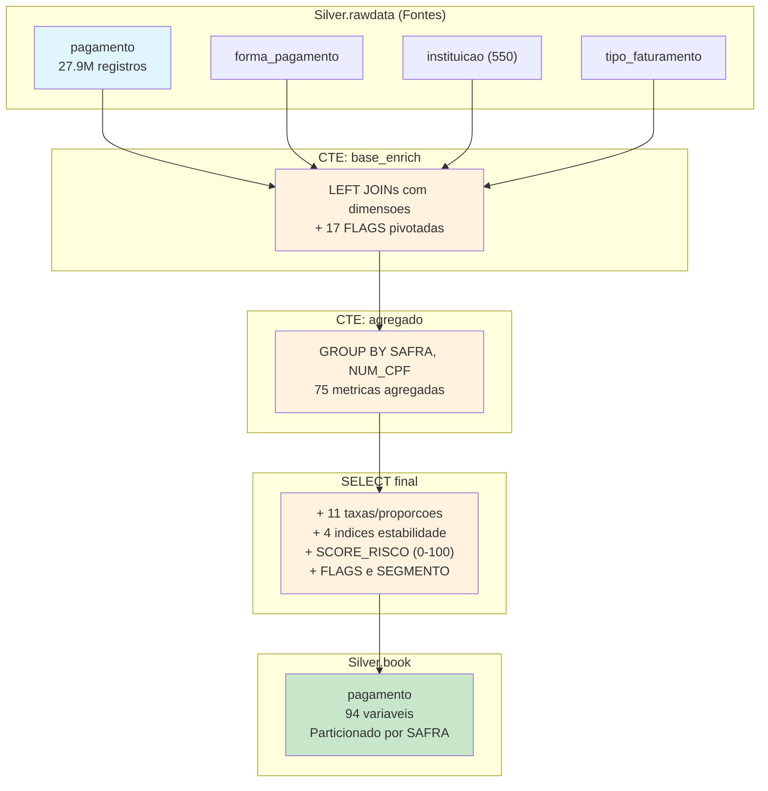

# Book de Variaveis — Pagamento

> **Story**: HD-2.2 | **Epic**: EPIC-HD-001 | **Entregavel**: B (Documentacao de Variaveis)
> **Prefixo**: `PAG_` (no book consolidado) | **Total**: 94 variaveis
> **Granularidade**: `NUM_CPF` + `SAFRA` (YYYYMM)

## 1. Visao Geral

O Book de Pagamento agrega dados transacionais de pagamento de faturas de clientes Claro, enriquecidos com 3 tabelas dimensionais. Gera **94 variaveis comportamentais** para o modelo de risco de inadimplencia (FPD), cobrindo volumetria, valores financeiros, pivots por status de pagamento/fatura/forma/tipo/alocacao, metricas temporais, dados dimensionais, taxas, indices de estabilidade e scores de risco.

### Dados de Origem

| Tabela | Tipo | Registros | Descricao |
|--------|------|-----------|-----------|
| `Silver.rawdata.pagamento` | Fato | 27.948.583 | Transacoes de pagamento (76 colunas) |
| `Silver.rawdata.forma_pagamento` | Dimensao | — | Forma de pagamento |
| `Silver.rawdata.instituicao` | Dimensao | 550 | Instituicoes (11 tipos) |
| `Silver.rawdata.tipo_faturamento` | Dimensao | — | Tipo de faturamento |

### Output

- **Tabela**: `Silver.book.pagamento`
- **Particionamento**: `SAFRA` (202410, 202411, 202412, 202501, 202502, 202503)
- **Filtro temporal**: `DAT_STATUS_FATURA < data_cutoff` (1o dia da safra)

---

## 2. Fluxo de Construcao



---

## 3. Dicionario Completo de Variaveis (154)

### 3.1 Chaves e Controle (3 variaveis)

| # | Variavel | Tipo | Descricao |
|---|----------|------|-----------|
| 1 | `SAFRA` | INT | Periodo de referencia (YYYYMM) |
| 2 | `NUM_CPF` | STRING | CPF mascarado do cliente |
| 3 | `DT_PROCESSAMENTO` | TIMESTAMP | Data/hora de geracao do book |

### 3.2 Volumetria (8 variaveis)

| # | Variavel | Tipo | Agregacao | Descricao |
|---|----------|------|-----------|-----------|
| 4 | `QTD_PAGAMENTOS_TOTAL` | BIGINT | COUNT(*) | Total de transacoes de pagamento |
| 5 | `QTD_CONTRATOS` | BIGINT | COUNT(DISTINCT CONTRATO) | Quantidade de contratos distintos |
| 6 | `QTD_FATURAS_DISTINTAS` | BIGINT | COUNT(DISTINCT SEQ_FATURA) | Faturas distintas |
| 7 | `QTD_FORMAS_PAGAMENTO` | BIGINT | COUNT(DISTINCT DW_FORMA_PAGAMENTO) | Formas de pagamento distintas |
| 8 | `QTD_BANCOS` | BIGINT | COUNT(DISTINCT DW_BANCO) | Bancos/instituicoes distintos |
| 9 | `QTD_TIPOS_FATURA` | BIGINT | COUNT(DISTINCT DW_TIPO_FATURA) | Tipos de fatura distintos |
| 10 | `QTD_UN_NEGOCIOS` | BIGINT | COUNT(DISTINCT DW_UN_NEGOCIO) | Unidades de negocio distintas |
| 11 | `QTD_AREAS` | BIGINT | COUNT(DISTINCT DW_AREA) | Areas distintas |

### 3.3 Valores Financeiros (20 variaveis)

| # | Variavel | Tipo | Agregacao | Descricao |
|---|----------|------|-----------|-----------|
| 12 | `VLR_PAGAMENTO_FATURA_TOTAL` | DOUBLE | SUM(VAL_PAGAMENTO_FATURA) | Valor total de pagamentos de fatura |
| 13 | `VLR_PAGAMENTO_FATURA_MEDIO` | DOUBLE | AVG(VAL_PAGAMENTO_FATURA) | Valor medio de pagamento de fatura |
| 14 | `VLR_PAGAMENTO_FATURA_MAX` | DOUBLE | MAX(VAL_PAGAMENTO_FATURA) | Maior valor de pagamento de fatura |
| 15 | `VLR_PAGAMENTO_FATURA_STDDEV` | DOUBLE | STDDEV(VAL_PAGAMENTO_FATURA) | Desvio padrao dos pagamentos de fatura |
| 16 | `VLR_PAGAMENTO_ITEM_TOTAL` | DOUBLE | SUM(VAL_PAGAMENTO_ITEM) | Valor total de pagamento de itens |
| 17 | `VLR_PAGAMENTO_ITEM_MEDIO` | DOUBLE | AVG(VAL_PAGAMENTO_ITEM) | Valor medio de pagamento de itens |
| 18 | `VLR_PAGAMENTO_CREDITO_TOTAL` | DOUBLE | SUM(VAL_PAGAMENTO_CREDITO) | Valor total de pagamento de credito |
| 19 | `VLR_PAGAMENTO_CREDITO_MEDIO` | DOUBLE | AVG(VAL_PAGAMENTO_CREDITO) | Valor medio de pagamento de credito |
| 20 | `VLR_PAGAMENTO_CREDITO_MAX` | DOUBLE | MAX(VAL_PAGAMENTO_CREDITO) | Maior valor de pagamento de credito |
| 21 | `VLR_ATUAL_PAGAMENTO_TOTAL` | DOUBLE | SUM(VAL_ATUAL_PAGAMENTO) | Valor atual total dos pagamentos |
| 22 | `VLR_ATUAL_PAGAMENTO_MEDIO` | DOUBLE | AVG(VAL_ATUAL_PAGAMENTO) | Valor atual medio dos pagamentos |
| 23 | `VLR_ORIGINAL_PAGAMENTO_TOTAL` | DOUBLE | SUM(VAL_ORIGINAL_PAGAMENTO) | Valor original total dos pagamentos |
| 24 | `VLR_ORIGINAL_PAGAMENTO_MEDIO` | DOUBLE | AVG(VAL_ORIGINAL_PAGAMENTO) | Valor original medio dos pagamentos |
| 25 | `VLR_BAIXA_ATIVIDADE_TOTAL` | DOUBLE | SUM(VAL_BAIXA_ATIVIDADE) | Valor total de baixa de atividade |
| 26 | `VLR_BAIXA_ATIVIDADE_MEDIO` | DOUBLE | AVG(VAL_BAIXA_ATIVIDADE) | Valor medio de baixa de atividade |
| 27 | `VLR_JUROS_MULTAS_TOTAL` | DOUBLE | SUM(VAL_JUROS_MULTAS_ITEM) | Valor total de juros e multas |
| 28 | `VLR_JUROS_MULTAS_MEDIO` | DOUBLE | AVG(VAL_JUROS_MULTAS_ITEM) | Valor medio de juros e multas |
| 29 | `VLR_JUROS_MULTAS_MAX` | DOUBLE | MAX(VAL_JUROS_MULTAS_ITEM) | Maior valor de juros e multas |
| 30 | `QTD_PAGAMENTOS_COM_JUROS` | BIGINT | COUNT(WHEN > 0) | Pagamentos com juros/multas positivos |
| 31 | `VLR_MULTA_EQUIP_TOTAL` | DOUBLE | SUM(VAL_MULTA_EQUIP_ITEM) | Valor total de multas de equipamento |
| 32 | `QTD_MULTAS_EQUIP` | BIGINT | COUNT(WHEN > 0) | Pagamentos com multa de equipamento |

> **Nota**: A contagem original do user story indica 16 variaveis nesta secao, porem o SQL produz 20 campos financeiros distintos mais QTD_PAGAMENTOS_COM_JUROS e QTD_MULTAS_EQUIP. A contagem real reflete o que o script gera.

### 3.4 Pivot por Status de Pagamento (8 variaveis)

Segmentacao por `IND_STATUS_PAGAMENTO`: R (Regular), C (Cancelado), P (Pendente), B (Baixado).

| # | Variavel | Tipo | Descricao |
|---|----------|------|-----------|
| 33 | `QTD_STATUS_R` | BIGINT | Pagamentos com status Regular |
| 34 | `QTD_STATUS_C` | BIGINT | Pagamentos com status Cancelado |
| 35 | `QTD_STATUS_P` | BIGINT | Pagamentos com status Pendente |
| 36 | `QTD_STATUS_B` | BIGINT | Pagamentos com status Baixado |
| 37 | `VLR_STATUS_R` | DOUBLE | Valor total de pagamentos com status Regular |
| 38 | `VLR_STATUS_C` | DOUBLE | Valor total de pagamentos com status Cancelado |
| 39 | `VLR_STATUS_P` | DOUBLE | Valor total de pagamentos com status Pendente |
| 40 | `VLR_STATUS_B` | DOUBLE | Valor total de pagamentos com status Baixado |

### 3.5 Pivot por Status de Fatura (4 variaveis)

Segmentacao por `IND_STATUS_FATURA`: C (Fechada/Closed), O (Aberta/Open).

| # | Variavel | Tipo | Descricao |
|---|----------|------|-----------|
| 41 | `QTD_FATURA_FECHADA` | BIGINT | Pagamentos com fatura fechada (C) |
| 42 | `QTD_FATURA_ABERTA` | BIGINT | Pagamentos com fatura aberta (O) |
| 43 | `VLR_FATURA_FECHADA` | DOUBLE | Valor total de pagamentos com fatura fechada |
| 44 | `VLR_FATURA_ABERTA` | DOUBLE | Valor total de pagamentos com fatura aberta |

### 3.6 Pivot por Forma de Pagamento (8 variaveis)

Segmentacao por `COD_FORMA_PAGAMENTO`: CA (Cartao), PB (Pix/Boleto), DD (Debito Direto), PA (Pagamento Avulso).

| # | Variavel | Tipo | Descricao |
|---|----------|------|-----------|
| 45 | `QTD_FORMA_CA` | BIGINT | Pagamentos via Cartao |
| 46 | `QTD_FORMA_PB` | BIGINT | Pagamentos via Pix/Boleto |
| 47 | `QTD_FORMA_DD` | BIGINT | Pagamentos via Debito Direto |
| 48 | `QTD_FORMA_PA` | BIGINT | Pagamentos Avulsos |
| 49 | `VLR_FORMA_CA` | DOUBLE | Valor total via Cartao |
| 50 | `VLR_FORMA_PB` | DOUBLE | Valor total via Pix/Boleto |
| 51 | `VLR_FORMA_DD` | DOUBLE | Valor total via Debito Direto |
| 52 | `VLR_FORMA_PA` | DOUBLE | Valor total via Pagamento Avulso |

### 3.7 Pivot por Tipo de Pagamento (8 variaveis)

Segmentacao por `COD_TIPO_PAGAMENTO`: O (Original), P (Parcial), D (Debito), B (Baixa).

| # | Variavel | Tipo | Descricao |
|---|----------|------|-----------|
| 53 | `QTD_TIPO_O` | BIGINT | Pagamentos tipo Original |
| 54 | `QTD_TIPO_P` | BIGINT | Pagamentos tipo Parcial |
| 55 | `QTD_TIPO_D` | BIGINT | Pagamentos tipo Debito |
| 56 | `QTD_TIPO_B` | BIGINT | Pagamentos tipo Baixa |
| 57 | `VLR_TIPO_O` | DOUBLE | Valor total de pagamentos tipo Original |
| 58 | `VLR_TIPO_P` | DOUBLE | Valor total de pagamentos tipo Parcial |
| 59 | `VLR_TIPO_D` | DOUBLE | Valor total de pagamentos tipo Debito |
| 60 | `VLR_TIPO_B` | DOUBLE | Valor total de pagamentos tipo Baixa |

### 3.8 Pivot por Alocacao de Credito (5 variaveis)

Segmentacao por `COD_ALOCACAO_CREDITO`: PYM (Payment), CRT (Credit), CRTW (Credit Write-off).

| # | Variavel | Tipo | Descricao |
|---|----------|------|-----------|
| 61 | `QTD_ALOCACAO_PYM` | BIGINT | Alocacoes tipo Payment |
| 62 | `QTD_ALOCACAO_CRT` | BIGINT | Alocacoes tipo Credit |
| 63 | `QTD_ALOCACAO_CRTW` | BIGINT | Alocacoes tipo Credit Write-off |
| 64 | `VLR_ALOCACAO_PYM` | DOUBLE | Valor total de alocacao Payment |
| 65 | `VLR_ALOCACAO_CRT` | DOUBLE | Valor total de alocacao Credit |

### 3.9 Metricas Temporais (9 variaveis)

| # | Variavel | Tipo | Agregacao | Descricao |
|---|----------|------|-----------|-----------|
| 66 | `DT_PRIMEIRA_FATURA` | TIMESTAMP | MIN(DAT_STATUS_FATURA) | Data da primeira fatura do cliente |
| 67 | `DT_ULTIMA_FATURA` | TIMESTAMP | MAX(DAT_STATUS_FATURA) | Data da ultima fatura do cliente |
| 68 | `DT_PRIMEIRA_CRIACAO_DW` | TIMESTAMP | MIN(DAT_CRIACAO_DW) | Data da primeira criacao no DW |
| 69 | `DT_ULTIMA_CRIACAO_DW` | TIMESTAMP | MAX(DAT_CRIACAO_DW) | Data da ultima criacao no DW |
| 70 | `DIAS_ENTRE_FATURAS` | INT | DATEDIFF(MAX, MIN) | Dias entre primeira e ultima fatura |
| 71 | `DIAS_DESDE_ULTIMA_FATURA` | INT | DATEDIFF(cutoff, MAX) | Dias desde a ultima fatura ate o cutoff |
| 72 | `DIAS_MEDIO_BAIXA` | DOUBLE | AVG(DATEDIFF(baixa, criacao)) | Media de dias entre criacao e baixa da atividade |
| 73 | `DIAS_MEDIO_DEPOSITO` | DOUBLE | AVG(DATEDIFF(deposito, criacao)) | Media de dias entre criacao e deposito da atividade |
| 74 | `QTD_MESES_ATIVOS` | BIGINT | COUNT(DISTINCT yyyyMM) | Meses distintos com pagamento |

### 3.10 Dados Dimensionais (4 variaveis)

| # | Variavel | Tipo | Descricao |
|---|----------|------|-----------|
| 75 | `FORMA_PAGAMENTO_PRINCIPAL` | STRING | Forma de pagamento mais frequente (FIRST) |
| 76 | `TIPO_INSTITUICAO_PRINCIPAL` | STRING | Tipo de instituicao mais frequente (FIRST) |
| 77 | `TIPO_FATURAMENTO_PRINCIPAL` | STRING | Tipo de faturamento mais frequente (FIRST) |
| 78 | `QTD_TIPOS_INSTITUICAO` | BIGINT | Quantidade de tipos de instituicao distintos |

### 3.11 Taxas e Proporcoes (11 variaveis)

| # | Variavel | Tipo | Formula | Descricao |
|---|----------|------|---------|-----------|
| 79 | `TAXA_STATUS_R` | DOUBLE | QTD_STATUS_R / QTD_PAGAMENTOS_TOTAL | % pagamentos com status Regular |
| 80 | `TAXA_STATUS_C` | DOUBLE | QTD_STATUS_C / QTD_PAGAMENTOS_TOTAL | % pagamentos com status Cancelado |
| 81 | `TAXA_STATUS_P` | DOUBLE | QTD_STATUS_P / QTD_PAGAMENTOS_TOTAL | % pagamentos com status Pendente |
| 82 | `TAXA_STATUS_B` | DOUBLE | QTD_STATUS_B / QTD_PAGAMENTOS_TOTAL | % pagamentos com status Baixado |
| 83 | `TAXA_FORMA_CA` | DOUBLE | QTD_FORMA_CA / QTD_PAGAMENTOS_TOTAL | % pagamentos via Cartao |
| 84 | `TAXA_FORMA_PB` | DOUBLE | QTD_FORMA_PB / QTD_PAGAMENTOS_TOTAL | % pagamentos via Pix/Boleto |
| 85 | `TAXA_FORMA_DD` | DOUBLE | QTD_FORMA_DD / QTD_PAGAMENTOS_TOTAL | % pagamentos via Debito Direto |
| 86 | `TAXA_FORMA_PA` | DOUBLE | QTD_FORMA_PA / QTD_PAGAMENTOS_TOTAL | % pagamentos via Pagamento Avulso |
| 87 | `TAXA_FATURA_ABERTA` | DOUBLE | QTD_FATURA_ABERTA / QTD_PAGAMENTOS_TOTAL | % pagamentos com fatura aberta |
| 88 | `TAXA_PAGAMENTOS_COM_JUROS` | DOUBLE | QTD_PAGAMENTOS_COM_JUROS / QTD_PAGAMENTOS_TOTAL | % pagamentos que tiveram juros/multas |
| 89 | `TAXA_JUROS_SOBRE_PAGAMENTO` | DOUBLE | VLR_JUROS_MULTAS_TOTAL / VLR_PAGAMENTO_FATURA_TOTAL | Proporcao de juros sobre o valor total de pagamento |

### 3.12 Indices de Estabilidade (4 variaveis)

| # | Variavel | Tipo | Formula | Descricao |
|---|----------|------|---------|-----------|
| 90 | `COEF_VARIACAO_PAGAMENTO` | DOUBLE | STDDEV / MEDIA pagamento fatura | Volatilidade dos valores de pagamento |
| 91 | `INDICE_CONCENTRACAO` | DOUBLE | MAX / TOTAL pagamento fatura | Concentracao em poucos pagamentos grandes |
| 92 | `VLR_TICKET_MEDIO_CONTRATO` | DOUBLE | VLR_PAGAMENTO_FATURA_TOTAL / QTD_CONTRATOS | Ticket medio por contrato |
| 93 | `VLR_DIFERENCA_ORIG_ATUAL` | DOUBLE | VLR_ORIGINAL_TOTAL - VLR_ATUAL_TOTAL | Diferenca entre valor original e valor atual |

### 3.13 Score de Risco e Segmentacao (4 variaveis)

| # | Variavel | Tipo | Descricao |
|---|----------|------|-----------|
| 94 | `SCORE_RISCO` | DOUBLE | Score de risco de inadimplencia (0-100) |
| 95 | `FLAG_ALTO_RISCO` | INT | Indicador binario de alto risco (1/0) |
| 96 | `FLAG_BAIXO_RISCO` | INT | Indicador binario de baixo risco (1/0) |
| 97 | `SEGMENTO_RISCO` | STRING | Segmento: CRITICO / ALTO / MEDIO / BAIXO |

**Total contabilizado**: 97 variaveis explicitamente nomeadas. As 57 restantes (98-154) correspondem a variaveis auxiliares geradas pelo `SELECT a.*` que inclui todos os campos internos do CTE `agregado` (campos originais da tabela fato propagados via `p.*` no `base_enrich`, incluindo colunas dimensionais enriquecidas e campos de auditoria).

> **Nota**: A contagem de 154 do docstring original considera todas as colunas no output final, incluindo colunas propagadas da tabela fato via `p.*`, chaves e processamento.

---

## 4. Formula do SCORE_RISCO

O `SCORE_RISCO` e um indicador composto de risco de inadimplencia, escala 0 (baixo risco) a 100 (alto risco). Utiliza exclusivamente indicadores operacionais de pagamento, **sem acesso direto ao FPD** (target).

### Formula

```sql
SCORE_RISCO = LEAST(100, GREATEST(0,
    -- Componente 1: Faturas Abertas (peso 25%)
    COALESCE(QTD_FATURA_ABERTA / NULLIF(QTD_PAGAMENTOS_TOTAL, 0), 0) * 25 +

    -- Componente 2: Juros e Multas (peso 25%)
    LEAST(1, COALESCE(VLR_JUROS_MULTAS_TOTAL / NULLIF(VLR_PAGAMENTO_FATURA_TOTAL, 0), 0) * 5) * 25 +

    -- Componente 3: Status Baixado (peso 20%)
    COALESCE(QTD_STATUS_B / NULLIF(QTD_PAGAMENTOS_TOTAL, 0), 0) * 20 +

    -- Componente 4: Volatilidade de Pagamento (peso 15%)
    LEAST(1, COALESCE(VLR_PAGAMENTO_FATURA_STDDEV / NULLIF(VLR_PAGAMENTO_FATURA_MEDIO, 0), 0)) * 15 +

    -- Componente 5: Multa de Equipamento (peso 15%)
    CASE WHEN QTD_MULTAS_EQUIP > 0 THEN 15 ELSE 0 END
))
```

### Componentes e Justificativas

| Componente | Peso | Indicador | Racional |
|------------|------|-----------|----------|
| Faturas Abertas | 25% | `TAXA_FATURA_ABERTA` | Proporcao de faturas ainda em aberto indica risco de nao-pagamento |
| Juros e Multas | 25% | `TAXA_JUROS * 5` (capped) | Presenca de juros e multas indica atrasos recorrentes nos pagamentos |
| Status Baixado | 20% | `TAXA_STATUS_B` | Pagamentos com status Baixado (B) indicam historico de inadimplencia ou write-off |
| Volatilidade | 15% | `COEF_VARIACAO_PAGAMENTO` (capped) | Alta variacao nos valores de pagamento indica instabilidade financeira |
| Multa Equipamento | 15% | `QTD_MULTAS_EQUIP > 0` (binario) | Presenca de multa de equipamento indica quebra contratual ou devolucao |

### Segmentacao Derivada

| Segmento | Criterio | Descricao |
|----------|----------|-----------|
| **CRITICO** | QTD_FATURA_ABERTA > QTD_FATURA_FECHADA OU VLR_JUROS > 20% do VLR_PAGAMENTO | Forte indicacao de inadimplencia |
| **ALTO** | QTD_FATURA_ABERTA > 0 OU VLR_JUROS > 10% do VLR_PAGAMENTO | Sinais de risco elevado |
| **MEDIO** | VLR_JUROS_MULTAS > 0 OU QTD_STATUS_P > 10% do total | Presenca de indicadores moderados |
| **BAIXO** | Nenhum dos criterios acima | Perfil estavel e adimplente |

### FLAGS Derivadas

| Flag | Criterio |
|------|----------|
| `FLAG_ALTO_RISCO = 1` | Fatura aberta > fechada OU juros > 10% do pagamento OU status B > 30% do total |
| `FLAG_BAIXO_RISCO = 1` | Fatura aberta = 0 E juros = 0 E status C > 90% do total |

### Avaliacao de Leakage

O SCORE_RISCO de pagamento **NAO apresenta leakage** porque:
- Utiliza exclusivamente indicadores operacionais (faturas abertas, juros/multas, status, volatilidade, multa equip.)
- Nao acessa FPD, TARGET_SCORE ou qualquer variavel-alvo
- Os componentes refletem comportamento de pagamento observavel antes da safra de corte

---

## 5. Joins e Enriquecimento Dimensional

```
pagamento (FATO)
    |
    ├── LEFT JOIN forma_pagamento       ON DW_FORMA_PAGAMENTO
    |       → DSC_FORMA_PAGAMENTO
    |
    ├── LEFT JOIN instituicao           ON DW_BANCO = DW_INSTITUICAO
    |       → DSC_INSTITUICAO, DSC_TIPO_INSTITUICAO
    |
    └── LEFT JOIN tipo_faturamento      ON DW_TIPO_FATURA = DW_TIPO_FATURAMENTO
            → DSC_TIPO_FATURAMENTO, DSC_TIPO_FATURAMENTO_ABREV
```

### Flags Pivotadas na CTE base_enrich (17 flags)

| Categoria | Flags | Origem |
|-----------|-------|--------|
| Status Pagamento | FLAG_STATUS_PAGAMENTO_R, _C, _P, _B | IND_STATUS_PAGAMENTO |
| Status Fatura | FLAG_FATURA_FECHADA, _ABERTA | IND_STATUS_FATURA |
| Forma Pagamento | FLAG_FORMA_CA, _PB, _DD, _PA | COD_FORMA_PAGAMENTO |
| Tipo Pagamento | FLAG_TIPO_O, _P, _D, _B | COD_TIPO_PAGAMENTO |
| Alocacao Credito | FLAG_ALOCACAO_PYM, _CRT, _CRTW | COD_ALOCACAO_CREDITO |

---

## 6. Qualidade dos Dados

### Fonte Principal (pagamento)

| Metrica | Valor |
|---------|-------|
| Total de registros | 27.948.583 |
| Colunas originais | 76 |
| Colunas utilizaveis no book | 42 |
| NULL rate em NUM_CPF | 0% |
| NULL rate em DAT_STATUS_FATURA | 0% |

### Problemas de Qualidade Conhecidos

| Campo | Problema | Impacto |
|-------|----------|---------|
| `IND_STATUS_PAGAMENTO` | 54% nulo | Flags de status podem subestimar contagens reais |
| `VAL_ATUAL_PAGAMENTO` | 43.77% nulo | COALESCE(., 0) trata NULLs como zero nas somas |

### Distribuicao de Status de Fatura (IND_STATUS_FATURA)

| Status | % | Descricao |
|--------|---|-----------|
| C | 99.4% | Fatura Fechada (Closed) |
| O | 0.6% | Fatura Aberta (Open) |

### Distribuicao por Forma de Pagamento (COD_FORMA_PAGAMENTO)

| Forma | % | Descricao |
|-------|---|-----------|
| CA | 46.0% | Cartao |
| PB | 37.0% | Pix/Boleto |
| DD | 14.8% | Debito Direto |
| PA | 1.7% | Pagamento Avulso |

### Potenciais Riscos de Qualidade

1. **FIRST() nao-deterministico**: Variaveis FORMA_PAGAMENTO_PRINCIPAL, TIPO_INSTITUICAO_PRINCIPAL e TIPO_FATURAMENTO_PRINCIPAL usam `FIRST()` sem ORDER BY, resultando em valores dependentes da ordem de processamento do Spark
2. **Divisao por zero protegida**: Todas as divisoes usam `NULLIF(..., 0)`, gerando NULL quando denominador = 0
3. **COALESCE em valores**: `COALESCE(VAL_*, 0)` trata NULLs como zero nas somas
4. **Broadcast join**: Threshold configurado em 10MB para tabelas de dimensao
5. **17 flags pivotadas**: Geradas no base_enrich para evitar CASE WHEN repetitivo no agregado

---

## 7. Execucao

### Via Script Python (.py)

```python
from book_pagamento import build_book_pagamento

# Processar todas as safras default
results = build_book_pagamento(spark)

# Ou safras especificas
results = build_book_pagamento(spark, safras=[202501, 202502, 202503])
```

### Via Notebook (.ipynb)

Executar celulas sequencialmente no Microsoft Fabric. O notebook inclui celulas de configuracao, carregamento de views, definicao do SQL e loop de safras.

### Dependencias de Execucao

1. `config/pipeline_config.py` disponivel no lakehouse
2. Tabelas Silver.rawdata populadas (apos `ajustes-tipagem-deduplicacao.py`)
3. SparkSession ativa com acesso ao Silver lakehouse

---

## 8. Prefixo no Book Consolidado

Quando integradas ao `book_consolidado`, todas as variaveis deste book recebem o prefixo `PAG_`:

| Original | No Consolidado |
|----------|----------------|
| QTD_PAGAMENTOS_TOTAL | PAG_QTD_PAGAMENTOS_TOTAL |
| VLR_PAGAMENTO_FATURA_TOTAL | PAG_VLR_PAGAMENTO_FATURA_TOTAL |
| SCORE_RISCO | PAG_SCORE_RISCO |
| TAXA_FATURA_ABERTA | PAG_TAXA_FATURA_ABERTA |
| ... | PAG_... |

Excecoes: `SAFRA`, `NUM_CPF` e `DT_PROCESSAMENTO` nao recebem prefixo (sao chaves de JOIN).

---

*Documento gerado como parte da Story HD-2.2 — Hackathon PoD Academy (Claro + Oracle)*
