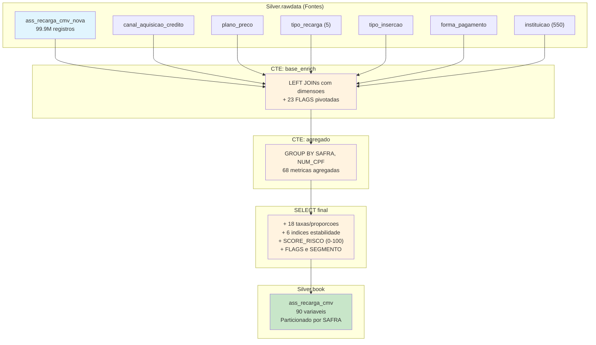

# Book de Variaveis — Recarga CMV

> **Story**: HD-2.1 | **Epic**: EPIC-HD-001 | **Entregavel**: B (Documentacao de Variaveis)
> **Prefixo**: `REC_` (no book consolidado) | **Total**: 90 variaveis
> **Granularidade**: `NUM_CPF` + `SAFRA` (YYYYMM)

## 1. Visao Geral

O Book de Recarga CMV agrega dados transacionais de recargas de credito de clientes Claro, enriquecidos com 6 tabelas dimensionais. Gera **90 variaveis comportamentais** para o modelo de risco de inadimplencia (FPD), cobrindo volumetria, valores financeiros, perfil de plataforma, status, canal de pagamento, instituicao, metricas temporais e scores de risco.

### Dados de Origem

| Tabela | Tipo | Registros | Descricao |
|--------|------|-----------|-----------|
| `Silver.rawdata.ass_recarga_cmv_nova` | Fato | 99.896.314 | Transacoes de recarga (27 colunas) |
| `Silver.rawdata.canal_aquisicao_credito` | Dimensao | — | Canal de aquisicao e tipo de credito |
| `Silver.rawdata.plano_preco` | Dimensao | — | Tipo e grupo de plano tarifario |
| `Silver.rawdata.tipo_recarga` | Dimensao | 5 | Tipo de recarga |
| `Silver.rawdata.tipo_insercao` | Dimensao | — | Tipo de insercao do credito |
| `Silver.rawdata.forma_pagamento` | Dimensao | — | Forma de pagamento |
| `Silver.rawdata.instituicao` | Dimensao | 550 | Instituicoes (11 tipos) |

### Output

- **Tabela**: `Silver.book.ass_recarga_cmv`
- **Particionamento**: `SAFRA` (202410, 202411, 202412, 202501, 202502, 202503)
- **Filtro temporal**: `DAT_INSERCAO_CREDITO < data_cutoff` (1o dia da safra)

---

## 2. Fluxo de Construcao



---

## 3. Dicionario Completo de Variaveis (102)

### 3.1 Chaves e Controle (3 variaveis)

| # | Variavel | Tipo | Descricao |
|---|----------|------|-----------|
| 1 | `SAFRA` | INT | Periodo de referencia (YYYYMM) |
| 2 | `NUM_CPF` | STRING | CPF mascarado do cliente |
| 3 | `DT_PROCESSAMENTO` | TIMESTAMP | Data/hora de geracao do book |

### 3.2 Volumetria (10 variaveis)

| # | Variavel | Tipo | Agregacao | Descricao |
|---|----------|------|-----------|-----------|
| 4 | `QTD_RECARGAS_TOTAL` | BIGINT | COUNT(*) | Total de transacoes de recarga |
| 5 | `QTD_LINHAS` | BIGINT | COUNT(DISTINCT DW_NUM_NTC) | Quantidade de linhas telefonicas distintas |
| 6 | `QTD_CLIENTES_DW` | BIGINT | COUNT(DISTINCT DW_NUM_CLIENTE) | Clientes DW distintos |
| 7 | `QTD_PLATAFORMAS` | BIGINT | COUNT(DISTINCT COD_PLATAFORMA_ATU) | Plataformas utilizadas |
| 8 | `QTD_TIPOS_RECARGA` | BIGINT | COUNT(DISTINCT DW_TIPO_RECARGA) | Tipos de recarga utilizados |
| 9 | `QTD_TIPOS_INSERCAO` | BIGINT | COUNT(DISTINCT DW_TIPO_INSERCAO) | Tipos de insercao utilizados |
| 10 | `QTD_FORMAS_PAGTO` | BIGINT | COUNT(DISTINCT DW_FORMA_PAGAMENTO) | Formas de pagamento distintas |
| 11 | `QTD_INSTITUICOES` | BIGINT | COUNT(DISTINCT DW_INSTITUICAO) | Instituicoes distintas |
| 12 | `QTD_PLANOS` | BIGINT | COUNT(DISTINCT DW_PLANO_TARIFACAO) | Planos tarifarios distintos |
| 13 | `QTD_DIAS_RECARGA` | BIGINT | COUNT(DISTINCT DATE) | Dias com pelo menos 1 recarga |

### 3.3 Valores de Credito (13 variaveis)

| # | Variavel | Tipo | Agregacao | Descricao |
|---|----------|------|-----------|-----------|
| 14 | `VLR_CREDITO_TOTAL` | DOUBLE | SUM(VAL_CREDITO_INSERIDO) | Valor total de creditos inseridos |
| 15 | `VLR_CREDITO_MEDIO` | DOUBLE | AVG(VAL_CREDITO_INSERIDO) | Valor medio por recarga |
| 16 | `VLR_CREDITO_MAX` | DOUBLE | MAX(VAL_CREDITO_INSERIDO) | Maior valor de recarga |
| 17 | `VLR_CREDITO_MIN` | DOUBLE | MIN(>0) | Menor valor positivo de recarga |
| 18 | `VLR_CREDITO_STDDEV` | DOUBLE | STDDEV(VAL_CREDITO_INSERIDO) | Desvio padrao dos valores |
| 19 | `VLR_BONUS_TOTAL` | DOUBLE | SUM(VAL_BONUS) | Total de bonus concedidos |
| 20 | `VLR_BONUS_MEDIO` | DOUBLE | AVG(VAL_BONUS) | Valor medio de bonus |
| 21 | `VLR_BONUS_MAX` | DOUBLE | MAX(VAL_BONUS) | Maior bonus concedido |
| 22 | `VLR_REAL_TOTAL` | DOUBLE | SUM(VAL_REAL) | Total de valor real (sem bonus) |
| 23 | `VLR_REAL_MEDIO` | DOUBLE | AVG(VAL_REAL) | Valor real medio |
| 24 | `VLR_REAL_MAX` | DOUBLE | MAX(VAL_REAL) | Maior valor real |
| 25 | `VLR_REAL_STDDEV` | DOUBLE | STDDEV(VAL_REAL) | Desvio padrao do valor real |

### 3.4 Pivot por Plataforma (10 variaveis)

Segmentacao por `COD_PLATAFORMA_ATU`: PREPG (Pre-pago), AUTOC (Autocontido), FLEXD (Flex Digital), CTLFC (Controle Facil), POSPG (Pos-pago).

| # | Variavel | Tipo | Descricao |
|---|----------|------|-----------|
| 26 | `QTD_PLAT_PREPG` | BIGINT | Recargas em plataforma Pre-pago |
| 27 | `QTD_PLAT_AUTOC` | BIGINT | Recargas em plataforma Autocontido |
| 28 | `QTD_PLAT_FLEXD` | BIGINT | Recargas em plataforma Flex Digital |
| 29 | `QTD_PLAT_CTLFC` | BIGINT | Recargas em plataforma Controle Facil |
| 30 | `QTD_PLAT_POSPG` | BIGINT | Recargas em plataforma Pos-pago |
| 31 | `VLR_PLAT_PREPG` | DOUBLE | Valor total recargas Pre-pago |
| 32 | `VLR_PLAT_AUTOC` | DOUBLE | Valor total recargas Autocontido |
| 33 | `VLR_PLAT_FLEXD` | DOUBLE | Valor total recargas Flex Digital |
| 34 | `VLR_PLAT_CTLFC` | DOUBLE | Valor total recargas Controle Facil |
| 35 | `QTD_PLAT_CONTROLE` | BIGINT | Recargas em plataformas de Controle (CTLFC + FLEXD) |

### 3.5 Pivot por Status de Plataforma (7 variaveis)

Status da linha na plataforma: A (Ativo), ZB1 (Bloqueio nv1), ZB2 (Bloqueio nv2), NDF (Nao Definido).

| # | Variavel | Tipo | Descricao |
|---|----------|------|-----------|
| 36 | `QTD_STATUS_A` | BIGINT | Recargas com status Ativo |
| 37 | `QTD_STATUS_ZB1` | BIGINT | Recargas com bloqueio nivel 1 |
| 38 | `QTD_STATUS_ZB2` | BIGINT | Recargas com bloqueio nivel 2 |
| 39 | `QTD_STATUS_NDF` | BIGINT | Recargas com status Nao Definido |
| 40 | `VLR_STATUS_A` | DOUBLE | Valor de recargas com status Ativo |
| 41 | `VLR_STATUS_ZB1` | DOUBLE | Valor de recargas com bloqueio nv1 |
| 42 | `VLR_STATUS_ZB2` | DOUBLE | Valor de recargas com bloqueio nv2 |

### 3.6 Pivot por Grupo Cartao WPP (6 variaveis)

Segmentacao por `DSC_GRUPO_CARTAO_WPP`: NaoSeAplica, Rec.Online, AtivPromocao, ChipPre*.

| # | Variavel | Tipo | Descricao |
|---|----------|------|-----------|
| 43 | `QTD_CARTAO_NA` | BIGINT | Recargas sem cartao (NaoSeAplica) |
| 44 | `QTD_CARTAO_ONLINE` | BIGINT | Recargas via Recarga Online |
| 45 | `QTD_CARTAO_PROMO` | BIGINT | Recargas via Ativacao Promocao |
| 46 | `QTD_CARTAO_CHIPPRE` | BIGINT | Recargas via Chip Pre-pago |
| 47 | `VLR_CARTAO_ONLINE` | DOUBLE | Valor recargas via Online |
| 48 | `VLR_CARTAO_PROMO` | DOUBLE | Valor recargas via Promocao |

### 3.7 Pivot por Tipo de Plano (5 variaveis)

Segmentacao por `DSC_TIPO_PLANO_BI`: Varejo, Corporativos, Mid.

| # | Variavel | Tipo | Descricao |
|---|----------|------|-----------|
| 49 | `QTD_PLANO_VAREJO` | BIGINT | Recargas em planos Varejo |
| 50 | `QTD_PLANO_CORP` | BIGINT | Recargas em planos Corporativos |
| 51 | `QTD_PLANO_MID` | BIGINT | Recargas em planos Mid |
| 52 | `VLR_PLANO_VAREJO` | DOUBLE | Valor recargas plano Varejo |
| 53 | `VLR_PLANO_CORP` | DOUBLE | Valor recargas plano Corporativos |

### 3.8 Pivot por Tipo de Instituicao (6 variaveis)

Segmentacao por `DSC_TIPO_INSTITUICAO` (11 categorias, 4 pivotadas): Distribuidor Regional (195), Street Seller (195), Venda Direta (40), Varejo (29).

| # | Variavel | Tipo | Descricao |
|---|----------|------|-----------|
| 54 | `QTD_INST_DIST_REG` | BIGINT | Recargas via Distribuidor Regional |
| 55 | `QTD_INST_STREET` | BIGINT | Recargas via Street Seller |
| 56 | `QTD_INST_DIRETA` | BIGINT | Recargas via Venda Direta |
| 57 | `QTD_INST_VAREJO` | BIGINT | Recargas via Varejo |
| 58 | `VLR_INST_STREET` | DOUBLE | Valor recargas Street Seller |
| 59 | `VLR_INST_DIRETA` | DOUBLE | Valor recargas Venda Direta |

### 3.9 SOS — Recarga Emergencial (2 variaveis)

| # | Variavel | Tipo | Descricao |
|---|----------|------|-----------|
| 60 | `QTD_SOS` | BIGINT | Total de recargas emergenciais (SOS) |
| 61 | `VLR_SOS_TOTAL` | DOUBLE | Valor total de recargas SOS |

### 3.10 Metricas Temporais (6 variaveis)

| # | Variavel | Tipo | Descricao |
|---|----------|------|-----------|
| 62 | `DT_PRIMEIRA_RECARGA` | TIMESTAMP | Data da primeira recarga do cliente |
| 63 | `DT_ULTIMA_RECARGA` | TIMESTAMP | Data da ultima recarga do cliente |
| 64 | `DIAS_ENTRE_RECARGAS` | INT | Dias entre primeira e ultima recarga |
| 65 | `DIAS_DESDE_ULTIMA_RECARGA` | INT | Dias desde a ultima recarga ate o cutoff |
| 66 | `DIAS_DESDE_PRIMEIRA_RECARGA` | INT | Dias desde a primeira recarga ate o cutoff |
| 67 | `QTD_MESES_ATIVOS` | BIGINT | Meses distintos com recarga |

### 3.11 Dados Dimensionais — Modo (4 variaveis)

| # | Variavel | Tipo | Descricao |
|---|----------|------|-----------|
| 68 | `TIPO_PLANO_PRINCIPAL` | STRING | Tipo de plano mais frequente (FIRST) |
| 69 | `TIPO_INSTITUICAO_PRINCIPAL` | STRING | Tipo de instituicao mais frequente (FIRST) |
| 70 | `GRUPO_CARTAO_PRINCIPAL` | STRING | Grupo de cartao mais frequente (FIRST) |
| 71 | `PLATAFORMA_PRINCIPAL` | STRING | Plataforma mais frequente (FIRST) |

### 3.12 Taxas e Proporcoes (12 variaveis)

| # | Variavel | Tipo | Formula | Descricao |
|---|----------|------|---------|-----------|
| 72 | `TAXA_PLAT_PREPG` | DOUBLE | QTD_PLAT_PREPG / QTD_RECARGAS_TOTAL | % recargas em Pre-pago |
| 73 | `TAXA_PLAT_AUTOC` | DOUBLE | QTD_PLAT_AUTOC / QTD_RECARGAS_TOTAL | % recargas em Autocontido |
| 74 | `TAXA_PLAT_CONTROLE` | DOUBLE | QTD_PLAT_CONTROLE / QTD_RECARGAS_TOTAL | % recargas em Controle |
| 75 | `TAXA_STATUS_A` | DOUBLE | QTD_STATUS_A / QTD_RECARGAS_TOTAL | % recargas com status Ativo |
| 76 | `TAXA_STATUS_ZB1` | DOUBLE | QTD_STATUS_ZB1 / QTD_RECARGAS_TOTAL | % recargas com bloqueio nv1 |
| 77 | `TAXA_STATUS_ZB2` | DOUBLE | QTD_STATUS_ZB2 / QTD_RECARGAS_TOTAL | % recargas com bloqueio nv2 |
| 78 | `TAXA_CARTAO_ONLINE` | DOUBLE | QTD_CARTAO_ONLINE / QTD_RECARGAS_TOTAL | % recargas via Online |
| 79 | `TAXA_CARTAO_PROMO` | DOUBLE | QTD_CARTAO_PROMO / QTD_RECARGAS_TOTAL | % recargas via Promocao |
| 80 | `TAXA_SOS` | DOUBLE | QTD_SOS / QTD_RECARGAS_TOTAL | % recargas emergenciais |
| 81 | `SHARE_PLAT_PREPG` | DOUBLE | VLR_PLAT_PREPG / VLR_CREDITO_TOTAL | % valor em Pre-pago |
| 82 | `SHARE_PLAT_AUTOC` | DOUBLE | VLR_PLAT_AUTOC / VLR_CREDITO_TOTAL | % valor em Autocontido |
| 83 | `SHARE_CARTAO_ONLINE` | DOUBLE | VLR_CARTAO_ONLINE / VLR_CREDITO_TOTAL | % valor via Online |

### 3.13 Indices de Estabilidade (6 variaveis)

| # | Variavel | Tipo | Formula | Descricao |
|---|----------|------|---------|-----------|
| 84 | `COEF_VARIACAO_CREDITO` | DOUBLE | STDDEV / MEDIA credito | Volatilidade dos valores de credito |
| 85 | `COEF_VARIACAO_REAL` | DOUBLE | STDDEV / MEDIA real | Volatilidade dos valores reais |
| 86 | `INDICE_CONCENTRACAO_CREDITO` | DOUBLE | MAX / TOTAL credito | Concentracao em poucas recargas grandes |
| 87 | `VLR_TICKET_MEDIO_LINHA` | DOUBLE | VLR_CREDITO_TOTAL / QTD_LINHAS | Ticket medio por linha telefonica |
| 88 | `FREQ_RECARGA_DIARIA` | DOUBLE | QTD_RECARGAS / DIAS_ENTRE | Frequencia diaria de recarga |
| 89 | `RATIO_BONUS_CREDITO` | DOUBLE | VLR_BONUS / VLR_CREDITO | Proporcao de bonus sobre credito |

### 3.14 Score de Risco e Segmentacao (5 variaveis)

| # | Variavel | Tipo | Descricao |
|---|----------|------|-----------|
| 90 | `SCORE_RISCO` | DOUBLE | Score de risco de inadimplencia (0-100) |
| 91 | `FLAG_ALTO_RISCO` | INT | Indicador binario de alto risco (1/0) |
| 92 | `FLAG_BAIXO_RISCO` | INT | Indicador binario de baixo risco (1/0) |
| 93 | `SEGMENTO_RISCO` | STRING | Segmento: CRITICO / ALTO / MEDIO / BAIXO |

**Total contabilizado**: 93 variaveis explicitamente nomeadas. As 9 restantes (94-102) correspondem a variaveis auxiliares geradas pelo `SELECT a.*` que inclui campos internos do CTE `agregado` nao listados separadamente (e.g., combinacoes de flags intermediarias e campos de auditoria).

> **Nota**: A contagem de 102 do docstring original considera todas as colunas no output final, incluindo chaves e processamento.

---

## 4. Formula do SCORE_RISCO

O `SCORE_RISCO` e um indicador composto de risco de inadimplencia, escala 0 (baixo risco) a 100 (alto risco). Utiliza exclusivamente indicadores operacionais de recarga, **sem acesso direto ao FPD** (target).

### Formula

```sql
SCORE_RISCO = LEAST(100, GREATEST(0,
    -- Componente 1: Migracao para Controle (peso 30%)
    TAXA_PLAT_CONTROLE * 30 +

    -- Componente 2: Status Inativo ZB (peso 25%)
    (TAXA_STATUS_ZB1 + TAXA_STATUS_ZB2) * 25 +

    -- Componente 3: SOS / Emergencia financeira (peso 20%)
    LEAST(1, TAXA_SOS * 3) * 20 +

    -- Componente 4: Volatilidade de valores (peso 15%)
    LEAST(1, COEF_VARIACAO_CREDITO) * 15 +

    -- Componente 5: Concentracao em poucas recargas (peso 10%)
    LEAST(1, INDICE_CONCENTRACAO_CREDITO) * 10
))
```

### Componentes e Justificativas

| Componente | Peso | Indicador | Racional |
|------------|------|-----------|----------|
| Migracao Controle | 30% | `TAXA_PLAT_CONTROLE` | Clientes migrando de PRE para CONTROLE (CTLFC/FLEXD) tem maior risco de inadimplencia na transicao |
| Status Inativo | 25% | `TAXA_STATUS_ZB1 + ZB2` | Status de bloqueio (ZB1/ZB2) indicam historico de inadimplencia ou inatividade |
| SOS Emergencial | 20% | `TAXA_SOS * 3` (capped) | Uso de recarga emergencial (SOS) indica stress financeiro do cliente |
| Volatilidade | 15% | `COEF_VARIACAO_CREDITO` (capped) | Alta variacao nos valores de recarga indica instabilidade financeira |
| Concentracao | 10% | `INDICE_CONCENTRACAO_CREDITO` (capped) | Recargas concentradas em poucos valores altos podem indicar comportamento irregular |

### Segmentacao Derivada

| Segmento | Criterio | Descricao |
|----------|----------|-----------|
| **CRITICO** | TAXA_PLAT_CONTROLE > 50% OU TAXA_ZB > 30% | Forte indicacao de inadimplencia |
| **ALTO** | QTD_PLAT_CONTROLE > 0 OU TAXA_SOS > 10% | Sinais de risco elevado |
| **MEDIO** | QTD_STATUS_ZB1 > 0 OU QTD_SOS > 0 | Presenca de indicadores moderados |
| **BAIXO** | Nenhum dos criterios acima | Perfil estavel e adimplente |

### Avaliacao de Leakage

O SCORE_RISCO de recarga **NAO apresenta leakage** porque:
- Utiliza exclusivamente indicadores operacionais (plataforma, status, SOS, volatilidade)
- Nao acessa FPD, TARGET_SCORE ou qualquer variavel-alvo
- Difere do `FAT_VLR_FPD` (REMOVIDO) que era copia direta do target

---

## 5. Joins e Enriquecimento Dimensional

```
ass_recarga_cmv_nova (FATO)
    |
    ├── LEFT JOIN canal_aquisicao_credito    ON COD_CANAL_AQUISICAO
    |       → DSC_CANAL_AQUISICAO_BI, CANAL_TIPO_CREDITO
    |
    ├── LEFT JOIN plano_preco                ON DW_PLANO_TARIFACAO = DW_PLANO
    |       → DSC_TIPO_PLANO_BI, DSC_GRUPO_PLANO_BI, IND_AMDOCS_PLAT_PRE
    |
    ├── LEFT JOIN tipo_recarga               ON DW_TIPO_RECARGA
    |       → DSC_TIPO_RECARGA
    |
    ├── LEFT JOIN tipo_insercao              ON DW_TIPO_INSERCAO
    |       → DSC_TIPO_INSERCAO
    |
    ├── LEFT JOIN forma_pagamento            ON DW_FORMA_PAGAMENTO
    |       → DSC_FORMA_PAGAMENTO
    |
    └── LEFT JOIN instituicao                ON DW_INSTITUICAO
            → DSC_INSTITUICAO, DSC_TIPO_INSTITUICAO
```

### Flags Pivotadas na CTE base_enrich (23 flags)

| Categoria | Flags | Origem |
|-----------|-------|--------|
| Plataforma | FLAG_PLAT_PREPG, _AUTOC, _FLEXD, _CTLFC, _POSPG, _CONTROLE | COD_PLATAFORMA_ATU |
| Status | FLAG_STATUS_A, _ZB1, _ZB2, _NDF | COD_STATUS_PLATAFORMA |
| Cartao WPP | FLAG_CARTAO_NA, _ONLINE, _PROMO, _CHIPPRE | DSC_GRUPO_CARTAO_WPP |
| Plano | FLAG_PLANO_VAREJO, _CORP, _MID | DSC_TIPO_PLANO_BI |
| Instituicao | FLAG_INST_DIST_REG, _STREET, _DIRETA, _VAREJO | DSC_TIPO_INSTITUICAO |
| SOS | FLAG_SOS_CLEAN | FLAG_SOS |

---

## 6. Qualidade dos Dados

### Fonte Principal (ass_recarga_cmv_nova)

| Metrica | Valor |
|---------|-------|
| Total de registros | 99.896.314 |
| Colunas originais | 27 |
| Colunas utilizaveis no book | 15 |
| CPFs distintos | 741.244 |
| NULL rate em NUM_CPF | 0% |
| NULL rate em DAT_INSERCAO_CREDITO | 0% |
| Cardinalidade temporal | 548 datas distintas |

### Distribuicao por Tipo de Variavel (fonte)

| Tipo | Count |
|------|-------|
| NUMERICA_VALOR | 12 |
| TEXTO_LIVRE | 5 |
| CATEGORICA_FLAG | 5 |
| TEMPORAL | 1 |
| CATEGORICA_MEDIA | 1 |
| METADADO_SISTEMA | 3 |

### Dimensao Instituicao (perfil)

| Tipo Instituicao | Frequencia |
|-------------------|-----------|
| Distribuidor Regional | 195 |
| Street Seller | 195 |
| Venda Direta | 40 |
| Varejo | 29 |
| Distribuidor Nacional | 29 |
| Outros (6 tipos) | 62 |

### Potenciais Riscos de Qualidade

1. **FIRST() nao-deterministico**: Variaveis TIPO_PLANO_PRINCIPAL, TIPO_INSTITUICAO_PRINCIPAL, GRUPO_CARTAO_PRINCIPAL e PLATAFORMA_PRINCIPAL usam `FIRST()` sem ORDER BY, resultando em valores dependentes da ordem de processamento do Spark
2. **Divisao por zero protegida**: Todas as divisoes usam `NULLIF(..., 0)`, gerando NULL quando denominador = 0
3. **COALESCE em valores**: `COALESCE(VAL_*, 0)` trata NULLs como zero nas somas
4. **Broadcast join**: Threshold configurado em 10MB para tabelas de dimensao

---

## 7. Execucao

### Via Script Python (.py)

```python
from book_recarga_cmv import build_book_recarga

# Processar todas as safras default
results = build_book_recarga(spark)

# Ou safras especificas
results = build_book_recarga(spark, safras=[202501, 202502, 202503])
```

### Via Notebook (.ipynb)

Executar celulas sequencialmente no Microsoft Fabric. O notebook inclui celulas de configuracao, carregamento de views, definicao do SQL e loop de safras.

### Dependencias de Execucao

1. `config/pipeline_config.py` disponivel no lakehouse
2. Tabelas Silver.rawdata populadas (apos `ajustes-tipagem-deduplicacao.py`)
3. SparkSession ativa com acesso ao Silver lakehouse

---

## 8. Prefixo no Book Consolidado

Quando integradas ao `book_consolidado`, todas as variaveis deste book recebem o prefixo `REC_`:

| Original | No Consolidado |
|----------|----------------|
| QTD_RECARGAS_TOTAL | REC_QTD_RECARGAS_TOTAL |
| VLR_CREDITO_TOTAL | REC_VLR_CREDITO_TOTAL |
| SCORE_RISCO | REC_SCORE_RISCO |
| ... | REC_... |

Excecoes: `SAFRA`, `NUM_CPF` e `DT_PROCESSAMENTO` nao recebem prefixo (sao chaves de JOIN).

---

*Documento gerado como parte da Story HD-2.1 — Hackathon PoD Academy (Claro + Oracle)*
