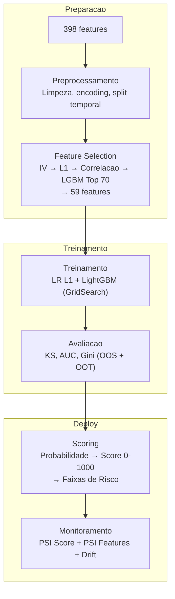

# Modelagem — Metodologia e Resultados

Documentacao completa da estrategia de modelagem, desde preprocessamento ate monitoramento em producao.

## Documentos

| # | Documento | Descricao |
|---|-----------|-----------|
| 1 | [Preprocessamento](preprocessing.md) | Pipeline de limpeza e transformacao de dados |
| 2 | [Selecao de Features](feature-selection.md) | Estrategia de selecao em 4 etapas |
| 3 | [Modelo Baseline](model-baseline.md) | Configuracao e hiperparametros |
| 4 | [Resultados do Modelo](model-results.md) | Metricas, graficos e interpretacao |
| 5 | [Analise de Swap](swap-analysis.md) | Estabilidade de ranking |
| 6 | [Monitoramento](monitoring.md) | Framework de drift e alertas |

## Resumo dos Resultados

| Modelo | KS (OOT) | AUC (OOT) | Gini (OOT) |
|--------|----------|-----------|------------|
| **LightGBM** | **33.97%** | **0.7303** | **46.06 pp** |
| Logistic Regression L1 | 32.77% | 0.7207 | 44.15 pp |
| *Benchmark* | *33.10%* | *—* | *—* |

## Pipeline

