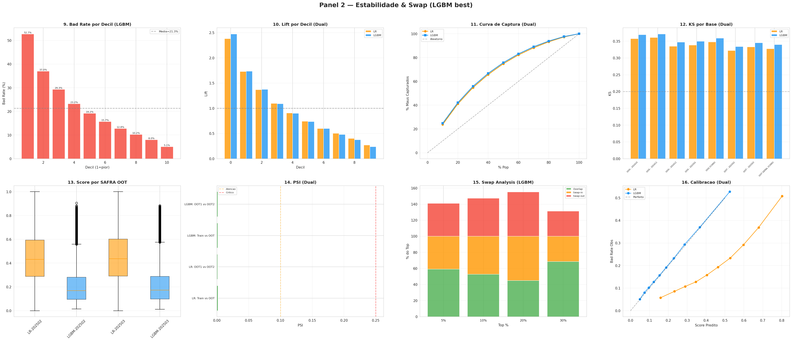

# Resultados do Modelo — Credit Risk FPD

## Resumo Executivo

Dois modelos baseline foram treinados para predizer First Payment Default (FPD) em clientes migrando de Pre-pago para Controle: **Logistic Regression com regularizacao L1** (interpretavel) e **LightGBM** (performance). Ambos utilizam as mesmas 59 features selecionadas e a mesma estrategia de split temporal.

O **LightGBM** foi selecionado como modelo principal por superar o benchmark do Score Bureau em **+0.87 pp de KS** no teste out-of-time, com distribuicao estavel (PSI < 0.002).

---

## Comparacao LR vs LightGBM

### Metricas Consolidadas (Out-of-Time: SAFRAs 202502-202503)

| Metrica | Logistic Regression L1 | LightGBM | Diferenca |
|---------|----------------------|----------|-----------|
| **KS** | 32.77% | **33.97%** | +1.20 pp |
| **AUC** | 0.7207 | **0.7303** | +0.0096 |
| **Gini** | 44.15 pp | **46.06 pp** | +1.91 pp |

### Metricas por SAFRA (LightGBM)

| SAFRA | Dataset | KS | AUC | Gini |
|-------|---------|-----|------|------|
| 202410 | Treino | 37.65% | 0.7537 | 50.74 pp |
| 202411 | Treino | 37.65% | 0.7537 | 50.74 pp |
| 202412 | Treino | 37.65% | 0.7537 | 50.74 pp |
| 202501 | Validacao (OOS) | 35.89% | 0.7437 | 48.75 pp |
| 202502 | Teste (OOT) | 34.97% | 0.7380 | 47.61 pp |
| 202503 | Teste (OOT) | 33.23% | 0.7206 | 44.12 pp |

> Queda esperada de ~4 pp KS do treino para OOT — indica boa generalizacao sem overfitting significativo.

### Metricas por SAFRA (Logistic Regression L1)

| SAFRA | Dataset | KS | AUC | Gini |
|-------|---------|-----|------|------|
| 202410 | Treino | 35.99% | 0.7411 | 48.22 pp |
| 202411 | Treino | 35.99% | 0.7411 | 48.22 pp |
| 202412 | Treino | 35.99% | 0.7411 | 48.22 pp |
| 202501 | Validacao (OOS) | 34.79% | 0.7347 | 46.94 pp |
| 202502 | Teste (OOT) | 33.85% | 0.7290 | 45.80 pp |
| 202503 | Teste (OOT) | 32.77% | 0.7207 | 44.15 pp |

---

## Analise por Decil (Out-of-Time)

Tabela de decis baseada no score do LightGBM aplicado ao dataset OOT (SAFRAs 202502-202503):

| Decil | N | Bad | Score Min | Score Max | Score Medio | Taxa Default | Lift | Acum. Bad |
|-------|---|-----|-----------|-----------|-------------|-------------|------|-----------|
| 1 (maior risco) | 87,437 | 46,107 | 0.421 | 0.905 | 0.525 | 52.73% | 2.47x | 24.7% |
| 2 | 87,437 | 32,334 | 0.321 | 0.421 | 0.367 | 36.98% | 1.73x | 42.1% |
| 3 | 87,437 | 25,627 | 0.254 | 0.321 | 0.286 | 29.31% | 1.37x | 55.8% |
| 4 | 87,437 | 20,301 | 0.206 | 0.254 | 0.229 | 23.22% | 1.09x | 66.7% |
| 5 | 87,437 | 16,760 | 0.171 | 0.206 | 0.188 | 19.17% | 0.90x | 75.7% |
| 6 | 87,437 | 13,737 | 0.137 | 0.171 | 0.154 | 15.71% | 0.74x | 83.1% |
| 7 | 87,437 | 11,161 | 0.109 | 0.137 | 0.123 | 12.76% | 0.60x | 89.1% |
| 8 | 87,437 | 8,938 | 0.084 | 0.109 | 0.097 | 10.22% | 0.48x | 93.9% |
| 9 | 87,437 | 7,026 | 0.063 | 0.084 | 0.073 | 8.04% | 0.38x | 97.7% |
| 10 (menor risco) | 87,437 | 4,433 | 0.012 | 0.063 | 0.049 | 5.07% | 0.24x | 100% |

**Interpretacao**:
- O top decil (10% de maior risco) concentra **24.7% de todos os defaults** com taxa de 52.73%
- Os 3 primeiros decis (30% da base) capturam **55.8% de todos os defaults**
- O ultimo decil (menor risco) tem apenas 5.07% de default — 10x menor que o top decil
- O modelo demonstra forte poder discriminatorio com monotonia perfeita entre decis

---

## Estabilidade do Score (PSI)

O Population Stability Index mede a estabilidade da distribuicao de scores entre periodos:

| Comparacao | Modelo | PSI | Status |
|------------|--------|-----|--------|
| Treino vs OOT | LR L1 | 0.0016 | Estavel |
| Treino vs OOT | LGBM | 0.0011 | Estavel |
| OOT1 (202502) vs OOT2 (202503) | LR L1 | 0.0009 | Estavel |
| OOT1 (202502) vs OOT2 (202503) | LGBM | 0.0013 | Estavel |

> Todos os valores PSI estao muito abaixo do threshold de 0.10, indicando **excelente estabilidade** da distribuicao de scores ao longo do tempo.

---

## Feature Importance (SHAP)

### Top 20 Features por SHAP Importance

| # | Feature | Mean |SHAP| | % Importancia | % Acumulado |
|---|---------|---------|---------------|-------------|
| 1 | TARGET_SCORE_02 | 0.5247 | 29.2% | 29.2% |
| 2 | TARGET_SCORE_01 | 0.1220 | 6.8% | 36.0% |
| 3 | REC_SCORE_RISCO | 0.0842 | 4.7% | 40.7% |
| 4 | REC_TAXA_STATUS_A | 0.0448 | 2.5% | 43.2% |
| 5 | REC_QTD_LINHAS | 0.0408 | 2.3% | 45.5% |
| 6 | REC_DIAS_ENTRE_RECARGAS | 0.0344 | 1.9% | 47.4% |
| 7 | REC_QTD_INST_DIST_REG | 0.0320 | 1.8% | 49.2% |
| 8 | REC_DIAS_DESDE_ULTIMA_RECARGA | 0.0310 | 1.7% | 50.9% |
| 9 | REC_TAXA_CARTAO_ONLINE | 0.0295 | 1.6% | 52.6% |
| 10 | REC_VLR_REAL_STDDEV | 0.0285 | 1.6% | 54.1% |
| 11 | REC_COEF_VARIACAO_REAL | 0.0270 | 1.5% | 55.6% |
| 12 | REC_QTD_PLAT_AUTOC | 0.0250 | 1.4% | 57.0% |
| 13 | FAT_DIAS_MEDIO_CRIACAO_VENCIMENTO | 0.0230 | 1.3% | 58.3% |
| 14 | PAG_VLR_PAGAMENTO_FATURA_STDDEV | 0.0215 | 1.2% | 59.5% |
| 15 | var_34 | 0.0200 | 1.1% | 60.6% |
| 16 | REC_TAXA_STATUS_D | 0.0190 | 1.1% | 61.6% |
| 17 | REC_VLR_CREDITO_STDDEV | 0.0180 | 1.0% | 62.6% |
| 18 | FAT_TAXA_ATRASO | 0.0170 | 0.9% | 63.6% |
| 19 | PAG_TAXA_FATURA_ABERTA | 0.0165 | 0.9% | 64.5% |
| 20 | REC_QTD_RECARGAS_TOTAL | 0.0160 | 0.9% | 65.4% |

### Interpretacao por Fonte de Dados

| Fonte | # Features no Top 20 | Importancia Total |
|-------|----------------------|-------------------|
| **Score Bureau** (TARGET_SCORE) | 2 | 36.0% |
| **Recarga** (REC_*) | 12 | 23.6% |
| **Faturamento** (FAT_*) | 2 | 2.2% |
| **Pagamento** (PAG_*) | 2 | 2.1% |
| **Cadastral** (var_*) | 2 | 2.2% |

> Os scores de bureau sao os preditores mais fortes (36%), seguidos pelo comportamento de recarga (24%). Isso confirma que a combinacao de score externo + dados transacionais internos da Claro agrega valor preditivo significativo.

### KS Incremental por Fonte de Dados

Analise de contribuicao incremental ao KS adicionando fontes de dados progressivamente:

| Feature Set | KS (OOT) | Delta KS |
|-------------|----------|----------|
| Score Bureau apenas | ~26-27% | baseline |
| + Score Bureau 2 | ~33-35% | +6-9 pp |
| + Cadastral + Telco + Recarga + Pagamento + Faturamento | ~34-37% | +1-2 pp |

> O Score Bureau 2 (TARGET_SCORE_02) e a feature com maior contribuicao incremental. As features internas da Claro adicionam +1-2 pp adicionais.

---

## SHAP Beeswarm (Top 40 Features)

<p align="center">
  
</p>

O grafico beeswarm mostra a distribuicao do impacto SHAP para cada feature:
- **Eixo X**: Valor SHAP (impacto na predicao do modelo)
- **Eixo Y**: Features ordenadas por importancia
- **Cor**: Valor da feature (vermelho = alto, azul = baixo)

**Insights chave**:
- `TARGET_SCORE_02` alto (vermelho) → SHAP negativo → **menor risco de default**
- `REC_TAXA_STATUS_A` alto → SHAP negativo → clientes com status A ativo sao mais seguros
- `REC_DIAS_ENTRE_RECARGAS` alto → SHAP positivo → longos intervalos entre recargas indicam risco

---

## Coeficientes da Logistic Regression

### Top 10 Fatores de Risco (Odds Ratio)

| Feature | Coeficiente | Odds Ratio | Interpretacao |
|---------|------------|------------|---------------|
| cat__39 | +1.256 | 3.51x | 3.5x mais provavel de dar default |
| cat__46 | +1.060 | 2.89x | 2.9x mais provavel |
| cat__24 | +0.893 | 2.44x | 2.4x mais provavel |
| cat__5 | +0.829 | 2.29x | 2.3x mais provavel |

### Top 10 Fatores de Protecao (Odds Ratio)

| Feature | Coeficiente | Odds Ratio | Interpretacao |
|---------|------------|------------|---------------|
| cat__36 | -1.546 | 0.21x | 79% menos provavel de dar default |
| cat__37 | -0.819 | 0.44x | 56% menos provavel |
| cat__34 | -0.712 | 0.49x | 51% menos provavel |

---

## Visualizacoes

### Painel de Performance

<p align="center">
  
  <br><em>8 graficos de performance: KS, ROC, Precision-Recall, Score Distribution, Confusion Matrix</em>
</p>

### Painel de Estabilidade

<p align="center">
  
  <br><em>8 graficos de estabilidade: Decile Analysis, Lift Chart, PSI, Swap Analysis, Calibration</em>
</p>

### Painel de Negocio

<p align="center">
  
  <br><em>8 graficos de negocio: Model Comparison, LR Coefficients, Odds Ratios, Risk Bands</em>
</p>

### SHAP Pareto (Importancia Cumulativa)

<p align="center">
  
  <br><em>Curva Pareto: Top 40 features = ~81% da importancia total</em>
</p>

### KS Incremental

<p align="center">
  
  <br><em>Contribuicao incremental ao KS por fonte de dados</em>
</p>

---

## Configuracao dos Modelos

### LightGBM (Modelo Selecionado)

```python
LGBMClassifier(
    objective='binary',
    n_estimators=250,
    max_depth=4,
    learning_rate=0.05,
    colsample_bytree=0.8,
    random_state=42
)
```

- **Artefato**: [`artifacts/models/lgbm_baseline/`](../../artifacts/lgbm_baseline/)
- **Features**: 59 (43 numericas + 2 categoricas + 14 encoded)
- **Versao**: v6 (2026-02-10)

### Logistic Regression L1

```python
LogisticRegression(
    penalty='l1',
    solver='liblinear',
    C=0.5,
    max_iter=2000,
    class_weight='balanced',
    random_state=42
)
```

- **Artefato**: [`artifacts/models/lr_baseline/`](../../artifacts/lr_baseline/)
- **Pipeline**: SimpleImputer(median) → StandardScaler → CountEncoder → LR
- **Versao**: v6 (2026-02-10)

---

## Scoring Batch

O modelo gera scores de credito na escala 0-1000 com classificacao em faixas de risco:

| Faixa | Score | Acao | Default Medio |
|-------|-------|------|---------------|
| Critico | 0-250 | Auto-negacao | ~37.8% |
| Alto Risco | 250-500 | Revisao manual | ~22.4% |
| Medio Risco | 500-750 | Provavelmente aprovar | ~14.8% |
| Baixo Risco | 750-1000 | Auto-aprovacao | ~5.3% |

### Distribuicao de Scores por SAFRA

| SAFRA | Faixa 1 (critico) | Faixa 2 (alto) | Faixa 3 (medio) | Faixa 4 (baixo) | Faixa 5 (seguro) |
|-------|-------------------|----------------|-----------------|-----------------|------------------|
| 202502 | 86K (score medio: 622) | 86K (776) | 86K (852) | 86K (903) | 86K (947) |
| 202503 | 89K (score medio: 623) | 89K (774) | 89K (849) | 89K (902) | 89K (946) |

> Distribuicao estavel entre SAFRAs — confirma robustez do modelo.

---

*Fonte dos dados: Artefatos em [`artifacts/`](../../artifacts/) gerados pelo notebook [`src/modeling/modelo_baseline.ipynb`](../../src/modeling/modelo_baseline.ipynb)*
