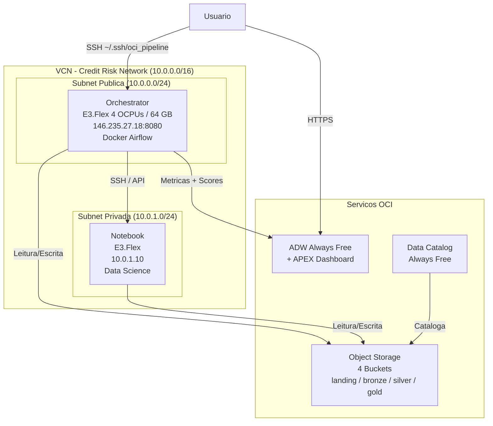
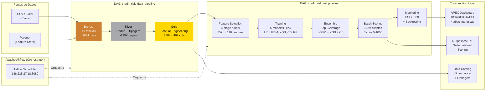
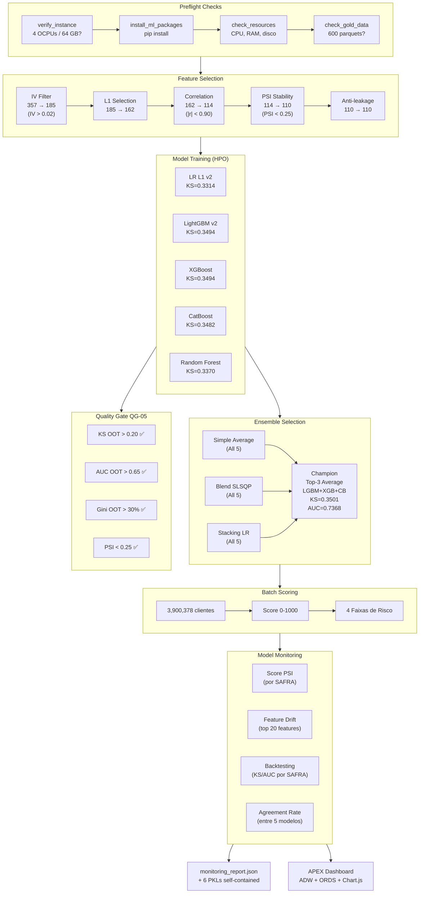
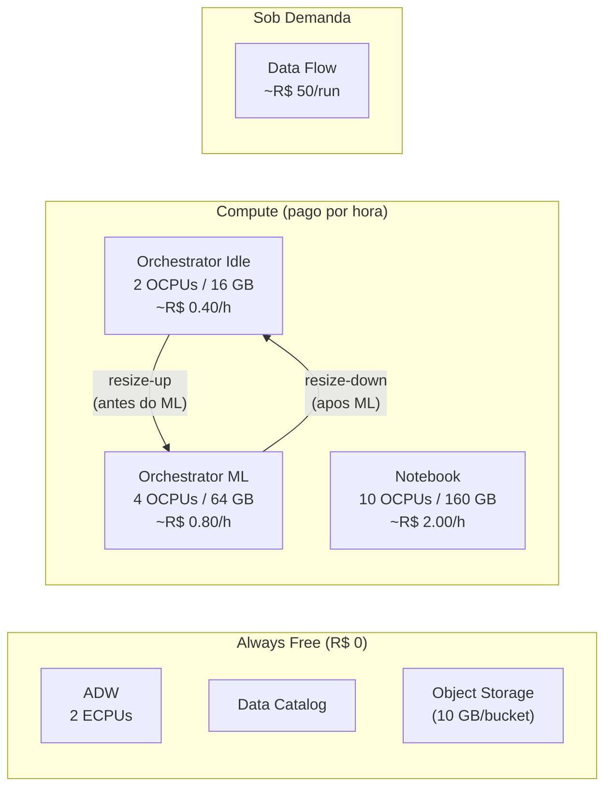

# Guia de Arquitetura OCI - Plataforma de Risco de Credito

## Visao Geral

A plataforma de risco de credito foi implantada na Oracle Cloud Infrastructure (OCI) na regiao **sa-saopaulo-1**, utilizando instancias **E3.Flex** como base computacional. A arquitetura segue o padrao Medallion (Bronze/Silver/Gold) com orquestracao via Apache Airflow em Docker.

**Run ID de Referencia**: `20260311_015100`
**Plataforma de Treinamento**: VM.Standard.E3.Flex (4 OCPUs / 64 GB)

---

## Componentes da Arquitetura

### 1. Object Storage (4 Buckets)

| Bucket | Camada | Descricao |
|--------|--------|-----------|
| `landing` | Ingestao | Arquivos brutos (CSV, Parquet, Excel) |
| `bronze` | Bronze | Dados raw em formato Delta Lake, 19 tabelas, 163M linhas |
| `silver` | Silver | Dados limpos e deduplicados, 275K duplicatas removidas |
| `gold` | Gold | Feature store consolidada, 3.9M x 402 colunas |

**Namespace**: `grlxi07jz1mo`

### 2. Orchestrator (E3.Flex + Docker Airflow)

- **IP Publico**: 146.235.27.18:8080
- **Shape**: VM.Standard.E3.Flex
- **Runtime**: Apache Airflow em Docker (docker-compose)
- **DAGs**: `credit_risk_data_pipeline` (3 tasks) + `credit_risk_ml_pipeline` (12 tasks)
- **Funcao**: Orquestracao end-to-end do pipeline de dados e ML

### 3. Notebook (E3.Flex - Data Science)

- **IP Privado**: 10.0.1.10
- **Shape**: VM.Standard.E3.Flex
- **Status**: Pode estar INACTIVE (parar para economia de custos)
- **Funcao**: Desenvolvimento, treinamento de modelos, notebooks Jupyter
- **Scripts**: 6 scripts Python de producao

### 4. Autonomous Data Warehouse (ADW)

- **Tier**: Always Free
- **APEX URL**: `https://G95D3985BD0D2FD-PODACADEMY2.adb.sa-saopaulo-1.oraclecloudapps.com/ords/apex`
- **Funcao**: Armazenamento de metricas, dashboard de monitoramento

### 5. APEX Dashboard

- **Integrado ao ADW**: Dashboard de monitoramento de modelos
- **Metricas**: KS, AUC, Gini, PSI, distribuicao de scores
- **Faixas de Risco**: CRITICO (<300), ALTO (300-499), MEDIO (500-699), BAIXO (>=700)

### 6. Data Catalog

- **Tier**: Always Free, ACTIVE
- **Funcao**: Governanca de dados, catalogacao de assets do Object Storage

---

## Diagrama de Infraestrutura



---

## Diagrama do Pipeline Completo (Airflow Orchestration)



---

## Diagrama do ML Pipeline (Detalhado)



---

## Diagrama de Custos e Recursos



---

## Rede (VCN)

### Configuracao

| Recurso | CIDR / Detalhe |
|---------|----------------|
| VCN | 10.0.0.0/16 |
| Subnet Publica | 10.0.0.0/24 (Orchestrator) |
| Subnet Privada | 10.0.1.0/24 (Notebook) |
| Internet Gateway | Trafego publico para Orchestrator |
| NAT Gateway | Saida para Notebook (subnet privada) |
| Service Gateway | Acesso a servicos OCI internos |

### Security Lists

- **Publica**: Ingress TCP 22 (SSH), TCP 8080 (Airflow UI), Egress all
- **Privada**: Ingress TCP 22 (SSH do Orchestrator), Egress via NAT Gateway

---

## Terraform

### Modulos (9 modulos)

```
infrastructure/terraform/
├── main.tf
├── variables.tf
├── outputs.tf
├── provider.tf
├── terraform.tfstate          # Estado local
├── terraform.tfvars.dev       # Variaveis DEV
├── terraform.tfvars.prd       # Variaveis PRD
├── terraform.tfvars.example
└── modules/
    ├── cost/                  # Orcamento e alertas
    ├── data-catalog/          # Data Catalog
    ├── database/              # ADW
    ├── dataflow/              # Data Flow (Spark)
    ├── datascience/           # Notebook Session
    ├── monitoring/            # Alarmes e notificacoes
    ├── network/               # VCN, subnets, gateways
    ├── orchestrator/          # VM + Docker Airflow
    └── storage/               # Object Storage buckets
```

### Comandos Basicos

```bash
# Inicializar (ja executado)
cd infrastructure/terraform
terraform init

# Planejar alteracoes
terraform plan -var-file=terraform.tfvars.dev

# Aplicar
terraform apply -var-file=terraform.tfvars.dev

# Verificar estado
terraform state list
```

### Estado

- **Backend**: Local (`terraform.tfstate`)
- **Status**: Inicializado e aplicado com sucesso

---

## Pre-requisitos

### 1. OCI CLI

```bash
# Instalacao
bash -c "$(curl -L https://raw.githubusercontent.com/oracle/oci-cli/master/scripts/install/install.sh)"

# Configuracao
oci setup config
```

### 2. Chave SSH

```bash
# Par de chaves utilizado
~/.ssh/oci_pipeline       # Chave privada
~/.ssh/oci_pipeline.pub   # Chave publica
```

### 3. Acesso ao Compartment

```
Compartment OCID: ocid1.compartment.oc1..aaaaaaaa7uh2lfpsc6qf73g7zalgbr262a2v6veb4lreykqn57gtjvoojeuq
Tenancy OCID:     ocid1.tenancy.oc1..aaaaaaaahse5thvzinsvm7bkyrd3zravzao2i6kpfl4bfxkplbu7ppla5x5a
Region:           sa-saopaulo-1
```

### 4. Terraform >= 1.0

```bash
terraform version
```

---

## Limitacoes do Trial

### ARM A1 (Ampere)

- **Status**: OUT_OF_HOST_CAPACITY em sa-saopaulo-1
- **Impacto**: Nao foi possivel provisionar instancias ARM A1 (Always Free)
- **Solucao adotada**: Todas as instancias utilizam shapes E3.Flex

### E3.Flex

- **Limite Trial**: Maximo 4 OCPUs por instancia (request de 8/128 bloqueado por LimitExceeded)
- **Configuracao usada**: E3.Flex com 4 OCPUs / 64 GB RAM para treinamento ML

### Data Science

- **Limite separado**: 24 OCPUs para servico Data Science
- **Permite**: Instancias maiores para treinamento de modelos

### Availability Domain

- **Unico AD disponivel**: TjOZ:SA-SAOPAULO-1-AD-1
- **Impacto**: Sem redundancia multi-AD

### Credito Trial

- **Valor**: $500 USD
- **Servicos Always Free**: ADW, Data Catalog, Object Storage (10 GB por bucket)

---

## Identificadores Chave

| Recurso | Identificador |
|---------|---------------|
| Namespace | `grlxi07jz1mo` |
| Region | `sa-saopaulo-1` |
| Compartment | `ocid1.compartment.oc1..aaaaaaaa7uh2lfpsc6qf73g7zalgbr262a2v6veb4lreykqn57gtjvoojeuq` |
| Tenancy | `ocid1.tenancy.oc1..aaaaaaaahse5thvzinsvm7bkyrd3zravzao2i6kpfl4bfxkplbu7ppla5x5a` |
| AD | `TjOZ:SA-SAOPAULO-1-AD-1` |
| ADW APEX | `G95D3985BD0D2FD-PODACADEMY2` |
