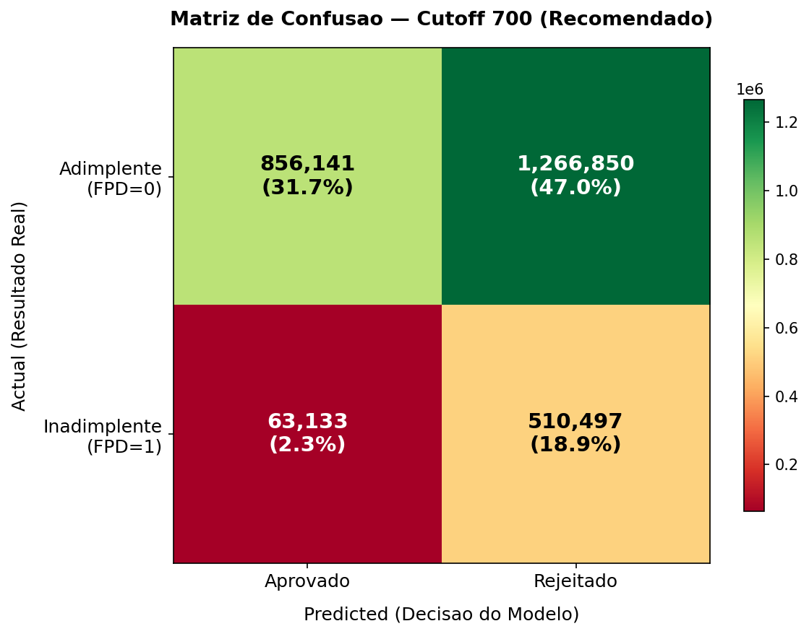
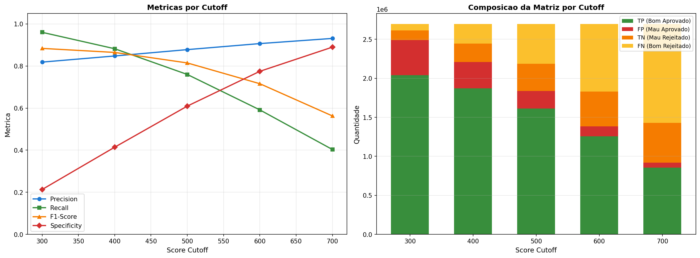
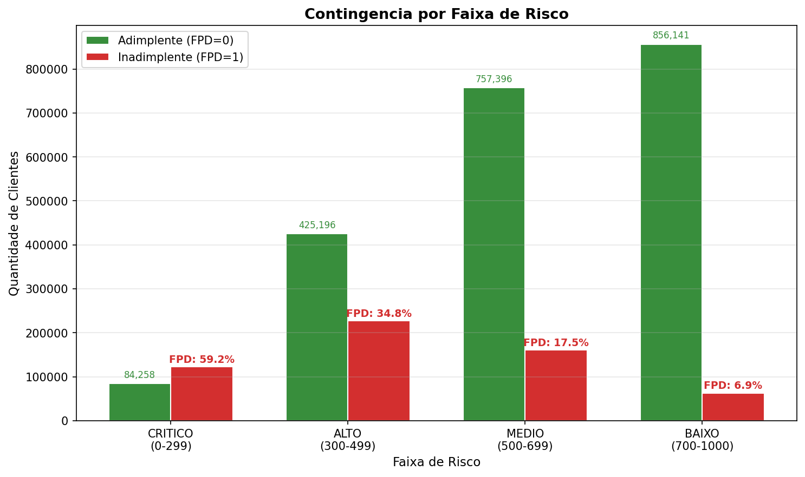
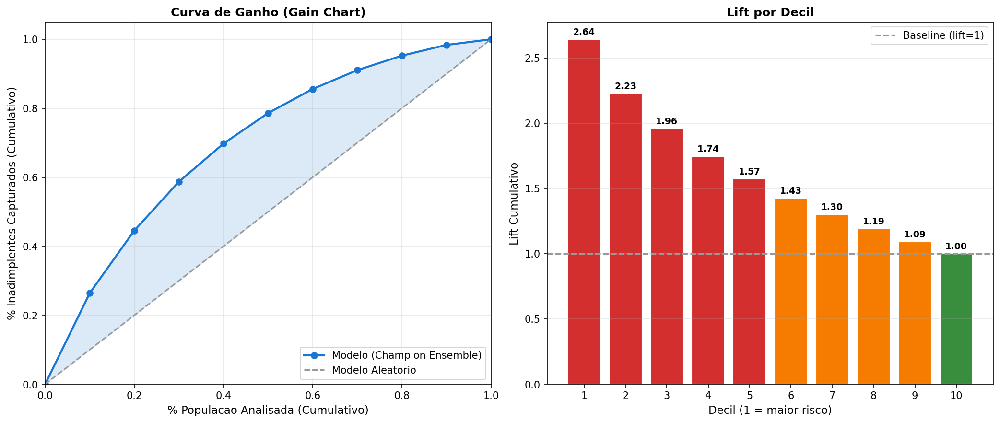
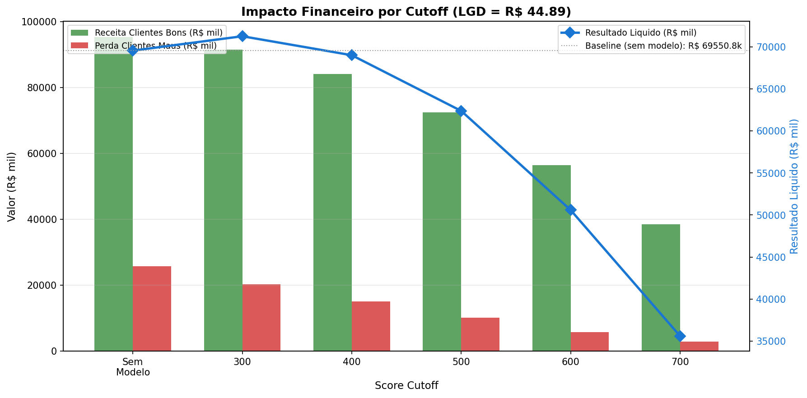

# Analise de Matriz de Confusao — Modelo de Credit Risk FPD

**Run ID**: `20260311_015100`
**Ensemble Champion**: Top-3 Average (LightGBM v2 + XGBoost + CatBoost)
**Base labelada**: 2.696.621 clientes | **FPD Rate baseline**: 21,27%

---

## 1. Resumo Executivo

> No cutoff recomendado de 700, o modelo atinge **Precision 93,13%** (apenas 6,9% dos aprovados sao inadimplentes) com **Specificity 89,0%** (89% dos inadimplentes sao corretamente rejeitados), demonstrando forte capacidade de separacao para decisao de credito em telecomunicacoes.

| Metrica (Cutoff 700) | Valor |
|---|---|
| Precision | 93,13% |
| Recall | 40,33% |
| Specificity | 88,99% |
| F1-Score | 56,28% |
| Accuracy | 50,68% |
| True Positives (aprovados adimplentes) | 856.141 |
| False Positives (aprovados inadimplentes) | 63.133 |

---

## 2. Contexto: Confusion Matrix em Risco de Credito

No contexto de credit risk para telecomunicacoes, a classificacao binaria e feita pelo **ponto de corte do score** (cutoff). Clientes com score >= cutoff sao **aprovados**; abaixo, **rejeitados**.

A interpretacao da confusion matrix e invertida em relacao ao padrao ML, pois o objetivo e **aprovar bons clientes** (nao detectar positivos):

| | Adimplente (FPD=0) | Inadimplente (FPD=1) |
|---|---|---|
| **Aprovado** (score >= cutoff) | **TP** — Receita | **FP** — PERDA (critico) |
| **Rejeitado** (score < cutoff) | **FN** — Receita perdida | **TN** — Risco evitado |

### Impacto de cada quadrante:

- **TP (True Positive)**: Cliente aprovado que paga — gera receita recorrente (ARPU)
- **FP (False Positive)**: Cliente aprovado que da default — perda financeira direta (LGD = R$ 44,89)
- **TN (True Negative)**: Cliente rejeitado que daria default — risco evitado corretamente
- **FN (False Negative)**: Cliente rejeitado que pagaria — receita perdida (custo de oportunidade)

---

## 3. Matriz de Confusao — Cutoff 700

### Contagens Absolutas

| | Adimplente (FPD=0) | Inadimplente (FPD=1) | Total |
|---|---|---|---|
| **Aprovado** | 856.141 (31,7%) | 63.133 (2,3%) | 919.274 |
| **Rejeitado** | 1.266.850 (47,0%) | 510.497 (18,9%) | 1.777.347 |
| **Total** | 2.122.991 | 573.630 | 2.696.621 |

### Metricas Derivadas

| Metrica | Formula | Valor |
|---|---|---|
| **Precision** | TP / (TP + FP) | 93,13% |
| **Recall (Sensitivity)** | TP / (TP + FN) | 40,33% |
| **Specificity** | TN / (TN + FP) | 88,99% |
| **F1-Score** | 2 x Prec x Rec / (Prec + Rec) | 56,28% |
| **Accuracy** | (TP + TN) / Total | 50,68% |
| **False Positive Rate** | FP / (FP + TN) | 11,01% |

> **Nota**: A accuracy (50,7%) pode parecer baixa, mas e enganosa neste contexto. O cutoff 700 e **conservador por design** — rejeita 65,9% da base para manter a precision em 93,1%. A metrica que importa para o negocio e a **precision** (qualidade dos aprovados) e a **specificity** (capacidade de barrar maus).

---

## 4. Analise Multi-Threshold

### Tabela Comparativa por Cutoff

| Cutoff | Aprovados | TP | FP | TN | FN | Precision | Recall | Specificity | F1 |
|---|---|---|---|---|---|---|---|---|---|
| **300** | 2.490.086 | 2.038.733 | 451.353 | 122.277 | 84.258 | 81,87% | 96,03% | 21,32% | 88,39% |
| **400** | 2.209.040 | 1.873.070 | 335.970 | 237.660 | 249.921 | 84,79% | 88,23% | 41,43% | 86,48% |
| **500** | 1.837.520 | 1.613.537 | 223.983 | 349.647 | 509.454 | 87,81% | 76,00% | 60,95% | 81,48% |
| **600** | 1.385.000 | 1.255.906 | 129.094 | 444.536 | 867.085 | 90,68% | 59,16% | 77,50% | 71,60% |
| **700** | 919.274 | 856.141 | 63.133 | 510.497 | 1.266.850 | 93,13% | 40,33% | 88,99% | 56,28% |

### Interpretacao

O trade-off entre **precision** e **recall** e claro:
- Cutoff **baixo** (300): aprova quase todos — precision 81,9%, recall 96,0%
- Cutoff **alto** (700): aprova poucos, mas com alta qualidade — precision 93,1%, recall 40,3%

A **specificity** cresce monotonicamente com o cutoff (21,3% → 89,0%), confirmando que o modelo e eficaz em barrar inadimplentes em cutoffs mais altos.

---

## 5. Contingencia por Faixa de Risco

| Faixa | Score | Total | Adimplentes | Inadimplentes | Taxa FPD |
|---|---|---|---|---|---|
| **CRITICO** | 0-299 | 206.535 | 84.258 | 122.277 | 59,20% |
| **ALTO** | 300-499 | 652.566 | 425.196 | 227.370 | 34,84% |
| **MEDIO** | 500-699 | 918.246 | 757.396 | 160.850 | 17,52% |
| **BAIXO** | 700-1000 | 919.274 | 856.141 | 63.133 | 6,87% |

> **Validacao de calibracao**: A taxa FPD e **monotonicamente decrescente** das faixas de maior risco para menor risco (59,2% → 34,8% → 17,5% → 6,9%). Isso confirma que o modelo esta bem calibrado — scores mais altos correspondem consistentemente a menor probabilidade de default.

---

## 6. Gain/Lift Analysis

A analise de gain/lift mostra a capacidade do modelo de concentrar inadimplentes nas faixas de menor score:

| Decil | % Populacao | % Inadimplentes Acum. | Lift |
|---|---|---|---|
| 1 (pior score) | 10% | 26,4% | 2,64x |
| 2 | 20% | 44,6% | 2,23x |
| 3 | 30% | 58,7% | 1,96x |
| 4 | 40% | 69,8% | 1,74x |
| 5 | 50% | 78,6% | 1,57x |
| 6 | 60% | 85,6% | 1,43x |
| 7 | 70% | 91,1% | 1,30x |
| 8 | 80% | 95,3% | 1,19x |
| 9 | 90% | 98,4% | 1,09x |
| 10 (melhor score) | 100% | 100,0% | 1,00x |

> O **top 10% de piores scores concentra 26,4% de todos os inadimplentes** (lift 2,64x). Ao rejeitar os 30% piores, elimina-se 58,7% dos defaults. O modelo demonstra boa capacidade discriminativa crescente nos primeiros decis.

---

## 7. Aplicabilidade ao Negocio

### Simulacao de Impacto Financeiro

Utilizando **LGD = R$ 44,89** (mediana de VAL_FAT_ABERTO, conforme `business-value-analysis.md`):

| Cutoff | Aprovados | Receita Bruta Estimada | Perda (FP x LGD) | Receita Liquida | Economia vs Baseline |
|---|---|---|---|---|---|
| Baseline | 2.696.621 | R$ 95,30M | R$ 25,75M | R$ 69,55M | — |
| **300** | 2.490.086 | R$ 91,52M | R$ 20,26M | R$ 71,26M | R$ 1,71M |
| **400** | 2.209.040 | R$ 84,08M | R$ 15,08M | R$ 69,00M | -R$ 0,55M |
| **500** | 1.837.520 | R$ 72,43M | R$ 10,05M | R$ 62,38M | -R$ 7,17M |
| **600** | 1.385.000 | R$ 56,38M | R$ 5,80M | R$ 50,58M | -R$ 18,97M |
| **700** | 919.274 | R$ 38,43M | R$ 2,83M | R$ 35,60M | -R$ 33,95M |

> **Nota**: A receita bruta estimada = TP x R$ 44,89 (proxy de ticket). A economia vs baseline considera receita liquida total. Na pratica, clientes rejeitados podem ser redirecionados a produtos de menor risco (pre-pago), mitigando a perda de receita.

### Integracao com Swap Analysis

Os dados de confusion matrix complementam a analise de swap (ver `swap-analysis.md`):
- **Swap-Out** (FP) = 63.133 no cutoff 700 — inadimplentes aprovados
- **Swap-In** (FN) = 1.266.850 no cutoff 700 — adimplentes rejeitados
- A taxa FPD entre aprovados de 6,87% no cutoff 700 confirma alta precision do modelo

> **Nota sobre diferenca swap vs confusion matrix**: O swap_analysis.py usa scoring do pipeline original no servidor OCI; o confusion_matrix_analysis.py re-escora localmente com o champion_ensemble.pkl. Pequenas diferencas nos contadores sao esperadas (arredondamento, ordem de operacoes). As metricas desta analise sao derivadas do re-scoring com o mesmo ensemble champion.

---

## 8. Cenarios Operacionais

| Cenario | Cutoff | Precision | Recall | FPD Aprov. | Aprovados | Uso Recomendado |
|---|---|---|---|---|---|---|
| **Conservador** | 700 | 93,1% | 40,3% | 6,9% | 34,1% | Pos-pago, alto ARPU, clientes novos |
| **Moderado** | 600 | 90,7% | 59,2% | 9,3% | 51,4% | Controle, pre-pago alto valor |
| **Agressivo** | 500 | 87,8% | 76,0% | 12,2% | 68,1% | Pre-pago, baixo CAC, campanhas de volume |

### Recomendacao por Tipo de Produto

- **Pos-pago** (maior risco financeiro): Cutoff 700 — precision 93,1% garante que <7% dos aprovados dao default
- **Pre-pago alto valor** (risco intermediario): Cutoff 600 — equilibrio entre volume (51%) e qualidade (90,7%)
- **Pre-pago basico** (baixo risco financeiro): Cutoff 500 — maximiza volume (68%) com precision aceitavel (87,8%)
- **Promocoes e campanhas**: Cutoff 400-500 com limite de credito reduzido como mitigacao adicional

---

## 9. Avaliacao do Modelo — Qualidade e Aplicabilidade

### 9.1 O modelo e bom para o objetivo?

O objetivo de negocio e identificar clientes **pre-pago** que se tornarao inadimplentes ao migrar para **controle/pos-pago** (First Payment Default). Nesse contexto, o modelo demonstra **boa capacidade discriminativa**, mas com nuances importantes para a tomada de decisao.

### 9.2 Pontos Fortes

| Indicador | Valor | Interpretacao |
|---|---|---|
| KS | 0,3501 | Boa separacao entre bons e maus (referencia: KS > 0,20 e aceitavel, > 0,30 e bom) |
| AUC | 0,7368 | Capacidade discriminativa acima da media (referencia: > 0,70 e bom, > 0,80 e excelente) |
| Precision (cutoff 700) | 93,1% | Dos aprovados, 93% pagam — excelente para proteger a operacao |
| Reducao de FPD | 21,3% → 6,9% | Reducao de **68%** na taxa de inadimplencia entre aprovados |
| Calibracao | Monotonica | Score mais alto = menor risco, consistentemente em todas as faixas |
| Lift decil 1 | 2,64x | Concentra inadimplentes nos piores scores (top 30% captura 58,7% dos maus) |

### 9.3 Limitacoes

| Limitacao | Detalhe | Impacto |
|---|---|---|
| Gain top 10% = 26,4% | Em modelos excelentes (KS > 0,45), o top 10% concentraria 35%+ dos inadimplentes | A separacao e boa mas nao excepcional — o modelo ranking funciona, mas nao e "cirurgico" |
| Recall baixo no cutoff 700 (40,3%) | Rejeita 66% da base, incluindo 1,27M de bons clientes | Se a Claro quer volume de migracao, o cutoff 700 e restritivo demais |
| AUC < 0,80 | Para ser considerado excelente, precisaria AUC > 0,80 e KS > 0,45 | O modelo esta na faixa "bom", nao "excelente" — mas entrega valor real |
| Trade-off volume vs risco | Cutoff mais baixo aumenta volume mas tambem aumenta FPD | Nao existe cutoff perfeito — depende do apetite de risco da operacao |

### 9.4 Contexto de Mercado

Em modelos de credit risk para telecomunicacoes, os benchmarks tipicos sao:

| Classificacao | KS | AUC | Referencia |
|---|---|---|---|
| Fraco | < 0,20 | < 0,65 | Pouca ou nenhuma capacidade discriminativa |
| Aceitavel | 0,20 - 0,30 | 0,65 - 0,70 | Modelo minimamente viavel |
| **Bom** | **0,30 - 0,45** | **0,70 - 0,80** | **Nosso modelo (KS=0,35, AUC=0,74)** |
| Excelente | > 0,45 | > 0,80 | Modelos com dados de bureau externo ou longo historico |

O modelo se posiciona na faixa **bom**, o que e consistente com os dados disponiveis (features internas de recarga, pagamento e faturamento, sem dados de bureau externo de credito).

### 9.5 Decisao de Negocio — Migracao Pre para Controle

Para a operacao especifica de migrar clientes pre-pago para controle, o modelo oferece tres estrategias:

| Estrategia | Cutoff | Quem migra | FPD Esperado | Trade-off |
|---|---|---|---|---|
| **Conservadora** | 700 | 34% da base (919K) | 6,9% | Migra poucos, quase nenhum da default. Ideal para **pos-pago alto ARPU** onde a perda por inadimplente e alta. |
| **Equilibrada** | 600 | 51% da base (1,39M) | 9,3% | Migra metade da base com FPD aceitavel. Bom para **controle padrao** — equilibra receita de novos clientes vs risco. |
| **Agressiva** | 500 | 68% da base (1,84M) | 12,2% | Migra a maioria. FPD mais alto, mas ainda **43% menor que baseline** (21,3%). Viavel para **controle basico** com ticket baixo. |

**Recomendacao**: Para migracao pre → controle, o **cutoff 600** (estrategia equilibrada) e o mais indicado como ponto de partida. Migra 51% da base com FPD de 9,3% — reducao de 56% vs baseline. O cutoff pode ser ajustado por produto:

- **Controle digital (ticket baixo)**: Cutoff 500 — aceitar mais risco, maximizar volume
- **Controle padrao**: Cutoff 600 — equilibrio
- **Pos-pago (ticket alto)**: Cutoff 700 — proteger contra perdas maiores

### 9.6 Clientes Rejeitados Nao Sao Perdidos

Os clientes rejeitados pelo modelo (score < cutoff) **nao precisam ser descartados**. Estrategias complementares:

1. **Manter no pre-pago**: Continuar gerando receita com menor risco
2. **Oferta condicionada**: Migrar com limite de credito reduzido ou deposito caucionario
3. **Re-avaliacao periodica**: Reavaliar a cada SAFRA — o comportamento pode melhorar
4. **Produto intermediario**: Criar faixa "controle light" com beneficios limitados para scores 400-600

---

## 10. Conclusao

1. **Modelo bom para o objetivo**: KS=0,3501 e AUC=0,7368 posicionam o modelo na faixa "bom" para credit risk em telecom, entregando valor real de negocio
2. **Calibracao validada**: Taxa FPD monotonicamente decrescente por faixa de risco (59,2% → 6,9%)
3. **Trade-off consciente**: O cutoff deve ser escolhido conforme o produto — 700 para pos-pago (precision 93%), 600 para controle (equilibrio), 500 para controle basico (volume)
4. **Reducao significativa**: Em qualquer cenario, o modelo reduz FPD em 43% a 68% vs baseline
5. **Lift funcional**: Top 30% de piores scores concentra 58,7% dos inadimplentes — o ranking e confiavel
6. **Perdas brutas evitadas**: R$ 22,9M (cutoff 700) / R$ 20,0M (cutoff 600) — economia liquida depende do trade-off com receita perdida por rejeicao (ver `business-value-analysis.md`)
7. **Monitoramento recomendado**: Acompanhar precision, recall e taxa FPD por SAFRA para detectar degradacao temporal. Se precision cair abaixo de 85% ou FPD entre aprovados ultrapassar 10%, reavaliar cutoff ou retreinar

---

## 11. Arquivos Fonte

| Arquivo | Descricao |
|---|---|
| `scripts/confusion_matrix_analysis.py` | Script de geracao dos artefatos |
| `artifacts/metrics/confusion_matrix_results.json` | Resultados completos em JSON |
| `artifacts/swap_analysis/swap_summary.json` | Dados de cutoff (complementar) |
| `docs/model/business-value-analysis.md` | LGD = R$ 44,89 |

### Visualizacoes

| Plot | Descricao |
|---|---|
| `confusion_matrix_cutoff700.png` | Heatmap 2x2 no cutoff recomendado |
| `confusion_matrix_multi_threshold.png` | Curvas Precision/Recall/F1/Specificity vs cutoff |
| `confusion_matrix_per_band.png` | Contingencia por faixa de risco |
| `gain_lift_chart.png` | Gain curve + Lift chart (10 decis) |
| `financial_impact_analysis.png` | Simulacao de impacto financeiro |

---

*Documento gerado: 2026-03-11 | Projeto: Hackathon PoD Academy (Claro + Oracle) | Plataforma: OCI sa-saopaulo-1*
