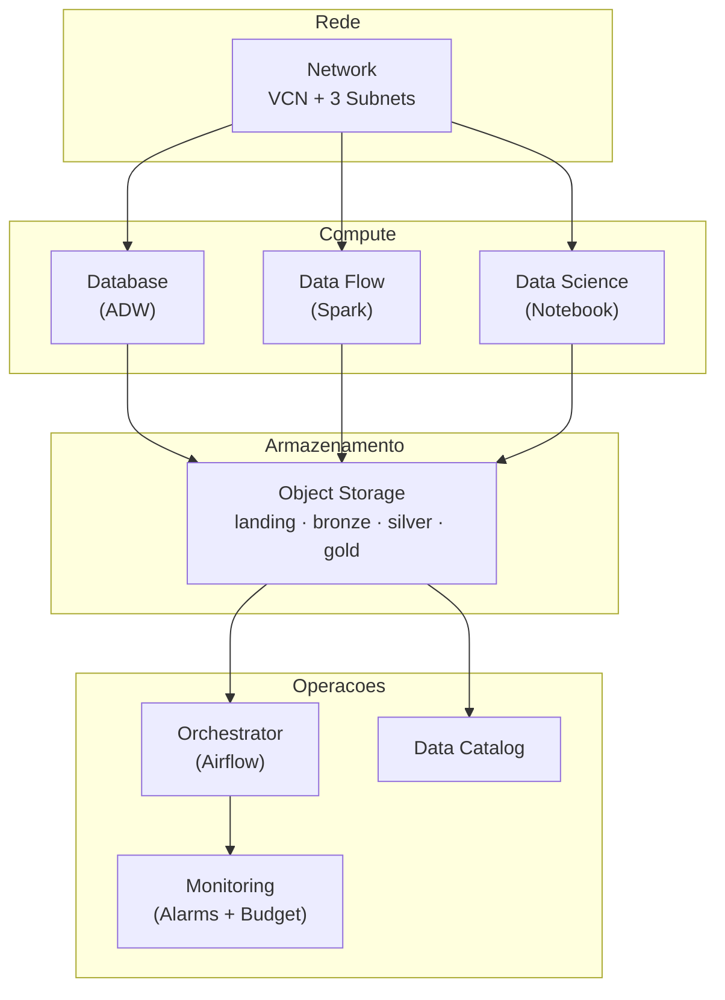

# Terraform — OCI Data Lakehouse Infrastructure

Provisionamento completo da infraestrutura OCI para o pipeline de Credit Risk via Terraform.

## Arquitetura



## Modulos (9)

| Modulo | Diretorio | Recursos Criados | Custo |
|--------|-----------|------------------|-------|
| **network** | `modules/network/` | VCN, 3 subnets (public, data, compute), Internet GW, NAT GW, Service GW, Route Tables, NSGs | Gratuito |
| **storage** | `modules/storage/` | 5 buckets Object Storage (landing, bronze, silver, gold, scripts), lifecycle rules | ~R$ 5/mes (1 TB) |
| **database** | `modules/database/` | ADW (Always Free ou pago), APEX workspace, External Tables SQL | Gratuito (Always Free) |
| **dataflow** | `modules/dataflow/` | Data Flow pool + 3 apps (bronze, silver, gold) | ~R$ 50/execucao |
| **datascience** | `modules/datascience/` | Projeto + Notebook Session (E4.Flex) | ~R$ 2/hora (10 OCPUs) |
| **orchestrator** | `modules/orchestrator/` | Compute Instance (E3/E4.Flex) + cloud-init (Docker + Airflow) | ~R$ 0.80/hora (4 OCPUs) |
| **monitoring** | `modules/monitoring/` | ONS Topic, Alarm Rules (CPU, memoria, disco) | Gratuito |
| **cost** | `modules/cost/` | Budget + Alert Rule (email) | Gratuito |
| **data-catalog** | `modules/data-catalog/` | Data Catalog (Always Free) | Gratuito |

## Pre-requisitos

1. **Terraform** >= 1.3.0 instalado
2. **OCI CLI** configurado (`oci setup config`)
3. **API Key** gerada no OCI Console (Profile > API Keys)
4. **Compartment** criado para o projeto
5. **SSH Key pair** para acesso a instancias compute

### Onde encontrar os OCIDs

| Valor | Onde encontrar no OCI Console |
|-------|-------------------------------|
| `tenancy_ocid` | Profile > Tenancy: OCID |
| `user_ocid` | Profile > My Profile: OCID |
| `compartment_ocid` | Identity > Compartments > seu compartment: OCID |
| `fingerprint` | Profile > API Keys > Fingerprint da chave |
| `namespace` | Administration > Tenancy Details > Object Storage Namespace |

## Quick Start

```bash
# 1. Copiar template de variaveis
cp terraform.tfvars.example terraform.tfvars

# 2. Editar com seus valores (ver secao "Onde encontrar os OCIDs")
vim terraform.tfvars

# 3. Inicializar providers
terraform init

# 4. Visualizar plano de execucao
terraform plan -out=tfplan

# 5. Aplicar (criacao dos recursos)
terraform apply tfplan

# 6. Ver outputs (IPs, OCIDs, URLs)
terraform output
terraform output -raw adw_admin_password   # Senha do ADW (sensivel)
```

## Configuracao

### terraform.tfvars

Copie `terraform.tfvars.example` e preencha com seus valores. Os parametros mais importantes:

| Parametro | Descricao | Default | Impacto no Custo |
|-----------|-----------|---------|------------------|
| `use_free_tier` | ADW Always Free | `false` | **Gratuito** se `true` |
| `orchestrator_ocpus` | OCPUs do Airflow VM | 2 | R$ 0.20/OCPU/hora |
| `orchestrator_memory_gb` | Memoria do Airflow VM | 16 | Incluido no OCPU |
| `notebook_ocpus` | OCPUs do Notebook | 10 | R$ 0.20/OCPU/hora |
| `enable_vault` | Criar OCI Vault + CMK | `true` | ~R$ 15/mes/chave |
| `monthly_budget` | Alerta de custo (BRL) | 500 | Apenas notificacao |
| `create_orchestrator` | Criar VM Airflow | `true` | Ver `orchestrator_ocpus` |

### Configuracoes de shape para Trial OCI

Para contas trial, respeitar os limites:

```hcl
# Trial: max 4 OCPUs E3.Flex total, max 10 OCPUs E4.Flex Data Science
orchestrator_shape     = "VM.Standard.E3.Flex"   # ou E4.Flex
orchestrator_ocpus     = 2                        # Resize para 4 durante ML
orchestrator_memory_gb = 16                       # Resize para 64 durante ML

notebook_shape     = "VM.Standard.E4.Flex"
notebook_ocpus     = 10                           # Limite trial: 24 E4 OCPUs
notebook_memory_gb = 160

# ADW Always Free (sem custo)
use_free_tier  = true
adw_ecpu_count = 2
```

## Remote State (Opcional)

Para compartilhar state entre membros do time, descomente o backend S3 em `provider.tf`:

```bash
# Criar bucket para state
oci os bucket create \
  --compartment-id $COMPARTMENT_OCID \
  --name pod-academy-terraform \
  --namespace $NAMESPACE

# Descomentar backend em provider.tf, depois:
terraform init -migrate-state
```

## Dependencias entre Modulos

```
Network (VCN, subnets)
  ├── Database (ADW) — precisa: data_subnet_id, adw_nsg_id
  ├── Data Science (Notebook) — precisa: compute_subnet_id
  ├── Orchestrator (Airflow) — precisa: public_subnet_id
  └── Storage (Buckets) — independente
        └── Data Flow (Spark) — precisa: bucket names

Cost, Monitoring, Data Catalog — independentes (podem ser aplicados separadamente)
```

## Outputs Principais

Apos `terraform apply`, os seguintes outputs ficam disponiveis:

| Output | Descricao |
|--------|-----------|
| `orchestrator_public_ip` | IP publico do Airflow (http://IP:8080) |
| `adw_id` | OCID do Autonomous Data Warehouse |
| `adw_admin_password` | Senha admin do ADW (sensivel) |
| `notebook_session_url` | URL do JupyterLab |
| `bucket_names` | Mapa de todos os buckets por layer |
| `data_catalog_id` | OCID do Data Catalog |

## Destruicao (Cleanup)

```bash
# Destruir TUDO (cuidado!)
terraform destroy

# Ou destruir modulos especificos:
terraform destroy -target=module.datascience
terraform destroy -target=module.orchestrator
```

> **ATENCAO**: `terraform destroy` remove TODOS os recursos incluindo dados nos buckets. Faca backup antes (`infrastructure/ops/backup-data.sh`).

## Troubleshooting

| Erro | Causa | Solucao |
|------|-------|---------|
| `LimitExceeded` | Trial atingiu limite de OCPUs | Reduzir `orchestrator_ocpus` ou `notebook_ocpus` |
| `OUT_OF_HOST_CAPACITY` | Shape indisponivel na regiao | Trocar para E3.Flex ou E4.Flex (A1 ARM indisponivel em sa-saopaulo-1) |
| `NotAuthorizedOrNotFound` | OCID incorreto ou sem permissao | Verificar `compartment_ocid` e policies |
| `ServiceTimeout` | Recurso demorando para provisionar | Esperar e executar `terraform apply` novamente |
| `InvalidParameter` | Shape incompativel com memoria | E4.Flex: 16 GB/OCPU; E3.Flex: ate 1024 GB total |
| `BucketAlreadyExists` | Bucket com mesmo nome existe | Alterar `prefix` ou `environment` em tfvars |

## Seguranca

- **Senhas**: ADW admin password gerada via `random_password` (20 chars, mixed)
- **SSH**: Acesso SSH restrito a VCN por padrao (`ssh_allowed_cidr = "10.0.0.0/16"`)
- **IAM**: Dynamic groups com least-privilege (Data Flow, Data Science, Orchestrator)
- **Vault**: Opcional KMS para encriptacao customer-managed dos buckets
- **NSGs**: Network Security Groups para ADW, Notebook, Data Flow
