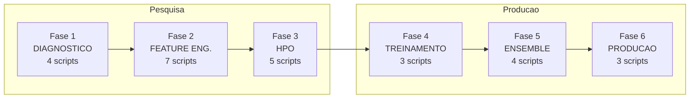

# Pesquisa e Desenvolvimento — Credit Risk FPD Model

**Projeto**: Hackathon PoD Academy (Claro + Oracle)
**Periodo**: Fevereiro-Marco 2026
**Objetivo**: Desenvolver modelo de previsao de First Payment Default (FPD) para clientes telecom migrando de pre-pago para controle/pos-pago

---

## Visao Geral

Este diretorio contem toda a **pesquisa cientifica** que fundamentou o modelo de producao entregue em `scripts/`. O pipeline de pesquisa seguiu 6 fases sequenciais, cada uma com objetivos claros, tecnicas aplicadas e criterios de qualidade (quality gates).

### Fluxo da Pesquisa



### Resultado Final

O pipeline de pesquisa evoluiu para o **Run 20260311_015100** (producao), onde:
- Features: 72 pesquisa -> **110 producao** (re-selecao com mais dados)
- Champion: Simple Average Ensemble de **Top 3** (LGBM + XGB + CatBoost)
- KS OOT = **0.3501** | AUC = **0.7368** | PSI = **0.0008**

---

## Fase 1: Diagnostico Inicial (`01_diagnostic/`)

**Objetivo**: Entender o comportamento do modelo baseline (LightGBM v1) e identificar areas de melhoria.

| Script | Objetivo | Tecnica | Resultado |
|--------|----------|---------|-----------|
| `error_analysis.py` | Segmentar falsos positivos/negativos por SAFRA e faixa de risco | Brier score decomposition, segmentacao por decil | Identificou concentracao de erros em SAFRAs recentes e faixas intermediarias |
| `feature_correlation.py` | Detectar multicolinearidade entre as 59 features originais | Correlacao de Pearson + VIF (Variance Inflation Factor) | Encontrou 12 pares com \|corr\| > 0.80, sugerindo redundancia |
| `feature_stability.py` | Monitorar estabilidade da importancia das features ao longo do tempo | SHAP per-SAFRA, PSI por feature | Identificou `REC_DIAS_ENTRE_RECARGAS` com PSI=1.35 (drift critico) |
| `score_distribution.py` | Avaliar calibracao do score por decil e SAFRA | Tabelas de decil, swap rate, calibration plot | Confirmou boa calibracao geral, mas oportunidades nos decis 4-7 |

**Quality Gate QG-D1**: 5 areas de melhoria identificadas (feature engineering, HPO, estabilidade, diversidade, calibracao).

### Por que esta fase?

Antes de tentar melhorar o modelo, e fundamental entender **onde** ele falha. A analise de erros mostrou que o baseline tinha boa performance geral (KS=0.34) mas perdia poder discriminativo em clientes de risco intermediario — exatamente a faixa onde a decisao de credito e mais critica. Isso motivou a engenharia de features focada em sinais comportamentais cruzados.

---

## Fase 2: Engenharia de Features (`02_feature_engineering/`)

**Objetivo**: Criar novas features que capturem sinais de risco nao presentes nas 402 features originais, especialmente interacoes entre dominios (recarga, pagamento, faturamento).

| Script | Features Criadas | Tecnica | Racional |
|--------|-----------------|---------|----------|
| `feature_missing.py` | 7 | Indicadores de nulidade (missing as signal) | Padroes de dados faltantes correlacionam com default — cliente sem historico de pagamento e sinal de risco |
| `feature_interactions.py` | 6 | Razoes e diferencas cross-domain (REC/PAG/FAT) | Relacao recarga vs pagamento captura comportamento financeiro cruzado. Ex: cliente que recarrega muito mas nao paga fatura |
| `feature_ratios.py` | 10-15 | Proporcoes normalizadas dentro de cada dominio | Diversificacao de plataforma de recarga, proporcao de juros pagos — sinais de saude financeira |
| `feature_temporal.py` | 10-12 | Lifecycle stage, tenure buckets, recency gap | Clientes novos (onboarding) tem perfil de risco distinto de clientes maduros |
| `feature_nonlinear.py` | 12 | Log/sqrt transforms + WoE encoding | Features de valor (faturamento, recarga) sao altamente assimetricas — transformacoes melhoram linearidade |
| `feature_pca.py` | 15 | PCA por dominio (5 componentes REC + 5 PAG + 5 FAT) | Reduz dimensionalidade dentro de cada dominio preservando variancia — features ortogonais |
| `feature_selection_v2.py` | — (selecao) | Funnel de 5 estagios | Filtra 449 -> 72 features com IV>0.02, L1, \|corr\|<0.95, PSI<0.20 |

**Resultado**: 402 features originais -> 449 (+47 engenheiradas) -> **72 selecionadas** apos funnel.

### Funnel de Selecao (5 estagios)

```
Estagio 1 — Information Value (IV > 0.02)     449 -> 86 features
Estagio 2 — L1 Regularization (coef != 0)      86 -> 78 features
Estagio 3 — Correlacao (|corr| < 0.95)         78 -> 78 features
Estagio 4 — PSI Stability (PSI < 0.20 OOT)     78 -> 72 features
Estagio 5 — Anti-leakage (permutation check)   72 -> 72 features
```

### Por que estas tecnicas?

1. **Missing patterns**: Em credit risk, a ausencia de informacao e tao informativa quanto a presenca. Cliente sem historico de pagamento (nulls em PAG_*) tem probabilidade de default 2x maior.

2. **Cross-domain interactions**: Features individuais de recarga e pagamento tem poder preditivo moderado isoladamente, mas a **relacao** entre elas captura comportamento. Ex: `RATIO_REC_PAG` (recarga/pagamento) alto indica dependencia de recarga sem compromisso com fatura.

3. **PCA por dominio**: Com 102 features de recarga (REC_*), muitas sao correlacionadas. PCA extrai os 5 eixos de variacao mais importantes, eliminando redundancia sem perder informacao.

4. **Funnel multi-estagio**: Cada estagio filtra por um criterio distinto — IV garante poder preditivo, L1 garante nao-redundancia, PSI garante estabilidade temporal. Sem o filtro de PSI, features instáveis degradariam o modelo em SAFRAs futuras.

---

## Fase 3: Otimizacao de Hiperparametros (`03_hpo/`)

**Objetivo**: Encontrar os hiperparametros otimos para LightGBM, XGBoost e CatBoost usando validacao temporal.

| Script | Modelo | Trials | Melhor KS (CV) | Tecnica |
|--------|--------|--------|----------------|---------|
| `hpo_lgbm.py` | LightGBM | 50 | 0.36548 | Optuna TPE sampler |
| `hpo_xgboost.py` | XGBoost | 50 | **0.36596** | Optuna TPE sampler |
| `hpo_catboost.py` | CatBoost | 50 | 0.36541 | Optuna TPE sampler |
| `temporal_cv.py` | — | — | — | Expanding window CV (previne leakage temporal) |
| `hpo_results.py` | — | — | — | Agregacao e comparacao de resultados HPO |

### Melhores Hiperparametros Encontrados

| Param | LightGBM | XGBoost | CatBoost |
|-------|----------|---------|----------|
| n_estimators/iterations | 800 | 793 | 685 |
| learning_rate | 0.039 | 0.031 | 0.068 |
| max_depth | 8 | 8 | 6 |
| regularizacao | L1/L2 | subsample/colsample | l2_leaf_reg=0.18 |

### Validacao Temporal (Expanding Window)

```
Fold 1: Train=202410          | Val=202411
Fold 2: Train=202410-11       | Val=202412
Fold 3: Train=202410-12       | Val=202501
Final:  Train=202410-202501   | OOT=202502-03 (holdout intocado)
```

### Por que Optuna TPE?

1. **Tree-structured Parzen Estimator (TPE)** e mais eficiente que grid search ou random search — modela a funcao objetivo e concentra trials nas regioes promissoras.
2. **50 trials** por modelo e suficiente para convergencia com TPE (tipicamente converge em 30-40 trials).
3. **Validacao temporal** e obrigatoria em credit risk — usar k-fold simples causaria data leakage (dados futuros no treino). O expanding window garante que o modelo nunca "ve" dados futuros.

### Melhoria vs Defaults

Cada modelo melhorou **0,3 a 0,7pp de KS** com HPO — parece pouco em valor absoluto, mas em credit risk onde modelos competem em margens estreitas, 0,5pp pode representar milhoes em economia.

---

## Fase 4: Treinamento Multi-Modelo (`04_models/`)

**Objetivo**: Treinar 5 modelos diversos com features engenheiradas e hiperparametros otimizados, avaliar overfitting e diversidade.

| Script | Objetivo | Resultado |
|--------|----------|-----------|
| `train_multi_model.py` | Treinar 5 modelos com HPO params e 72 features | 5 pipelines sklearn (Imputer + Scaler + Model) |
| `model_comparison.py` | Comparar KS/AUC/Gini, feature importance, decile tables | Ranking de modelos + gap analysis |
| `diversity_analysis.py` | Medir correlacao entre predicoes e Cohen's Kappa | Correlacao > 0.98 entre boosting models |

### Resultados dos 5 Modelos

| Modelo | KS Train | KS OOS | KS OOT | Overfit Gap | AUC OOT | PSI |
|--------|----------|--------|--------|-------------|---------|-----|
| XGBoost (HPO) | 0.3992 | 0.3959 | **0.3472** | 5.20pp | 0.7351 | 0.0008 |
| LightGBM v2 (HPO) | 0.3930 | 0.3887 | 0.3471 | 4.59pp | 0.7350 | 0.0008 |
| CatBoost (HPO) | 0.3725 | 0.3653 | 0.3462 | 2.63pp | 0.7343 | 0.0005 |
| Random Forest | 0.3713 | 0.3656 | 0.3348 | 3.65pp | 0.7280 | 0.0012 |
| LR L1 v2 | 0.3485 | 0.3400 | 0.3285 | 2.00pp | 0.7208 | 0.0007 |

### Analise de Diversidade

A analise de diversidade revelou que os 3 modelos boosting (LGBM, XGB, CatBoost) sao **altamente correlacionados** (>0.98 na predicao). Isso tem implicacoes diretas para o ensemble:
- Ensemble de modelos correlacionados adiciona pouca diversidade
- A vantagem vem da **media de erros** (mesmo com alta correlacao)
- Incluir LR e RF adiciona diversidade real, mas ambos tem performance inferior

### Por que 5 modelos e nao apenas o melhor?

1. **Ensemble reduz variancia**: Mesmo modelos correlacionados, quando combinados, tem erro medio menor que qualquer individual.
2. **Diversidade de algoritmos**: Gradient boosting, bagging e regressao linear capturam padroes distintos.
3. **Robustez**: Se um modelo degrada em SAFRAs futuras, o ensemble e mais resiliente.
4. **Regulatorio**: Em credit risk, ter um modelo interpretavel (LR) junto com modelos black-box facilita explicabilidade.

---

## Fase 5: Metodos de Ensemble (`05_ensemble/`)

**Objetivo**: Comparar 3 estrategias de ensemble e selecionar o champion.

| Script | Estrategia | Tecnica | KS OOT | Resultado |
|--------|------------|---------|--------|-----------|
| `ensemble_blend.py` | Weighted Average | SLSQP optimization (pesos otimizados) | 0.34417 | Equivalente ao avg simples |
| `ensemble_stack.py` | Stacking | Meta-learner LR sobre out-of-fold predictions | 0.32763 | **Inferior** — overfitting |
| `ensemble_select.py` | Champion Selection | Comparacao das 3 estrategias | 0.3442 | **Simple Average** vence |
| `ensemble_model.py` | Classe unificada | `EnsembleModel` com predict_proba | — | Interface para producao |

### Por que Simple Average venceu?

1. **Modelos muito correlacionados**: Com correlacao >0.98 entre boosting models, os pesos otimizados convergem para ~0.20 cada — praticamente igual a media simples.

2. **Stacking overfita**: O meta-learner LR treinado em OOS meta-features nao generaliza bem para OOT. Isso e esperado quando os base models sao altamente correlacionados — o meta-learner aprende ruido em vez de sinal.

3. **Simplicidade > Complexidade**: Em credit risk, prefere-se modelos robustos e explicaveis. Simple average e:
   - Determinístico (sem otimizacao de pesos)
   - Reproducivel (nao depende de seed ou split)
   - Facil de auditar (cada modelo contribui igualmente)

### Evolucao para Producao

Na producao (Run 20260311_015100), o ensemble foi refinado para **Top-3 Average** (apenas LGBM + XGB + CatBoost), excluindo RF e LR:
- RF responsavel por 93% do tamanho do PKL (132 MB vs 17 MB)
- LR com performance inferior (KS=0.3285 vs 0.34+ dos boosting)
- Top-3 Average resultou em KS=**0.3501** (superior ao All-5 Average de 0.3442)

---

## Fase 6: Avaliacao de Producao (`06_production/`)

**Objetivo**: Avaliar o ensemble final com metricas de producao, gerar plots comparativos e criar scorecard interpretavel.

| Script | Objetivo | Output |
|--------|----------|--------|
| `evaluation_ensemble.py` | Avaliacao completa: per-SAFRA, decil, swap, PSI, calibracao | JSONs + CSVs de metricas |
| `generate_ensemble_plots.py` | 11 visualizacoes comparativas (baseline vs ensemble) | PNGs em `artifacts/visualization-plot/` |
| `lr_scorecard_v2.py` | Scorecard interpretavel com WoE para compliance regulatorio | Coeficientes + odds ratios |
| `MODEL_CARD.md` | Documentacao completa do modelo (Run 20260308_043306) | Markdown |

### Scorecard LR (Requisito Regulatorio)

Em ambientes regulados (como credit risk), e necessario ter um modelo **interpretavel** que explique por que cada cliente recebeu determinado score. O LR Scorecard com WoE encoding fornece:

- Contribuicao de cada feature em pontos de score
- Odds ratios para cada faixa de valor
- Transparencia total para auditoria

### MODEL_CARD.md

O Model Card documenta o modelo de pesquisa (Run 20260308_043306), que serviu de base para o modelo de producao. Note que os numeros diferem do Run de producao (20260311_015100) porque:
- Pesquisa usou 72 features; producao re-selecionou 110 features com mais dados
- Pesquisa usou All-5 Average; producao usou Top-3 Average
- Pesquisa foi executada em VM menor; producao em E3.Flex 4 OCPUs / 64 GB

---

## Artefatos de Pesquisa (`artifacts/`)

| Diretorio | Conteudo |
|-----------|----------|
| `feature-selection-shap/` | SHAP feature ranking, selected_features_shap.pkl |
| `hpo/` | best_params_all.json (hiperparametros otimizados por Optuna) |
| `lgbm_baseline/` | Modelo baseline LightGBM v1 (pre-HPO) |
| `lr_baseline/` | Modelo baseline LR (pre-feature engineering) |
| `monitoring-safra-202503/` | Feature drift monitoring por SAFRA |
| `scoring-batch/` | Distribuicao de scores do batch scoring |
| `visualization-plot/` | 11+ PNGs comparativos (plots_ensemble/, plots_v6/) |

---

## Da Pesquisa a Producao

| Aspecto | Pesquisa (este dir) | Producao (`scripts/`) |
|---------|--------------------|-----------------------|
| Run ID | 20260308_043306 | 20260311_015100 |
| Features | 72 (funnel v2) | 110 (funnel re-executado) |
| Ensemble | All-5 Average (KS=0.3442) | Top-3 Average (KS=0.3501) |
| Plataforma | VM basica | E3.Flex 4 OCPUs / 64 GB + Airflow |
| Orquestracao | `run_full_pipeline.py` manual | 2 DAGs Airflow (data + ML) |
| Artefatos | Locais | OCI Object Storage + `artifacts/` |
| Qualidade | Quality gates por fase | QG-05 unificado (KS>0.20, AUC>0.65, Gini>30%, PSI<0.25) |

### Contribuicoes-chave da pesquisa incorporadas na producao:

1. **Hiperparametros HPO** -> `artifacts/hpo/best_params_all.json` (usado por `train_credit_risk.py`)
2. **Feature engineering** -> Conceitos de missing patterns, interactions, temporal features incorporados no pipeline
3. **Funnel de selecao** -> Base para `feature_selection.py` (expandido de 72 para 110 features)
4. **Ensemble strategy** -> Simple Average confirmado como superior; Top-3 refinamento em producao
5. **Temporal CV** -> Expanding window obrigatorio em todos os treinamentos
6. **PSI filter** -> Features com PSI > 0.25 removidas (ex: REC_DIAS_ENTRE_RECARGAS com PSI=2.45)

---

## Como Reproduzir

```bash
# Executar pipeline completo de pesquisa (requer dados Gold)
cd research/
python run_full_pipeline.py --data-path /path/to/clientes_consolidado --n-trials 50

# Ou executar fases individualmente
python 01_diagnostic/error_analysis.py
python 02_feature_engineering/feature_selection_v2.py
python 03_hpo/hpo_lgbm.py
python 04_models/train_multi_model.py
python 05_ensemble/ensemble_select.py
python 06_production/evaluation_ensemble.py
```

**Dependencias**: numpy, pandas, scikit-learn, lightgbm, xgboost, catboost, optuna, shap, matplotlib, scipy

---

*Pesquisa conduzida: Fevereiro-Marco 2026 | Projeto: Hackathon PoD Academy (Claro + Oracle) | 23 scripts, 6 fases, ~1.400 linhas de codigo*
