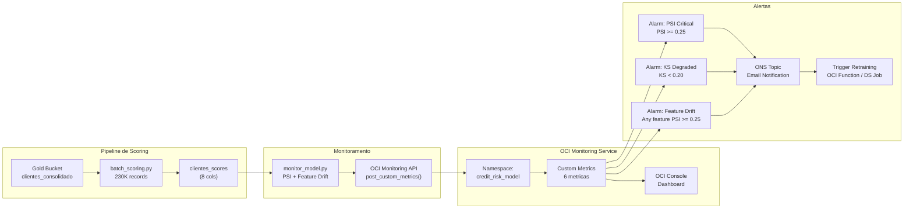
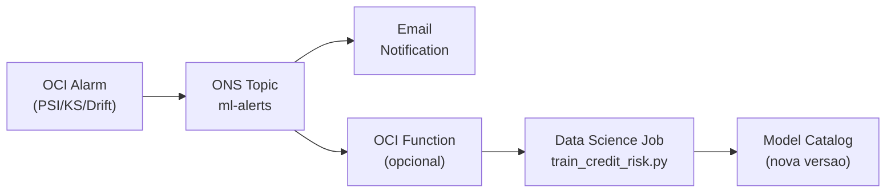

# Model Monitoring Dashboard — OCI Data Platform

**Projeto**: Hackathon PoD Academy — Credit Risk FPD (Claro + Oracle)
**Plataforma**: Oracle Cloud Infrastructure (sa-saopaulo-1)
**Data**: 2026-03-08
**Versao**: 2.0

---

## Dashboard ao Vivo

> **URL**: https://G95D3985BD0D2FD-PODACADEMY.adb.sa-saopaulo-1.oraclecloudapps.com/ords/mlmonitor/dashboard/
>
> Dashboard dinamico servido via ORDS REST a partir do Oracle Autonomous Database.
> Todos os dados sao carregados em tempo real das tabelas do ADW — sem valores hardcoded.
> Acesso publico, sem autenticacao necessaria.

### Stack do Dashboard

| Componente | Tecnologia | Detalhes |
|------------|-----------|---------|
| Backend | Oracle ADW + ORDS REST | 7 tabelas + 4 views, endpoints publicos |
| Frontend | HTML5 + Chart.js 4.4 | Dark theme, 3 paginas, responsivo |
| Hosting | ORDS Handler (PL/SQL) | HTML armazenado em CLOB, servido via `HTP.P()` |
| Schema | MLMONITOR | APEX workspace + user DASHADMIN |
| Deploy | `upload_dashboard.py` | Upload via base64 chunked |

### 3 Paginas do Dashboard

| Pagina | Conteudo | Fonte de Dados |
|--------|----------|----------------|
| Executive Overview | 6 KPI cards + KS trend + PSI trend + Risk bands + Score distribution | `model_performance`, `score_stability`, `score_distribution`, `model_status` |
| Model Performance | AUC/Gini trends + LightGBM vs LR comparison + Feature drift table | `model_performance`, `feature_drift`, `v_model_comparison` |
| Operations & Costs | Pipeline history + Cost donut + Cost trend | `pipeline_runs`, `cost_tracking`, `v_cost_trend` |

### Atualizacao dos Dados

Os dados do dashboard atualizam automaticamente ao recarregar a pagina. Para inserir novos dados:

```bash
# Via monitor_model.py (atualiza PSI, drift, status)
python oci/model/monitor_model.py --publish-metrics

# Via SQL direto (ex: nova SAFRA)
INSERT INTO model_performance (model_name, safra, dataset_type, ks_statistic, auc_roc, gini, n_records)
VALUES ('LightGBM', '202504', 'OOT', 0.3250, 0.7180, 43.60, 640000);
COMMIT;
```

### Scripts de Setup

| Script | Funcao |
|--------|--------|
| `oci/infrastructure/apex/01_create_schema.sql` | MLMONITOR user + APEX workspace |
| `oci/infrastructure/apex/02_create_tables.sql` | 7 tabelas + 4 views |
| `oci/infrastructure/apex/03_seed_data.sql` | Dados reais do projeto |
| `oci/infrastructure/apex/04_create_apex_app.sql` | Guia de setup + queries SQL |
| `oci/infrastructure/apex/dashboard.html` | HTML do dashboard (Chart.js) |
| `oci/infrastructure/apex/upload_dashboard.py` | Upload do HTML para ADW via ORDS |

---

## Indice

1. [Resumo](#1-resumo)
2. [Arquitetura do Dashboard](#2-arquitetura-do-dashboard)
3. [Layout do Dashboard — 6 Paineis](#3-layout-do-dashboard--6-paineis)
4. [Implementacao Custom Metrics](#4-implementacao-custom-metrics)
5. [Alert Rules para Retraining Automatico](#5-alert-rules-para-retraining-automatico)
6. [Integracao com monitor_model.py](#6-integracao-com-monitor_modelpy)
7. [Integracao Evidently AI (Opcional)](#7-integracao-evidently-ai-opcional)
8. [Terraform para Monitoramento ML](#8-terraform-para-monitoramento-ml)
9. [Guia Passo a Passo](#9-guia-passo-a-passo)

---

## 1. Resumo

O dashboard de monitoramento ML monitora a estabilidade do modelo de credit risk (FPD) em producao. Detecta drift de scores e features por SAFRA, dispara alertas quando thresholds sao atingidos, e trigger retraining automatico quando necessario.

### Objetivos

- Monitorar distribuicao de scores por SAFRA (202410–202503)
- Detectar drift via PSI (Population Stability Index) continuamente
- Acompanhar KS, AUC e Gini por periodo de avaliacao
- Alertar automaticamente quando modelo degrada
- Fornecer visibilidade operacional do pipeline de scoring

### Metricas de Referencia (Baseline)

| Metrica | LR L1 | LightGBM | Threshold |
|---------|-------|----------|-----------|
| KS (OOT) | 0.3277 | 0.3397 | > 0.20 |
| AUC (OOT) | 0.7207 | 0.7303 | > 0.65 |
| Gini (OOT) | 44.15% | 46.06% | > 30% |
| PSI (Train vs OOT) | 0.0012 | 0.0012 | < 0.25 |

---

## 2. Arquitetura do Dashboard

### Diagrama: Fluxo de Monitoramento



### Componentes

| Componente | Servico OCI | Funcao |
|-----------|-------------|--------|
| Custom Metrics | OCI Monitoring | Armazena metricas ML no namespace `credit_risk_model` |
| Dashboard | OCI Console | Visualizacao dos 6 paineis |
| Alarms | OCI Monitoring | 3 regras de alerta ML |
| Notifications | ONS | Entrega de alertas por email |
| Retraining Trigger | Functions / DS Jobs | Execucao automatica de retraining |

### Dimensoes das Metricas

Todas as custom metrics usam estas dimensoes para filtragem:

| Dimensao | Exemplo | Descricao |
|----------|---------|-----------|
| `model_name` | `lgbm_oci_v1`, `lr_l1_oci_v1` | Versao do modelo |
| `safra` | `202502`, `202503` | Periodo de scoring |
| `metric_type` | `score_psi`, `feature_drift` | Categoria da metrica |

---

## 3. Layout do Dashboard — 6 Paineis

### Painel 1: Score Distribution por SAFRA

**Visualizacao**: Histograma agrupado (barras por SAFRA)
**Custom Metric**: `credit_risk/score_distribution`

Mostra a distribuicao de scores (0-1000) por SAFRA, permitindo visualizar shifts na populacao.

| Faixa de Risco | Score Range | Cor |
|----------------|-------------|-----|
| CRITICO | 0–299 | Vermelho |
| ALTO | 300–499 | Laranja |
| MEDIO | 500–699 | Amarelo |
| BAIXO | 700–1000 | Verde |

**Metricas publicadas**:

```
credit_risk/score_mean      — Media do score por SAFRA
credit_risk/score_p25       — Percentil 25
credit_risk/score_p50       — Mediana
credit_risk/score_p75       — Percentil 75
credit_risk/pct_critico     — % clientes na faixa CRITICO
credit_risk/pct_baixo       — % clientes na faixa BAIXO
```

---

### Painel 2: PSI Trend

**Visualizacao**: Grafico de linha com faixas de referencia
**Custom Metric**: `credit_risk/score_psi`
**Alerta**: PSI >= 0.25 → CRITICAL

Mostra a evolucao do PSI (Population Stability Index) entre a distribuicao de treino e cada SAFRA de scoring.

| Faixa PSI | Status | Acao |
|-----------|--------|------|
| < 0.10 | OK (verde) | Nenhuma acao necessaria |
| 0.10 – 0.25 | WARNING (amarelo) | Monitorar de perto |
| >= 0.25 | RETRAIN (vermelho) | Retraining necessario |

---

### Painel 3: KS / AUC / Gini por SAFRA

**Visualizacao**: 3 linhas (uma por metrica) com baseline horizontal
**Custom Metrics**: `credit_risk/ks_statistic`, `credit_risk/auc_roc`, `credit_risk/gini`
**Alerta**: KS < 0.20 → WARNING

| Metrica | Baseline (LGBM) | Threshold Minimo |
|---------|-----------------|-----------------|
| KS | 0.3397 | 0.20 |
| AUC | 0.7303 | 0.65 |
| Gini | 46.06% | 30% |

> **Nota**: KS/AUC/Gini so podem ser calculados quando labels (FPD) estao disponiveis. Para SAFRAs recentes sem outcome observado, essas metricas ficam pendentes.

---

### Painel 4: Feature Drift Heatmap

**Visualizacao**: Heatmap (20 features x N SAFRAs)
**Custom Metric**: `credit_risk/feature_psi`
**Alerta**: Qualquer feature PSI >= 0.25

Monitora PSI das top 20 features mais importantes:

```
TARGET_SCORE_02, TARGET_SCORE_01, REC_SCORE_RISCO,
REC_TAXA_STATUS_A, REC_QTD_LINHAS, REC_DIAS_ENTRE_RECARGAS,
REC_QTD_INST_DIST_REG, REC_DIAS_DESDE_ULTIMA_RECARGA,
REC_TAXA_CARTAO_ONLINE, REC_QTD_STATUS_ZB2,
REC_QTD_CARTAO_ONLINE, REC_COEF_VARIACAO_REAL,
FAT_DIAS_MEDIO_CRIACAO_VENCIMENTO, REC_VLR_CREDITO_STDDEV,
REC_TAXA_PLAT_PREPG, REC_VLR_REAL_STDDEV,
PAG_QTD_PAGAMENTOS_TOTAL, FAT_QTD_FATURAS_PRIMEIRA,
REC_QTD_STATUS_ZB1, FAT_TAXA_PRIMEIRA_FAT
```

Escala de cores: Verde (PSI < 0.10) → Amarelo (0.10–0.25) → Vermelho (>= 0.25)

---

### Painel 5: Indicador de Retraining

**Visualizacao**: Semaforo (verde / amarelo / vermelho)
**Custom Metric**: `credit_risk/retrain_status`
**Alerta**: status == 2 → CRITICAL

| Valor | Status | Descricao |
|-------|--------|-----------|
| 0 | STABLE (verde) | Modelo estavel, sem acao necessaria |
| 1 | WARNING (amarelo) | Drift moderado, monitorar proximo batch |
| 2 | RETRAIN (vermelho) | Retraining necessario — PSI critico ou KS < threshold |

Logica de decisao:

```python
def compute_retrain_status(score_psi, feature_drift, ks_value=None):
    """Determina status de retraining."""
    # PSI critico em qualquer score
    if any(v["status"] == "RETRAIN" for v in score_psi.values()):
        return 2  # RETRAIN

    # KS abaixo do threshold (quando disponivel)
    if ks_value is not None and ks_value < 0.20:
        return 2  # RETRAIN

    # Feature drift critico (>= 3 features com PSI >= 0.25)
    drifted = sum(1 for v in feature_drift.values()
                  if v.get("status") == "RETRAIN")
    if drifted >= 3:
        return 2  # RETRAIN

    # Warning: drift moderado
    if any(v["status"] == "WARNING" for v in score_psi.values()):
        return 1  # WARNING

    warned_features = sum(1 for v in feature_drift.values()
                         if v.get("status") == "WARNING")
    if warned_features >= 5:
        return 1  # WARNING

    return 0  # STABLE
```

---

### Painel 6: Volume e Latencia de Scoring

**Visualizacao**: Barras (volume) + Linha (latencia)
**Custom Metrics**: `credit_risk/scoring_volume`, `credit_risk/scoring_latency_ms`
**Alerta**: Nenhum (informativo)

| Metrica | Descricao | Unidade |
|---------|-----------|---------|
| `scoring_volume` | Quantidade de registros scored por batch | count |
| `scoring_latency_ms` | Tempo total de scoring por batch | milliseconds |
| `scoring_throughput` | Registros por segundo | records/sec |

---

## 4. Implementacao Custom Metrics

### Codigo Python: Post Custom Metrics

```python
"""
OCI Custom Metrics — Credit Risk Model Monitoring
Publica metricas ML no OCI Monitoring Service.

Requer: oci (SDK), configuracao de Resource Principal ou API key.
"""
import oci
from datetime import datetime, timezone


def get_monitoring_client():
    """Inicializa MonitoringClient com Resource Principal ou config file."""
    try:
        # Resource Principal (dentro de OCI — notebook, function, job)
        signer = oci.auth.signers.get_resource_principals_signer()
        return oci.monitoring.MonitoringClient({}, signer=signer)
    except Exception:
        # Config file (local development)
        config = oci.config.from_file()
        return oci.monitoring.MonitoringClient(config)


def post_custom_metrics(
    compartment_id: str,
    model_name: str,
    safra: str,
    metrics: dict,
):
    """
    Publica metricas customizadas no OCI Monitoring.

    Args:
        compartment_id: OCID do compartment
        model_name: Nome do modelo (e.g., "lgbm_oci_v1")
        safra: SAFRA avaliada (e.g., "202503")
        metrics: Dict com nome_metrica -> valor
            Exemplo: {"score_psi": 0.0012, "ks_statistic": 0.3397, ...}
    """
    client = get_monitoring_client()

    metric_data_details = []
    timestamp = datetime.now(timezone.utc)

    for metric_name, value in metrics.items():
        metric_data_details.append(
            oci.monitoring.models.MetricDataDetails(
                namespace="credit_risk_model",
                compartment_id=compartment_id,
                name=f"credit_risk/{metric_name}",
                dimensions={
                    "model_name": model_name,
                    "safra": str(safra),
                    "metric_type": _classify_metric(metric_name),
                },
                datapoints=[
                    oci.monitoring.models.Datapoint(
                        timestamp=timestamp,
                        value=float(value),
                    )
                ],
                metadata={"unit": _get_unit(metric_name)},
            )
        )

    request = oci.monitoring.models.PostMetricDataDetails(
        metric_data=metric_data_details,
    )

    response = client.post_metric_data(
        post_metric_data_details=request,
    )

    print(f"[METRICS] Posted {len(metric_data_details)} metrics for "
          f"model={model_name}, safra={safra}. "
          f"Status: {response.status}")

    return response


def _classify_metric(name: str) -> str:
    """Classifica metrica por tipo."""
    if "psi" in name:
        return "stability"
    elif name in ("ks_statistic", "auc_roc", "gini"):
        return "performance"
    elif "score" in name or "pct" in name:
        return "distribution"
    elif "drift" in name or "feature" in name:
        return "feature_drift"
    else:
        return "operational"


def _get_unit(name: str) -> str:
    """Retorna unidade da metrica."""
    if "psi" in name:
        return "index"
    elif "latency" in name:
        return "milliseconds"
    elif "volume" in name or "count" in name:
        return "count"
    elif "pct" in name:
        return "percent"
    else:
        return "ratio"


def post_score_distribution_metrics(
    compartment_id: str,
    model_name: str,
    safra: str,
    scores: "np.ndarray",
):
    """
    Publica metricas de distribuicao de scores.

    Args:
        scores: Array de scores (0-1000)
    """
    import numpy as np

    total = len(scores)
    metrics = {
        "score_mean": float(np.mean(scores)),
        "score_p25": float(np.percentile(scores, 25)),
        "score_p50": float(np.percentile(scores, 50)),
        "score_p75": float(np.percentile(scores, 75)),
        "pct_critico": float((scores < 300).sum() / total * 100),
        "pct_alto": float(((scores >= 300) & (scores < 500)).sum() / total * 100),
        "pct_medio": float(((scores >= 500) & (scores < 700)).sum() / total * 100),
        "pct_baixo": float((scores >= 700).sum() / total * 100),
        "scoring_volume": float(total),
    }

    return post_custom_metrics(compartment_id, model_name, safra, metrics)


def post_monitoring_report_metrics(
    compartment_id: str,
    model_name: str,
    safra: str,
    report: dict,
):
    """
    Publica metricas do monitoring report (output de monitor_model.py).

    Args:
        report: Dict carregado do monitoring_report_YYYYMMDD.json
    """
    metrics = {}

    # Score PSI
    for col, data in report.get("score_psi", {}).items():
        metrics["score_psi"] = data["psi"]

    # Feature drift (publica cada feature)
    for feat, data in report.get("feature_drift", {}).items():
        if data.get("psi") is not None:
            post_custom_metrics(
                compartment_id,
                model_name,
                safra,
                {f"feature_psi_{feat}": data["psi"]},
            )

    # Retrain status
    status_map = {"STABLE": 0, "WARNING": 1, "RETRAIN_REQUIRED": 2}
    overall = report.get("overall_status", "STABLE")
    metrics["retrain_status"] = status_map.get(overall, 0)

    return post_custom_metrics(compartment_id, model_name, safra, metrics)
```

### Formato de Dados no OCI Monitoring

```json
{
  "metricData": [
    {
      "namespace": "credit_risk_model",
      "compartmentId": "ocid1.compartment.oc1..xxx",
      "name": "credit_risk/score_psi",
      "dimensions": {
        "model_name": "lgbm_oci_v1",
        "safra": "202503",
        "metric_type": "stability"
      },
      "datapoints": [
        {
          "timestamp": "2026-03-07T12:00:00Z",
          "value": 0.0012
        }
      ],
      "metadata": {
        "unit": "index"
      }
    }
  ]
}
```

---

## 5. Alert Rules para Retraining Automatico

### 3 Alarmes ML (Terraform)

```hcl
# ── Alarm: Score PSI Critical ──────────────────────────────────────────
resource "oci_monitoring_alarm" "ml_psi_critical" {
  compartment_id        = var.compartment_ocid
  display_name          = "${var.project_prefix}-ml-psi-critical"
  is_enabled            = true
  metric_compartment_id = var.compartment_ocid
  namespace             = "credit_risk_model"
  query                 = "credit_risk/score_psi[1d].max() >= 0.25"
  severity              = "CRITICAL"
  body                  = "Model score PSI >= 0.25 — score distribution has shifted significantly. Retraining required. Model: {{dimensions.model_name}}, SAFRA: {{dimensions.safra}}"
  pending_duration      = "PT5M"
  repeat_notification_duration = "PT4H"

  destinations = [oci_ons_notification_topic.ml_alerts.id]
}

# ── Alarm: KS Degradation ─────────────────────────────────────────────
resource "oci_monitoring_alarm" "ml_ks_degraded" {
  compartment_id        = var.compartment_ocid
  display_name          = "${var.project_prefix}-ml-ks-degraded"
  is_enabled            = true
  metric_compartment_id = var.compartment_ocid
  namespace             = "credit_risk_model"
  query                 = "credit_risk/ks_statistic[1d].min() < 0.20"
  severity              = "WARNING"
  body                  = "Model KS statistic dropped below 0.20 — discriminatory power degraded. Review model performance. Model: {{dimensions.model_name}}, SAFRA: {{dimensions.safra}}"
  pending_duration      = "PT1H"
  repeat_notification_duration = "PT24H"

  destinations = [oci_ons_notification_topic.ml_alerts.id]
}

# ── Alarm: Feature Drift ──────────────────────────────────────────────
resource "oci_monitoring_alarm" "ml_feature_drift" {
  compartment_id        = var.compartment_ocid
  display_name          = "${var.project_prefix}-ml-feature-drift"
  is_enabled            = true
  metric_compartment_id = var.compartment_ocid
  namespace             = "credit_risk_model"
  query                 = "credit_risk/feature_psi[1d]{metric_type = \"feature_drift\"}.max() >= 0.25"
  severity              = "CRITICAL"
  body                  = "Feature drift detected — one or more features have PSI >= 0.25. Investigate feature stability. Model: {{dimensions.model_name}}, SAFRA: {{dimensions.safra}}"
  pending_duration      = "PT5M"
  repeat_notification_duration = "PT4H"

  destinations = [oci_ons_notification_topic.ml_alerts.id]
}
```

### Fluxo de Retraining Automatico



**Fluxo**:
1. Custom metric excede threshold → Alarm dispara
2. Alarm notifica ONS Topic `ml-alerts`
3. ONS envia email + (opcionalmente) invoca OCI Function
4. Function cria Data Science Job Run com `train_credit_risk.py`
5. Novo modelo treinado e registrado no Model Catalog

> **Nota**: O trigger via OCI Function e uma extensao futura. No estado atual, o retraining e manual apos notificacao por email.

---

## 6. Integracao com monitor_model.py

O arquivo `oci/model/monitor_model.py` ja implementa PSI de scores e feature drift. As extensoes propostas integram com o OCI Monitoring API.

### Extensao 1: Post Metrics apos Generate Report

Adicionar chamada a `post_custom_metrics()` ao final de `generate_report()`:

```python
# Em monitor_model.py, apos generate_report():

def generate_report(score_psi, feature_drift, training_metrics, output_dir):
    # ... codigo existente ...

    # EXTENSAO: Publicar metricas no OCI Monitoring
    compartment_id = os.environ.get("COMPARTMENT_OCID")
    if compartment_id:
        from post_custom_metrics import (
            post_monitoring_report_metrics,
            post_custom_metrics,
        )
        # Publicar metricas agregadas
        post_monitoring_report_metrics(
            compartment_id=compartment_id,
            model_name="lgbm_oci_v1",
            safra=str(max(OOT_SAFRAS)),
            report=report,
        )
        print("[METRICS] Custom metrics posted to OCI Monitoring")
```

### Extensao 2: PSI por SAFRA Individual

Atualmente `monitor_model.py` calcula PSI agregado (todos OOT SAFRAs juntos). A extensao calcula por SAFRA:

```python
def monitor_score_psi_per_safra(df):
    """Compute PSI between training and each scoring SAFRA individually."""
    results = {}

    train_mask = df["SAFRA"].isin(TRAIN_SAFRAS)
    score_cols = [c for c in df.columns if "score" in c.lower() or "prob" in c.lower()]

    for safra in sorted(df["SAFRA"].unique()):
        if safra in TRAIN_SAFRAS:
            continue

        safra_mask = df["SAFRA"] == safra
        safra_results = {}

        for col in score_cols:
            train_scores = df.loc[train_mask, col].dropna().values
            safra_scores = df.loc[safra_mask, col].dropna().values

            if len(train_scores) < 100 or len(safra_scores) < 100:
                continue

            psi = compute_psi(train_scores, safra_scores)
            status = classify_psi(psi)
            safra_results[col] = {"psi": psi, "status": status, "n": len(safra_scores)}

        results[int(safra)] = safra_results
        print(f"  SAFRA {safra}: {safra_results}")

    return results
```

### Extensao 3: KS/AUC/Gini por SAFRA (quando labels disponiveis)

```python
def evaluate_per_safra(df, model_pipeline, target="FPD"):
    """Evaluate model performance per SAFRA when labels are available."""
    from sklearn.metrics import roc_auc_score
    from train_credit_risk import compute_ks, compute_gini, SELECTED_FEATURES

    results = {}

    for safra in sorted(df["SAFRA"].unique()):
        safra_df = df[df["SAFRA"] == safra].copy()
        safra_df = safra_df[safra_df[target].notna()]

        if len(safra_df) < 100:
            continue

        X = safra_df[SELECTED_FEATURES]
        y = safra_df[target].astype(int)
        y_prob = model_pipeline.predict_proba(X)[:, 1]

        auc = roc_auc_score(y, y_prob)
        ks = compute_ks(y.values, y_prob)
        gini = compute_gini(auc)

        results[int(safra)] = {
            "ks": round(ks, 5),
            "auc": round(auc, 5),
            "gini": round(gini, 2),
            "n": len(safra_df),
            "fpd_rate": round(float(y.mean()), 4),
        }
        print(f"  SAFRA {safra}: KS={ks:.4f}, AUC={auc:.4f}, Gini={gini:.2f}")

    return results
```

### Extensao 4: Historico em Object Storage

```python
def save_monitoring_history(report, safra):
    """Salva historico de monitoramento em Object Storage para trend analysis."""
    import oci

    config = oci.config.from_file()
    object_storage = oci.object_storage.ObjectStorageClient(config)

    namespace = os.environ.get("OCI_NAMESPACE", "grlxi07jz1mo")
    bucket = "pod-academy-gold"
    object_name = f"monitoring_history/report_{safra}_{datetime.now().strftime('%Y%m%d')}.json"

    object_storage.put_object(
        namespace_name=namespace,
        bucket_name=bucket,
        object_name=object_name,
        put_object_body=json.dumps(report, indent=2),
        content_type="application/json",
    )
    print(f"[HISTORY] Saved to oci://{bucket}@{namespace}/{object_name}")
```

---

## 7. Integracao Evidently AI (Opcional)

[Evidently](https://www.evidentlyai.com/) fornece analise de drift com visualizacoes HTML ricas. Pode ser integrado como complemento ao monitoramento nativo do OCI.

### Instalacao

```bash
pip install evidently
```

### Data Drift Report

```python
from evidently.report import Report
from evidently.metric_preset import DataDriftPreset
from evidently.tests import TestColumnDrift
from evidently.test_suite import TestSuite


def run_evidently_drift_report(train_df, scoring_df, features, output_dir):
    """
    Gera relatorio Evidently de data drift.

    Args:
        train_df: DataFrame de treino (referencia)
        scoring_df: DataFrame de scoring (atual)
        features: Lista de features a monitorar
        output_dir: Diretorio de saida para HTML
    """
    # Data Drift Report (visual)
    report = Report(metrics=[DataDriftPreset()])
    report.run(
        reference_data=train_df[features],
        current_data=scoring_df[features],
    )

    html_path = os.path.join(output_dir, "evidently_drift_report.html")
    report.save_html(html_path)
    print(f"[EVIDENTLY] Drift report saved to {html_path}")

    return report


def run_evidently_test_suite(train_df, scoring_df, features, output_dir):
    """
    Executa test suite Evidently com threshold por feature.
    """
    tests = [TestColumnDrift(column_name=f) for f in features]

    suite = TestSuite(tests=tests)
    suite.run(
        reference_data=train_df[features],
        current_data=scoring_df[features],
    )

    html_path = os.path.join(output_dir, "evidently_test_suite.html")
    suite.save_html(html_path)
    print(f"[EVIDENTLY] Test suite saved to {html_path}")

    # Extract results
    results = suite.as_dict()
    summary = results.get("summary", {})
    print(f"[EVIDENTLY] Tests: {summary.get('total_tests', 0)} total, "
          f"{summary.get('success_tests', 0)} passed, "
          f"{summary.get('failed_tests', 0)} failed")

    return suite
```

### Upload para Object Storage

```python
def upload_evidently_reports(output_dir):
    """Upload Evidently HTML reports para Object Storage para acesso via URL."""
    import oci

    config = oci.config.from_file()
    object_storage = oci.object_storage.ObjectStorageClient(config)
    namespace = os.environ.get("OCI_NAMESPACE", "grlxi07jz1mo")

    for filename in ["evidently_drift_report.html", "evidently_test_suite.html"]:
        filepath = os.path.join(output_dir, filename)
        if os.path.exists(filepath):
            with open(filepath, "rb") as f:
                object_storage.put_object(
                    namespace_name=namespace,
                    bucket_name="pod-academy-gold",
                    object_name=f"monitoring_reports/{filename}",
                    put_object_body=f,
                    content_type="text/html",
                )
            print(f"[UPLOAD] {filename} -> Object Storage")
```

---

## 8. Terraform para Monitoramento ML

### Novos Recursos para `modules/monitoring/main.tf`

Estes recursos estendem o modulo de monitoring existente (que ja tem 3 alarmes operacionais) com 3 alarmes ML adicionais.

```hcl
# ─── ML Monitoring: Notification Topic ──────────────────────────────
resource "oci_ons_notification_topic" "ml_alerts" {
  compartment_id = var.compartment_ocid
  name           = "${var.project_prefix}-ml-alerts"
  description    = "ML model monitoring alerts for ${var.project_prefix}"
}

resource "oci_ons_subscription" "ml_email_alert" {
  compartment_id = var.compartment_ocid
  topic_id       = oci_ons_notification_topic.ml_alerts.id
  protocol       = "EMAIL"
  endpoint       = var.alert_email
}

# ─── ML Alarm: Score PSI Critical ──────────────────────────────────
resource "oci_monitoring_alarm" "ml_psi_critical" {
  compartment_id        = var.compartment_ocid
  display_name          = "${var.project_prefix}-ml-psi-critical"
  is_enabled            = true
  metric_compartment_id = var.compartment_ocid
  namespace             = "credit_risk_model"
  query                 = "credit_risk/score_psi[1d].max() >= 0.25"
  severity              = "CRITICAL"
  body                  = <<-EOT
    Model score PSI >= 0.25 — significant score distribution shift detected.
    Retraining required.
    Check monitoring report and feature drift analysis.
    Dashboard: OCI Console > Monitoring > Custom Metrics > credit_risk_model
  EOT
  pending_duration             = "PT5M"
  repeat_notification_duration = "PT4H"

  destinations = [oci_ons_notification_topic.ml_alerts.id]
}

# ─── ML Alarm: KS Degradation ─────────────────────────────────────
resource "oci_monitoring_alarm" "ml_ks_degraded" {
  compartment_id        = var.compartment_ocid
  display_name          = "${var.project_prefix}-ml-ks-degraded"
  is_enabled            = true
  metric_compartment_id = var.compartment_ocid
  namespace             = "credit_risk_model"
  query                 = "credit_risk/ks_statistic[1d].min() < 0.20"
  severity              = "WARNING"
  body                  = <<-EOT
    Model KS statistic dropped below 0.20 threshold.
    Discriminatory power has degraded significantly.
    Review model performance and consider retraining.
  EOT
  pending_duration             = "PT1H"
  repeat_notification_duration = "PT24H"

  destinations = [oci_ons_notification_topic.ml_alerts.id]
}

# ─── ML Alarm: Feature Drift ──────────────────────────────────────
resource "oci_monitoring_alarm" "ml_feature_drift" {
  compartment_id        = var.compartment_ocid
  display_name          = "${var.project_prefix}-ml-feature-drift"
  is_enabled            = true
  metric_compartment_id = var.compartment_ocid
  namespace             = "credit_risk_model"
  query                 = "credit_risk/feature_psi[1d].max() >= 0.25"
  severity              = "CRITICAL"
  body                  = <<-EOT
    Feature drift detected — one or more monitored features have PSI >= 0.25.
    This indicates significant change in input data distribution.
    Investigate: which features drifted and why.
    Run: python monitor_model.py --scores-path <latest_scoring>
  EOT
  pending_duration             = "PT5M"
  repeat_notification_duration = "PT4H"

  destinations = [oci_ons_notification_topic.ml_alerts.id]
}
```

### Variaveis Adicionais

Nenhuma variavel adicional necessaria — os alarmes ML reutilizam `var.compartment_ocid`, `var.project_prefix` e `var.alert_email` ja definidos no modulo.

---

## 9. Guia Passo a Passo

### Step 1: Estender monitor_model.py com OCI Monitoring API

```bash
# 1. Criar arquivo de custom metrics (Secao 4 deste documento)
# Salvar como: oci/model/post_custom_metrics.py

# 2. Adicionar dependencia OCI SDK
pip install oci

# 3. Testar localmente
python -c "
from post_custom_metrics import get_monitoring_client
client = get_monitoring_client()
print('OCI Monitoring client initialized successfully')
"
```

### Step 2: Criar Data Science Job Agendado

```bash
# Criar job definition para monitoramento
oci data-science job create \
  --compartment-id $COMPARTMENT_OCID \
  --project-id $DS_PROJECT_OCID \
  --display-name "pod-academy-model-monitor" \
  --job-configuration-details '{
    "jobType": "DEFAULT",
    "environmentVariables": {
      "COMPARTMENT_OCID": "'$COMPARTMENT_OCID'",
      "OCI_NAMESPACE": "'$OCI_NAMESPACE'"
    }
  }' \
  --job-infrastructure-configuration-details '{
    "jobInfrastructureType": "STANDALONE",
    "shapeName": "VM.Standard.E4.Flex",
    "shapeConfigDetails": {"ocpus": 2, "memoryInGBs": 32},
    "subnetId": "'$COMPUTE_SUBNET_OCID'",
    "blockStorageSizeInGBs": 50
  }'
```

### Step 3: Apply Terraform para Novos Alarmes

```bash
cd oci/infrastructure/terraform

# Adicionar os recursos ML da Secao 8 ao modules/monitoring/main.tf
# Depois:
terraform plan -target=module.monitoring
terraform apply -target=module.monitoring
```

### Step 4: Dashboard — ORDS/APEX (Implementado)

O dashboard foi implementado como uma aplicacao HTML servida via ORDS REST diretamente do ADW.

**URL ao vivo**: https://G95D3985BD0D2FD-PODACADEMY.adb.sa-saopaulo-1.oraclecloudapps.com/ords/mlmonitor/dashboard/

Para recriar o dashboard do zero:

```bash
# 1. Executar scripts SQL (como ADMIN via ORDS)
cat oci/infrastructure/apex/01_create_schema.sql | curl -s -X POST "$ADW_ORDS_URL/ords/admin/_/sql" -H "Content-Type: application/sql" -u "ADMIN:$PASSWORD" --data-binary @-
cat oci/infrastructure/apex/02_create_tables.sql | curl -s -X POST "$ADW_ORDS_URL/ords/mlmonitor/_/sql" -H "Content-Type: application/sql" -u "MLMONITOR:$PASSWORD" --data-binary @-
cat oci/infrastructure/apex/03_seed_data.sql | curl -s -X POST "$ADW_ORDS_URL/ords/mlmonitor/_/sql" -H "Content-Type: application/sql" -u "MLMONITOR:$PASSWORD" --data-binary @-

# 2. Upload do HTML do dashboard
python oci/infrastructure/apex/upload_dashboard.py
```

**Alternativa (OCI Console)**: Para monitoramento via OCI Monitoring Service (custom metrics), acesse:
1. **OCI Console > Observability & Management > Monitoring > Metrics Explorer**
2. Namespace: `credit_risk_model`
3. Queries MQL: `credit_risk.score_psi[1d].max()`, `credit_risk.ks_statistic[1d].min()`, etc.

### Step 5: Testar Fluxo de Alerta End-to-End

```bash
# 1. Executar scoring batch
python batch_scoring.py

# 2. Executar monitoramento
python monitor_model.py --scores-path oci/artifacts/scoring/

# 3. Publicar metricas (com extensao da Secao 6)
python -c "
from post_custom_metrics import post_custom_metrics
import os
post_custom_metrics(
    compartment_id=os.environ['COMPARTMENT_OCID'],
    model_name='lgbm_oci_v1',
    safra='202503',
    metrics={
        'score_psi': 0.0012,
        'ks_statistic': 0.3397,
        'retrain_status': 0,
    },
)
"

# 4. Verificar metricas no OCI Console
# Monitoring > Metrics Explorer > namespace: credit_risk_model

# 5. Testar alarme (simular PSI critico)
python -c "
from post_custom_metrics import post_custom_metrics
import os
post_custom_metrics(
    compartment_id=os.environ['COMPARTMENT_OCID'],
    model_name='lgbm_oci_v1',
    safra='test',
    metrics={'score_psi': 0.30},  # Acima do threshold 0.25
)
# Aguardar 5 min (pending_duration) para alarme disparar
"
```

### Step 6: (Opcional) Deploy Integracao Evidently

```bash
# 1. Instalar Evidently
pip install evidently

# 2. Gerar reports
python -c "
import pandas as pd
from evidently_integration import run_evidently_drift_report

train_df = pd.read_parquet('oci/artifacts/scoring/clientes_scores_all.parquet')
# ... (carregar train e scoring)
run_evidently_drift_report(train_df, scoring_df, TOP_FEATURES, 'oci/artifacts/monitoring/')
"

# 3. Upload para Object Storage
python -c "
from evidently_integration import upload_evidently_reports
upload_evidently_reports('oci/artifacts/monitoring/')
"
```

---

## Apendice: Metricas Custom Completas

| Metrica | Namespace | Tipo | Threshold | Alarme |
|---------|-----------|------|-----------|--------|
| `credit_risk/score_psi` | `credit_risk_model` | stability | >= 0.25 | CRITICAL |
| `credit_risk/ks_statistic` | `credit_risk_model` | performance | < 0.20 | WARNING |
| `credit_risk/auc_roc` | `credit_risk_model` | performance | < 0.65 | — |
| `credit_risk/gini` | `credit_risk_model` | performance | < 30 | — |
| `credit_risk/feature_psi` | `credit_risk_model` | feature_drift | >= 0.25 | CRITICAL |
| `credit_risk/retrain_status` | `credit_risk_model` | operational | == 2 | CRITICAL |
| `credit_risk/score_mean` | `credit_risk_model` | distribution | — | — |
| `credit_risk/score_p50` | `credit_risk_model` | distribution | — | — |
| `credit_risk/pct_critico` | `credit_risk_model` | distribution | — | — |
| `credit_risk/pct_baixo` | `credit_risk_model` | distribution | — | — |
| `credit_risk/scoring_volume` | `credit_risk_model` | operational | — | — |
| `credit_risk/scoring_latency_ms` | `credit_risk_model` | operational | — | — |

---

*Documento gerado: 2026-03-07 | Projeto: Hackathon PoD Academy (Claro + Oracle) | Plataforma: OCI sa-saopaulo-1*
