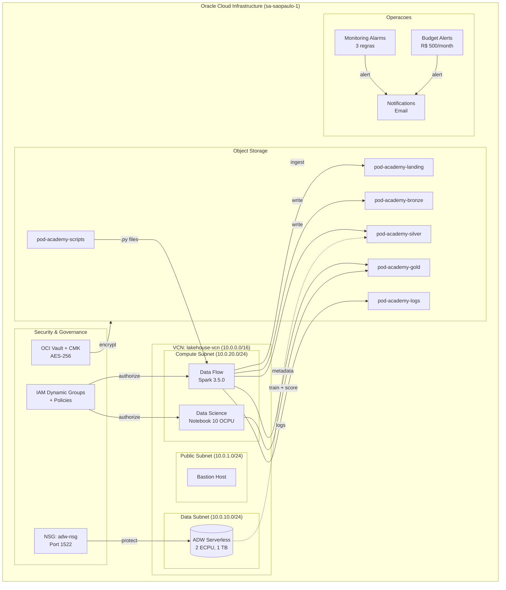
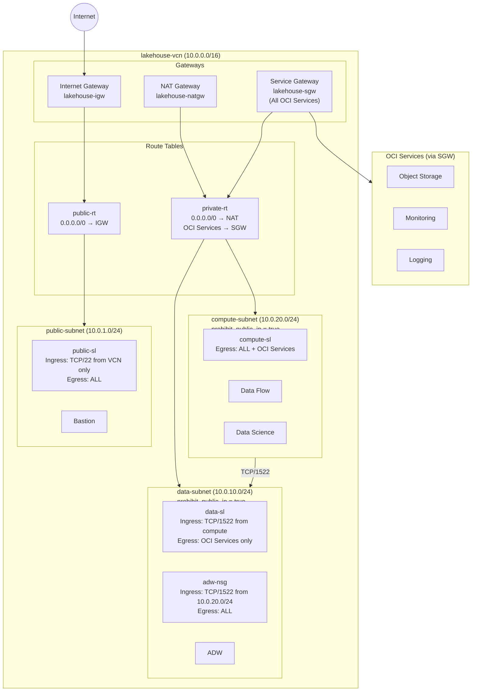
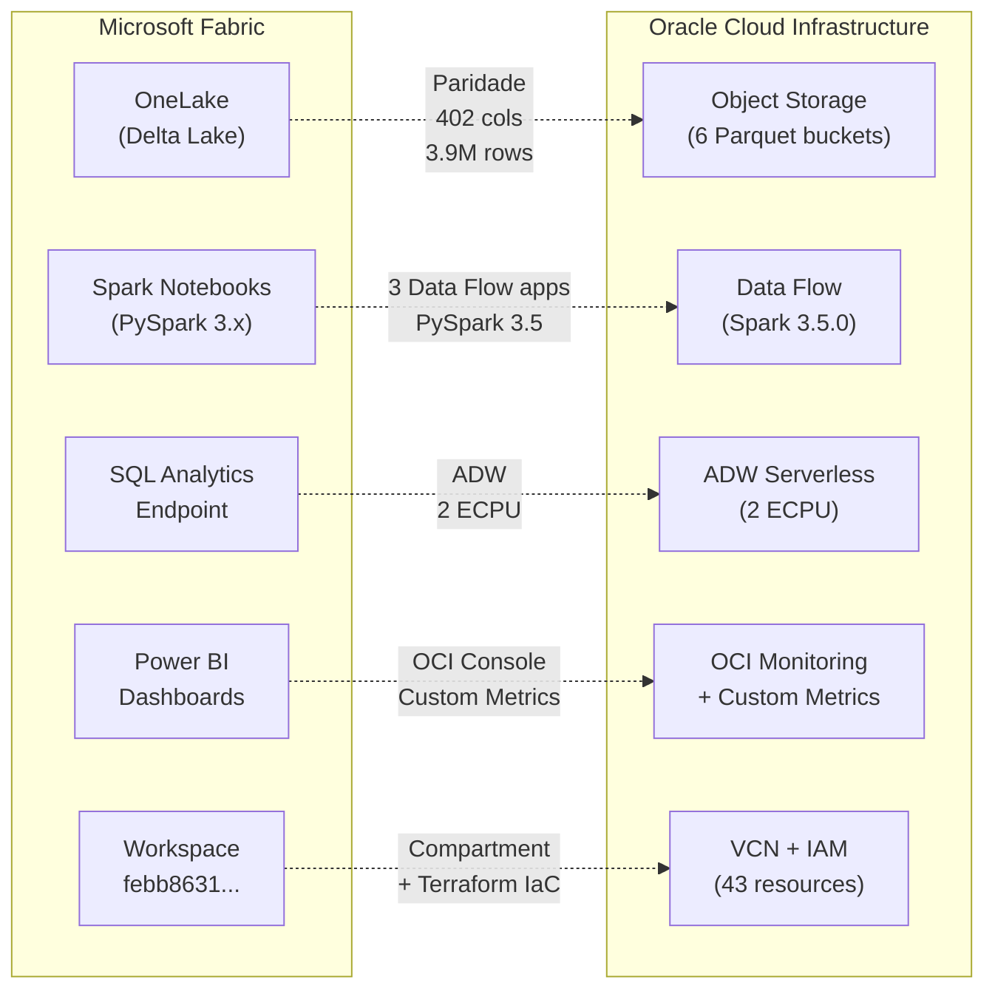
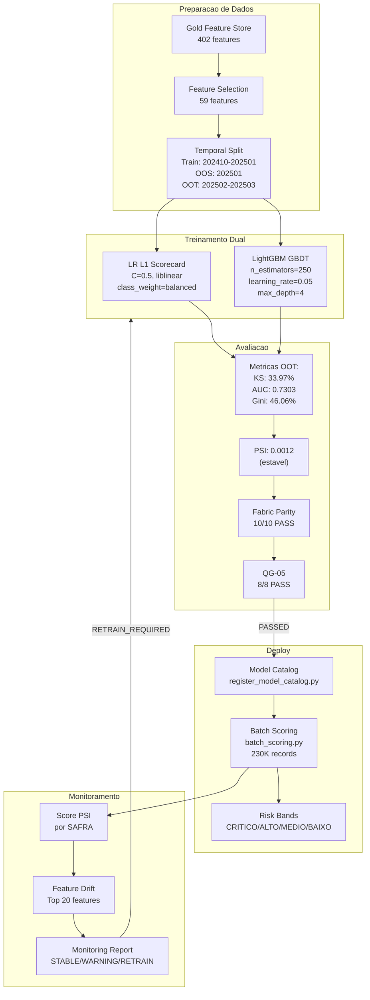
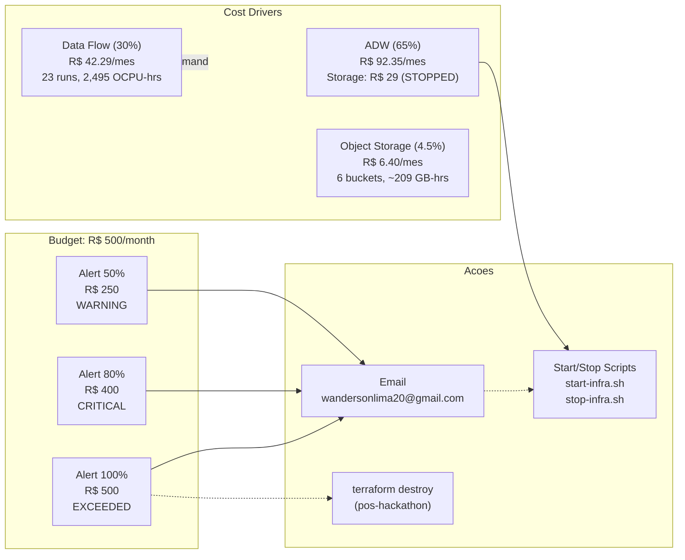

# Guia de Arquitetura OCI — Credit Risk Data Platform

**Projeto**: Hackathon PoD Academy — Credit Risk FPD (Claro + Oracle)
**Plataforma**: Oracle Cloud Infrastructure (sa-saopaulo-1)
**Data**: 2026-03-07
**Versao**: 1.0

---

## Indice

1. [Resumo Executivo](#1-resumo-executivo)
2. [Visao Geral da Arquitetura](#2-visao-geral-da-arquitetura)
3. [Topologia de Rede](#3-topologia-de-rede)
4. [Fluxo de Dados (Medallion)](#4-fluxo-de-dados-medallion)
5. [Ciclo de Vida ML](#5-ciclo-de-vida-ml)
6. [Gestao de Custos](#6-gestao-de-custos)
7. [Tutorial: Como Replicar Esta Arquitetura](#7-tutorial-como-replicar-esta-arquitetura)
8. [Troubleshooting](#8-troubleshooting)

---

## Architecture Evolution (v2)

### New Components
| Component | Service | Cost | Purpose |
|-----------|---------|------|---------|
| Unified Pipeline | Data Flow | Same as before | Single SparkSession for B->S->G (saves 6-12 min bootstrap) |
| ARM Orchestrator | Compute A1.Flex | $0 (Always Free) | Cron + OCI CLI orchestration |
| External Tables | ADW DBMS_CLOUD | $0 | Query Gold Parquet directly (no data duplication) |
| Data Catalog | Data Catalog | $0 (Free tier) | Schema harvesting, metadata, lineage |
| Batch Scoring Job | Data Science Jobs | ~$2/run | Automated scoring triggered by orchestrator |
| Model Catalog | Data Science | $0 | Model versioning, champion/challenger |

### Architecture Diagram (v2)
```
Landing Bucket (CSV/Parquet)
    |
    v
[OCI Data Flow — Unified Pipeline]
    |── Bronze (Delta Lake, 9 tables)
    |── Silver (Delta Lake, 19 tables)
    └── Gold (Delta Lake, 3 books + consolidado)
            |
            ├─> ADW External Tables ──> APEX Dashboard
            |
            └─> Data Science Job (Batch Scoring)
                    |
                    ├─> Gold/clientes_scores (Parquet)
                    └─> Model Catalog (versioned .pkl)

[ARM Orchestrator (A1 Always-Free)]
    |── Cron Schedule (weekly/daily)
    |── Submit Data Flow runs
    |── Trigger Data Science Jobs
    |── ONS notifications (success/failure)
    └── Health checks (6-hourly)

[Data Catalog]
    |── Harvest Bronze/Silver/Gold schemas
    └── Lineage: Landing -> Bronze -> Silver -> Gold -> Scores

[Monitoring]
    |── 6 alarms (pipeline, PSI, KS, cost)
    |── Budget alerts (50%, 80%, 100%)
    └── VCN Flow Logs
```

### Updated Cost Estimate
| Component | Monthly Cost | Notes |
|-----------|-------------|-------|
| ARM Orchestrator | $0 | Always Free (4 OCPU, 24 GB) |
| ADW (2 ECPU) | $0 | Always Free tier |
| Object Storage (~20 GB) | ~$0.50 | Standard tier |
| Data Flow (4 runs/month) | ~$8-12 | 14 OCPUs, ~30 min/run |
| Data Science notebook (20h) | ~$15-25 | E4.Flex 10 OCPU |
| Data Catalog | $0 | Free tier |
| KMS Vault | ~$5 | Per key version |
| **Total** | **~$30-45** | **Well within $500 trial** |

---

## 1. Resumo Executivo

Este documento descreve a arquitetura completa da plataforma de dados OCI construida para o Hackathon PoD Academy (Claro + Oracle). O objetivo e a predicao de **First Payment Default (FPD)** para clientes de telecomunicacoes, utilizando modelos de credit risk scoring.

### Resultados-Chave

| Metrica | Valor |
|---------|-------|
| Dados processados | 3.9M registros (NUM_CPF x SAFRA) |
| Features totais | 402 colunas no Gold |
| Features selecionadas | 59 (modelo) |
| LightGBM KS (OOT) | **33.97%** |
| AUC (OOT) | **0.7303** |
| Gini (OOT) | **46.06%** |
| PSI (score stability) | **0.0012** (estavel) |
| Fabric-OCI Parity | **10/10 PASS** |
| Custo total acumulado | **R$ 171.71** de US$ 500 trial credit |
| Quality Gates | **124/144 PASS** (100% dos aplicaveis) |
| Recursos Terraform | **43 gerenciados** em 7 modulos |

### Migracao Fabric → OCI

O pipeline original foi desenvolvido no Microsoft Fabric (OneLake + PySpark + Delta Lake). A migracao para OCI manteve **paridade exata** de dados (402 colunas, 3,900,378 linhas) e **paridade de modelo** (todas as metricas dentro da tolerancia de ±0.5%).

---

## 2. Visao Geral da Arquitetura

### Diagrama 1: Arquitetura de Alto Nivel



### Mapeamento Fabric → OCI

| Componente Fabric | Componente OCI | Terraform Module |
|-------------------|----------------|-----------------|
| OneLake (Lakehouse) | Object Storage (6 buckets) | `modules/storage` |
| Spark Notebooks | Data Flow (Spark 3.5.0) | `modules/dataflow` |
| Delta Lake Tables | Parquet no Object Storage | `modules/storage` |
| Fabric Workspace | Compartment + VCN | `modules/network` |
| SQL Analytics Endpoint | ADW Serverless (2 ECPU) | `modules/database` |
| Synapse ML Runtime | Data Science Notebook (10 OCPU) | `modules/datascience` |
| Power BI Dashboards | ORDS/APEX Dashboard (ADW) + OCI Custom Metrics | `modules/monitoring` + `infrastructure/apex/` |
| Fabric Cost | Budget Alerts (3 regras) | `modules/cost` |

### Recursos Terraform (43 total)

| Modulo | Recursos | Principais |
|--------|----------|-----------|
| `network` | 14 | VCN, 3 subnets, IGW, NAT, SGW, 2 route tables, 3 security lists, NSG, 2 flow logs |
| `storage` | 6 | 6 buckets (landing, bronze, silver, gold, logs, scripts) |
| `database` | 1 | ADW Serverless (2 ECPU, 1 TB) |
| `dataflow` | 4 | Pool + 3 applications (bronze, silver, gold) |
| `datascience` | 2 | Project + Notebook Session |
| `cost` | 4 | Budget + 3 alert rules |
| `monitoring` | 5 | Topic + Subscription + 3 alarms |
| Root (IAM) | 7 | 2 dynamic groups + 3 policies + Vault + CMK |
| **Total** | **43** | |

---

## 3. Topologia de Rede

### Diagrama 2: Rede VCN



### Configuracao de Rede

| Parametro | Valor | Arquivo |
|-----------|-------|---------|
| VCN CIDR | `10.0.0.0/16` | `variables.tf: vcn_cidr` |
| Public Subnet | `10.0.1.0/24` (cidrsubnet /16, 8, 1) | `modules/network/main.tf:76` |
| Data Subnet | `10.0.10.0/24` (cidrsubnet /16, 8, 10) | `modules/network/main.tf:87` |
| Compute Subnet | `10.0.20.0/24` (cidrsubnet /16, 8, 20) | `modules/network/main.tf:99` |
| SSH CIDR | `10.0.0.0/16` (VCN-only, sem SSH externo) | `variables.tf: ssh_allowed_cidr` |
| ADW Port | TCP/1522 (compute → data) | NSG + Security List |
| Flow Logs | Habilitados em data-subnet e compute-subnet | 30 dias retencao |
| DNS Labels | `lakehouse` (VCN), `pub`, `data`, `compute` | Subnets |

### Principios de Seguranca

1. **Zero public IPs** em subnets privadas (`prohibit_public_ip_on_vnic = true`)
2. **Defense-in-depth**: Security Lists + NSG para ADW
3. **Least-privilege IAM**: Dynamic groups com policies granulares
4. **Service Gateway**: Trafego para OCI Services sem sair do backbone Oracle
5. **NAT Gateway**: Acesso outbound para private subnets (packages, APIs)
6. **VCN Flow Logs**: Auditoria de trafego em subnets sensiveis
7. **Customer-Managed Keys**: Vault + CMK AES-256 para Object Storage

---

## 4. Fluxo de Dados (Medallion)

### Diagrama 3: Pipeline Bronze → Silver → Gold

```mermaid
flowchart LR
    subgraph LANDING["Landing Zone"]
        CSV["CSV/Excel/Parquet<br/>9 fontes originais"]
    end

    subgraph BRONZE["Bronze (Raw)"]
        B1["dados_cadastrais"]
        B2["telco"]
        B3["score_bureau_movel"]
        B4["recarga"]
        B5["pagamento"]
        B6["faturamento"]
        B7["config tables"]
        B8["staging tables"]
        B9["log_info"]
    end

    subgraph SILVER["Silver (Cleansed)"]
        S1["dados_cadastrais<br/>(typed + dedup)"]
        S2["telco"]
        S3["score_bureau_movel"]
        S4["recarga_cmv"]
        S5["pagamento"]
        S6["faturamento"]
        S7["...19 tables total"]
    end

    subgraph GOLD["Gold (Features)"]
        G1["book_recarga_cmv<br/>102 vars (REC_*)"]
        G2["book_pagamento<br/>154 vars (PAG_*)"]
        G3["book_faturamento<br/>108 vars (FAT_*)"]
        G4["clientes_consolidado<br/>402 cols, 3.9M rows"]
        G5["clientes_scores<br/>8 cols, scoring output"]
    end

    CSV -->|"Data Flow:<br/>ingest_bronze.py"| BRONZE
    BRONZE -->|"Data Flow:<br/>transform_silver.py"| SILVER
    SILVER -->|"Data Flow:<br/>engineer_gold.py"| GOLD

    G1 -->|"LEFT JOIN<br/>(NUM_CPF, SAFRA)"| G4
    G2 -->|"LEFT JOIN<br/>(NUM_CPF, SAFRA)"| G4
    G3 -->|"LEFT JOIN<br/>(NUM_CPF, SAFRA)"| G4
    G4 -->|"LightGBM<br/>scoring"| G5
```



### Buckets e Conteudo

| Bucket | Conteudo | Versioning | Auto-Tiering |
|--------|----------|-----------|--------------|
| `pod-academy-landing` | Raw files (CSV, Excel, Parquet) | Disabled | Disabled |
| `pod-academy-bronze` | Ingested tables (Parquet) | Enabled | InfrequentAccess |
| `pod-academy-silver` | Typed + deduplicated tables | Enabled | InfrequentAccess |
| `pod-academy-gold` | Feature store + scoring output + model artifacts | Enabled | InfrequentAccess |
| `pod-academy-logs` | Data Flow execution logs | Disabled | InfrequentAccess |
| `pod-academy-scripts` | Pipeline Python scripts (.py) | Enabled | Disabled |

### Feature Store: `clientes_consolidado`

- **Granularidade**: `NUM_CPF` (CPF mascarado) + `SAFRA` (YYYYMM)
- **Records**: ~3.9M
- **Colunas**: 402
- **Particoes**: SAFRA (202410, 202411, 202412, 202501, 202502, 202503)
- **Targets**: `FPD`, `TARGET_SCORE_01`, `TARGET_SCORE_02`

**Pattern de Join** — todos LEFT JOINs em `(NUM_CPF, SAFRA)`:

```
dados_cadastrais (base)
  ├── telco
  ├── score_bureau_movel (targets)
  ├── book_recarga_cmv       (REC_*  — 102 features)
  ├── book_pagamento          (PAG_*  — 154 features)
  └── book_faturamento        (FAT_*  — 108 features)
```

### Diagrama 6: Comparacao Fabric vs OCI



---

## 5. Ciclo de Vida ML

### Diagrama 4: ML Lifecycle



### Configuracao do Modelo

| Parametro | LR L1 Scorecard | LightGBM GBDT |
|-----------|----------------|---------------|
| Tipo | Logistic Regression | Gradient Boosted Trees |
| Penalty/Objective | L1 (Lasso) | binary |
| C / n_estimators | 0.5 | 250 |
| Solver / learning_rate | liblinear | 0.05 |
| max_depth | — | 4 |
| class_weight | balanced | — |
| colsample_bytree | — | 0.8 |
| random_state | 42 | 42 |
| Preprocessing (num) | Median Impute + StandardScaler | Median Impute |
| Preprocessing (cat) | MostFrequent + CountEncoder | MostFrequent + CountEncoder |
| Features categoricas | `var_34`, `var_67` | `var_34`, `var_67` |

### Quality Gate QG-05 (Pre-Deployment)

| Check | Threshold | Resultado |
|-------|-----------|-----------|
| KS OOT > 0.20 (LR) | 0.20 | 0.3277 PASS |
| KS OOT > 0.20 (LGBM) | 0.20 | 0.3397 PASS |
| AUC OOT > 0.65 (LR) | 0.65 | 0.7207 PASS |
| AUC OOT > 0.65 (LGBM) | 0.65 | 0.7303 PASS |
| Gini OOT > 30 (LR) | 30.0 | 44.15 PASS |
| Gini OOT > 30 (LGBM) | 30.0 | 46.06 PASS |
| PSI < 0.25 (LR) | 0.25 | 0.0012 PASS |
| PSI < 0.25 (LGBM) | 0.25 | 0.0012 PASS |

---

## 6. Gestao de Custos

### Diagrama 5: Fluxo de Custos



### Custo Acumulado

| Periodo | Custo (R$) | Atividades |
|---------|-----------|-----------|
| Fevereiro 2026 | 141.04 | Full pipeline: 23 Data Flow runs, ADW, model training |
| Marco 2026 (parcial) | 30.67 | ADW storage (STOPPED) + Object Storage |
| **Total** | **171.71** | **34.3% do budget** |

### Projecoes Mensais

| Cenario | Custo/mes | Descricao |
|---------|-----------|-----------|
| Idle | R$ 31 | ADW stopped, storage only |
| Development | R$ 78 | ADW 8h/dia, 3-5 runs/semana |
| Full Production | R$ 267 | ADW 24/7, daily scoring, notebook + deployment |

---

## 7. Tutorial: Como Replicar Esta Arquitetura

Este tutorial permite recriar a plataforma completa de dados e ML em OCI. Cada fase inclui comandos exatos, valores de configuracao reais do projeto, e verificacoes.

### Pre-requisitos

**Software necessario**:

```bash
# OCI CLI
oci --version    # Testado com 3.x

# Terraform
terraform --version    # Testado com 1.5+

# Python (para model scripts)
python3 --version    # 3.9+
```

**Configuracao OCI CLI**:

```bash
# Configurar perfil OCI
oci setup config
# Gera ~/.oci/config com:
#   tenancy, user, fingerprint, key_file, region
```

**Variaveis de ambiente**:

```bash
export TENANCY_OCID="ocid1.tenancy.oc1..your_tenancy"
export COMPARTMENT_OCID="ocid1.compartment.oc1..your_compartment"
export USER_OCID="ocid1.user.oc1..your_user"
export OCI_NAMESPACE=$(oci os ns get --query 'data' --raw-output)
export REGION="sa-saopaulo-1"
export PREFIX="pod-academy"
```

**Criar `terraform.tfvars`**:

```hcl
# oci/infrastructure/terraform/terraform.tfvars
# NUNCA commitar este arquivo (ja esta no .gitignore)

tenancy_ocid     = "ocid1.tenancy.oc1..your_tenancy"
user_ocid        = "ocid1.user.oc1..your_user"
fingerprint      = "aa:bb:cc:dd:..."
private_key_path = "~/.oci/oci_api_key.pem"
region           = "sa-saopaulo-1"

compartment_ocid = "ocid1.compartment.oc1..your_compartment"
namespace        = "your_namespace"
prefix           = "pod-academy"
environment      = "dev"

# Network
vcn_cidr         = "10.0.0.0/16"
ssh_allowed_cidr = "10.0.0.0/16"

# Database
adw_ecpu_count   = 2
use_free_tier    = false

# Data Flow
driver_shape       = "VM.Standard.E4.Flex"
executor_shape     = "VM.Standard.E4.Flex"
executor_ocpus     = 1
executor_memory_gb = 16
max_executors      = 4
num_executors      = 1
num_executors_heavy = 2

# Data Science
notebook_shape     = "VM.Standard.E4.Flex"
notebook_ocpus     = 10
notebook_memory_gb = 160

# Cost
monthly_budget     = 500
alert_recipients   = "your-email@domain.com"

# Security
enable_vault       = true
```

---

### Fase 1: Network & Security

**Objetivo**: Criar VCN, subnets, gateways, IAM dynamic groups e policies.

```bash
cd oci/infrastructure/terraform

# Inicializar Terraform
terraform init

# Aplicar apenas o modulo de rede
terraform apply -target=module.network
```

**O que sera criado** (14 recursos):
- VCN `lakehouse-vcn` com CIDR 10.0.0.0/16
- Public subnet (10.0.1.0/24) com Internet Gateway
- Data subnet (10.0.10.0/24) — private, porta 1522
- Compute subnet (10.0.20.0/24) — private, egress all
- NAT Gateway (outbound para private subnets)
- Service Gateway (acesso a OCI Services via backbone)
- 3 Security Lists + 1 NSG (adw-nsg)
- 2 Route Tables (public, private)
- Flow Logs para data e compute subnets

**Aplicar IAM** (root-level, requer tenancy_ocid):

```bash
# Dynamic groups + policies (definidos no main.tf raiz)
terraform apply \
  -target=oci_identity_dynamic_group.dataflow \
  -target=oci_identity_dynamic_group.datascience \
  -target=oci_identity_policy.dataflow_policy \
  -target=oci_identity_policy.datascience_policy \
  -target=oci_identity_policy.service_policy
```

**Verificacao**:

```bash
# Verificar VCN
oci network vcn list \
  --compartment-id $COMPARTMENT_OCID \
  --query 'data[*].{"name":"display-name","cidr":"cidr-blocks[0]","state":"lifecycle-state"}' \
  --output table

# Verificar subnets
oci network subnet list \
  --compartment-id $COMPARTMENT_OCID \
  --query 'data[*].{"name":"display-name","cidr":"cidr-block","public":"prohibit-public-ip-on-vnic"}' \
  --output table
```

---

### Fase 2: Storage

**Objetivo**: Criar 6 buckets com versionamento, auto-tiering e encriptacao.

```bash
# Vault + CMK (para customer-managed encryption)
terraform apply \
  -target=oci_kms_vault.lakehouse \
  -target=oci_kms_key.data_key

# Storage module
terraform apply -target=module.storage
```

**O que sera criado** (6 buckets):

| Bucket | Versioning | Auto-Tiering | Uso |
|--------|-----------|-------------|-----|
| `pod-academy-landing` | Disabled | Disabled | Raw files de entrada |
| `pod-academy-bronze` | Enabled | InfrequentAccess | Dados ingeridos |
| `pod-academy-silver` | Enabled | InfrequentAccess | Dados tipados + dedup |
| `pod-academy-gold` | Enabled | InfrequentAccess | Feature store + scores |
| `pod-academy-logs` | Disabled | InfrequentAccess | Logs do Data Flow |
| `pod-academy-scripts` | Enabled | Disabled | Scripts Python |

Todos os buckets: `access_type = "NoPublicAccess"`, KMS encryption via Vault.

**Upload dos dados fonte**:

```bash
# Upload raw files para landing bucket
oci os object bulk-upload \
  --bucket-name pod-academy-landing \
  --src-dir ./data/raw/ \
  --overwrite

# Upload pipeline scripts para scripts bucket
for script in ingest_bronze.py transform_silver.py engineer_gold.py; do
  oci os object put \
    --bucket-name pod-academy-scripts \
    --file oci/pipeline/$script \
    --name $script \
    --force
done
```

**Verificacao**:

```bash
# Listar buckets
oci os bucket list \
  --compartment-id $COMPARTMENT_OCID \
  --query 'data[*].{"name":name,"versioning":versioning,"access":"public-access-type"}' \
  --output table

# Verificar objetos no scripts bucket
oci os object list \
  --bucket-name pod-academy-scripts \
  --query 'data[*].{"name":name,"size":"size"}' \
  --output table
```

---

### Fase 3: Compute (ADW + Data Flow + Data Science)

**Objetivo**: Provisionar ADW, Data Flow pool + 3 apps, e Data Science notebook.

```bash
# Database (ADW)
terraform apply -target=module.database

# Data Flow (pool + 3 applications)
terraform apply -target=module.dataflow

# Data Science (project + notebook)
terraform apply -target=module.datascience
```

**ADW Serverless**:
- Nome: `pod-academy-adw`
- Workload: DW (Data Warehouse)
- Compute: ECPU model, 2 ECPUs, auto-scaling enabled
- Storage: 1 TB
- Endpoint: Private (data-subnet + adw-nsg)
- License: LICENSE_INCLUDED

**Data Flow**:
- Pool: `pod-academy-dev-pool` (min=0, max=4, idle_timeout=30min)
- Spark: 3.5.0
- Shape: VM.Standard.E4.Flex (1 OCPU, 16 GB)
- 3 Applications:
  - `pod-academy-ingest-bronze` (1 executor, timeout 120min)
  - `pod-academy-transform-silver` (1 executor, timeout 180min)
  - `pod-academy-engineer-gold` (2 executors, timeout 240min)

**Data Science**:
- Project: `pod-academy-ml-project`
- Notebook: `pod-academy-training-notebook` (10 OCPUs, 160 GB, 150 GB block storage)

**Verificacao**:

```bash
# ADW status
oci db autonomous-database list \
  --compartment-id $COMPARTMENT_OCID \
  --query 'data[*].{"name":"display-name","state":"lifecycle-state","ecpu":"compute-count"}' \
  --output table

# Data Flow applications
oci data-flow application list \
  --compartment-id $COMPARTMENT_OCID \
  --query 'data[*].{"name":"display-name","spark":"spark-version","language":language}' \
  --output table

# Data Science project
oci data-science project list \
  --compartment-id $COMPARTMENT_OCID \
  --query 'data[*].{"name":"display-name","state":"lifecycle-state"}' \
  --output table
```

---

### Fase 4: Pipeline de Dados

**Objetivo**: Executar o pipeline completo Bronze → Silver → Gold.

**Executar Bronze (ingestao)**:

```bash
# Obter OCID da app Bronze
BRONZE_APP_OCID=$(oci data-flow application list \
  --compartment-id $COMPARTMENT_OCID \
  --query 'data[?"display-name"==`pod-academy-ingest-bronze`].id | [0]' \
  --raw-output)

# Submeter run
oci data-flow run submit \
  --application-id $BRONZE_APP_OCID \
  --display-name "bronze-ingest-$(date +%Y%m%d)"
```

**Executar Silver (transformacao)**:

```bash
SILVER_APP_OCID=$(oci data-flow application list \
  --compartment-id $COMPARTMENT_OCID \
  --query 'data[?"display-name"==`pod-academy-transform-silver`].id | [0]' \
  --raw-output)

oci data-flow run submit \
  --application-id $SILVER_APP_OCID \
  --display-name "silver-transform-$(date +%Y%m%d)"
```

**Executar Gold (feature engineering)**:

```bash
GOLD_APP_OCID=$(oci data-flow application list \
  --compartment-id $COMPARTMENT_OCID \
  --query 'data[?"display-name"==`pod-academy-engineer-gold`].id | [0]' \
  --raw-output)

oci data-flow run submit \
  --application-id $GOLD_APP_OCID \
  --display-name "gold-engineer-$(date +%Y%m%d)"
```

**Monitorar execucao**:

```bash
# Listar runs recentes
oci data-flow run list \
  --compartment-id $COMPARTMENT_OCID \
  --query 'data[*].{"name":"display-name","state":"lifecycle-state","duration":"run-duration-in-milliseconds"}' \
  --output table \
  --sort-by timeCreated \
  --sort-order DESC \
  --limit 10
```

**Verificacao**:

```bash
# Verificar dados no Gold bucket
oci os object list \
  --bucket-name pod-academy-gold \
  --prefix "clientes_consolidado/" \
  --query 'data | length(@)' \
  --raw-output

# Verificar total de objetos por bucket
for bucket in bronze silver gold; do
  COUNT=$(oci os object list --bucket-name pod-academy-${bucket} --query 'data | length(@)' --raw-output)
  echo "pod-academy-${bucket}: ${COUNT} objects"
done
```

---

### Fase 5: Modelo ML

**Objetivo**: Treinar os modelos LR L1 + LightGBM, avaliar, registrar e fazer scoring.

**5a. Preparar ambiente no notebook**:

```bash
# No OCI Data Science notebook session:
pip install scikit-learn==1.3.2 lightgbm category-encoders==2.6.3 pyarrow

# Copiar dados do Gold bucket para block volume (performance)
oci os object bulk-download \
  --bucket-name pod-academy-gold \
  --prefix clientes_consolidado/ \
  --download-dir /home/datascience/data/clientes_consolidado/
```

**5b. Treinar modelos**:

```bash
# No notebook ou terminal:
cd /home/datascience
python train_credit_risk.py
```

Saida esperada:
- LR L1: KS OOT ~0.3277, AUC ~0.7207
- LightGBM: KS OOT ~0.3397, AUC ~0.7303
- QG-05: 8/8 PASS
- Artifacts salvos em `/home/datascience/artifacts/`

**5c. Batch scoring**:

```bash
python batch_scoring.py
```

Saida: `clientes_scores` com 8 colunas (NUM_CPF, SAFRA, SCORE, FAIXA_RISCO, PROBABILIDADE_FPD, MODELO_VERSAO, DATA_SCORING, EXECUTION_ID).

**5d. Upload artifacts para Gold bucket**:

```bash
oci os object bulk-upload \
  --bucket-name pod-academy-gold \
  --src-dir /home/datascience/artifacts/ \
  --object-prefix model_artifacts/ \
  --overwrite
```

**5e. Registrar no Model Catalog**:

```bash
python register_model_catalog.py
```

**Verificacao**:

```bash
# Verificar artifacts no Gold bucket
oci os object list \
  --bucket-name pod-academy-gold \
  --prefix "model_artifacts/" \
  --query 'data[*].{"name":name,"size":size}' \
  --output table

# Verificar model catalog
oci data-science model list \
  --compartment-id $COMPARTMENT_OCID \
  --query 'data[*].{"name":"display-name","state":"lifecycle-state"}' \
  --output table
```

---

### Fase 6: Monitoramento

**Objetivo**: Configurar alarmes, health check e monitoramento de drift do modelo.

```bash
# Monitoring module (topic + 3 alarms)
terraform apply -target=module.monitoring
```

**Alarmes criados**:

| Alarme | Namespace | Query | Severity |
|--------|-----------|-------|----------|
| `pod-academy-dataflow-failures` | `oci_dataflow` | `RunsFailed[1h].sum() > 0` | CRITICAL |
| `pod-academy-storage-growth` | `oci_objectstorage` | `StoredBytes[1d].max() > 50GB` | WARNING |
| `pod-academy-budget-critical` | `oci_budget` | `BudgetActualSpend > 80%` | CRITICAL |

**Health check**:

```bash
bash oci/infrastructure/ops/health-check.sh
```

Verifica: 6 buckets, Data Science project, Data Flow apps, VCN, ADW status, budget, model artifacts.

**Monitoramento do modelo**:

```bash
python oci/model/monitor_model.py \
  --scores-path oci/artifacts/scoring/ \
  --output-dir oci/artifacts/monitoring/
```

Gera relatorio JSON com PSI de scores e drift de features (top 20).

**Verificacao**:

```bash
# Verificar alarmes
oci monitoring alarm list \
  --compartment-id $COMPARTMENT_OCID \
  --query 'data[*].{"name":"display-name","enabled":"is-enabled","severity":severity}' \
  --output table

# Verificar topico de notificacao
oci ons topic list \
  --compartment-id $COMPARTMENT_OCID \
  --query 'data[*].{"name":name,"state":"lifecycle-state"}' \
  --output table
```

---

### Fase 7: Custos e Lifecycle

**Objetivo**: Configurar budget alerts, start/stop e teardown.

```bash
# Cost module (budget + 3 alert rules)
terraform apply -target=module.cost
```

**Operacoes diarias**:

```bash
# Iniciar infraestrutura (ADW + notebook)
bash oci/infrastructure/ops/start-infra.sh

# Parar infraestrutura (economizar custos)
bash oci/infrastructure/ops/stop-infra.sh

# Verificar custo acumulado
oci budgets budget list \
  --compartment-id $TENANCY_OCID \
  --query 'data[*].{"name":"display-name","budget":amount,"spent":"actual-spend","forecast":"forecasted-spend"}' \
  --output table
```

**Teardown pos-hackathon**:

```bash
# CUIDADO: Destroi toda a infraestrutura
# Primeiro, parar recursos ativos
bash oci/infrastructure/ops/stop-infra.sh

# Listar o que sera destruido
terraform plan -destroy

# Destruir (requer confirmacao)
terraform destroy
```

> **Nota**: Apos `terraform destroy`, os dados em Object Storage sao removidos. Faca backup antes se necessario.

---

## 8. Troubleshooting

### Data Flow Failures

**Problema**: Data Flow run falha com `DeltaLakeVersionError`
**Causa**: Spark 3.5.0 do Data Flow usa Delta Lake 2.x; dados podem ter sido escritos com versao incompativel.
**Solucao**: Usar formato Parquet puro ao inves de Delta. Os scripts do projeto ja usam Parquet.

**Problema**: Data Flow run falha com `OutOfMemoryError`
**Causa**: Dataset grande demais para 1 executor com 16 GB.
**Solucao**: Aumentar `num_executors` ou `executor_memory_gb` em `variables.tf`. Para Gold engineering, usamos `num_executors_heavy = 2`.

**Problema**: Data Flow run fica em estado `ACCEPTED` por muito tempo
**Causa**: Pool pode estar sem capacidade ou idle timeout expirou.
**Solucao**: Verificar pool status e limites do trial. O pool tem `min=0`, entao a primeira execucao demora mais (cold start).

### ADW Connectivity

**Problema**: Notebook nao consegue conectar ao ADW (timeout)
**Causa**: NSG ou Security List bloqueando porta 1522.
**Solucao**:
1. Verificar que o notebook esta no compute-subnet (10.0.20.0/24)
2. Verificar NSG `adw-nsg`: permite TCP/1522 de 10.0.20.0/24
3. Verificar Security List `data-sl`: permite TCP/1522 de compute subnet

```bash
# Verificar NSG rules
oci network nsg rules list \
  --network-security-group-id $ADW_NSG_OCID \
  --query 'data[*].{"direction":direction,"protocol":protocol,"source":source,"port":"tcp-options"}' \
  --output table
```

### Notebook Conda Environment

**Problema**: `category_encoders` passa `force_all_finite` deprecated para sklearn >=1.4
**Causa**: Incompatibilidade entre `category_encoders==2.6.3` e `sklearn>=1.4`.
**Solucao**: O `train_credit_risk.py` ja inclui patch automatico (linhas 36-42):

```python
# Monkey-patch: converte force_all_finite para ensure_all_finite
import sklearn.utils.validation as _val
_original_check = _val.check_array
def _patched_check(*a, **kw):
    force_val = kw.pop("force_all_finite", None)
    if force_val is not None and "ensure_all_finite" not in kw:
        kw["ensure_all_finite"] = force_val
    return _original_check(*a, **kw)
_val.check_array = _patched_check
```

### Terraform State

**Problema**: `terraform plan` mostra changes inesperados em recursos existentes
**Causa**: State drift — recurso foi modificado manualmente no console.
**Solucao**:

```bash
# Refresh state para sincronizar
terraform refresh

# Se necessario, importar recurso existente
terraform import module.network.oci_core_vcn.lakehouse $VCN_OCID
```

**Problema**: Trial limitation — recurso nao pode ser criado
**Causa**: OCI Trial tem limites especificos (ex: 24 OCPUs E4 total para Data Science).
**Solucao**: Verificar limites em OCI Console > Governance > Limits. Ajustar shapes e OCPUs em `variables.tf`.

### Budget e Custos

**Problema**: Custo acumulado acima do esperado
**Causa**: ADW cobra storage (~R$ 29/mes) mesmo quando STOPPED.
**Solucao**:
1. Verificar: `oci db autonomous-database get --query 'data."lifecycle-state"'`
2. Se nao estiver em uso, parar: `bash stop-infra.sh`
3. Para eliminar custo de storage: `terraform destroy -target=module.database`
4. Para eliminar tudo pos-hackathon: `terraform destroy`

---

## Apendice: Referencia Rapida de Comandos

```bash
# ── Terraform ──
terraform init                              # Inicializar
terraform plan                              # Preview
terraform apply                             # Aplicar tudo
terraform apply -target=module.network      # Aplicar modulo especifico
terraform destroy                           # Destruir tudo
terraform state list                        # Listar recursos no state

# ── Pipeline ──
oci data-flow run submit --application-id $APP_OCID --display-name "run-name"
oci data-flow run list --compartment-id $COMPARTMENT_OCID --limit 5

# ── ADW ──
oci db autonomous-database start --autonomous-database-id $ADW_OCID
oci db autonomous-database stop --autonomous-database-id $ADW_OCID

# ── Object Storage ──
oci os object list --bucket-name pod-academy-gold --prefix "clientes_consolidado/"
oci os object bulk-upload --bucket-name pod-academy-landing --src-dir ./data/

# ── Monitoring ──
oci monitoring alarm list --compartment-id $COMPARTMENT_OCID
bash oci/infrastructure/ops/health-check.sh

# ── Budget ──
oci budgets budget list --compartment-id $TENANCY_OCID --output table
```

---

*Documento gerado: 2026-03-07 | Projeto: Hackathon PoD Academy (Claro + Oracle) | Plataforma: OCI sa-saopaulo-1*
